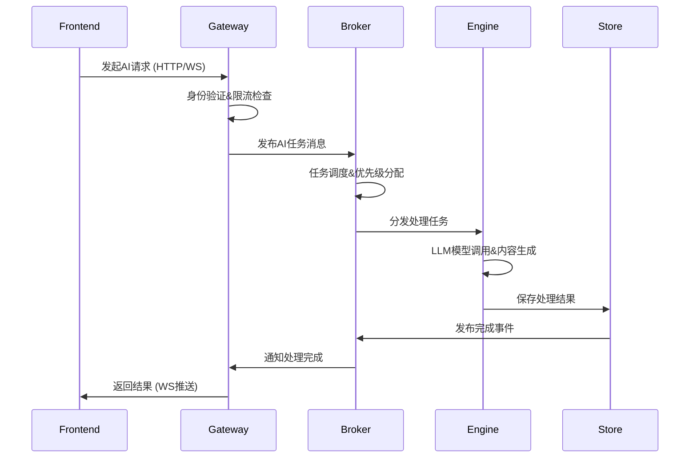

# SKER 系统架构分析

## 概述

SKER 是一个基于微服务架构的AI辅助内容管理系统，由四个核心服务模块构成，形成完整的分布式处理生态：

```mermaid
graph TB
    A[Frontend - @sker/studio] --> B[@sker/gateway - API网关]
    B --> C[@sker/broker - 消息代理]
    C --> D[@sker/engine - AI引擎]
    D --> E[@sker/store - 数据存储]

    B -.-> E
    D -.-> E
    C -.-> B
```

## 核心模块架构

### 服务层次结构

```
┌─────────────────────────────────────────────────────────────┐
│                    Frontend Layer                           │
│                  @sker/studio (React)                      │
└─────────────────────────────────────────────────────────────┘
                              ↓ HTTP/WebSocket
┌─────────────────────────────────────────────────────────────┐
│                   Gateway Layer                             │
│           @sker/gateway (Express + Socket.IO)              │
│              • API路由  • 认证授权  • 限流控制               │
└─────────────────────────────────────────────────────────────┘
                              ↓ Message Queue
┌─────────────────────────────────────────────────────────────┐
│                  Message Broker Layer                       │
│             @sker/broker (RabbitMQ + AMQP)                 │
│              • 任务调度  • 事件分发  • 负载均衡               │
└─────────────────────────────────────────────────────────────┘
                              ↓ Task Processing
┌─────────────────────────────────────────────────────────────┐
│                   AI Engine Layer                          │
│           @sker/engine (OpenAI Integration)                │
│            • 内容生成  • 语义分析  • 批量处理                │
└─────────────────────────────────────────────────────────────┘
                              ↓ Data Persistence
┌─────────────────────────────────────────────────────────────┐
│                  Data Storage Layer                         │
│        @sker/store (PostgreSQL + Redis)                    │
│            • 数据模型  • 缓存管理  • 事务处理                │
└─────────────────────────────────────────────────────────────┘
```

## 模块详细分析

### 1. @sker/store - 数据存储层

**职责**: 系统数据的持久化和管理基础设施

#### 核心功能
- **PostgreSQL数据管理**: 关系型数据的完整生命周期管理
- **Redis缓存服务**: 高性能缓存层，提升访问速度
- **用户认证系统**: JWT Token生成、验证和用户权限管理
- **数据模型管理**: User、Project、Node、Connection、AITask等核心实体
- **数据库迁移**: 版本化的数据库结构管理和升级
- **Repository模式**: 标准化的数据访问层实现

#### 技术栈
- **数据库**: PostgreSQL 8.11+, Redis 4.6+
- **ORM**: 原生SQL + 类型安全的Repository模式
- **认证**: bcryptjs + jsonwebtoken
- **验证**: joi数据验证
- **测试**: jest单元测试

#### 对外接口
```typescript
// 核心服务接口
storeService.users.*        // 用户管理
storeService.projects.*     // 项目管理
storeService.nodes.*        // 节点管理
storeService.connections.*  // 连接管理
storeService.aiTasks.*      // AI任务管理
storeService.cache()*       // 缓存操作
```

### 2. @sker/gateway - API网关层

**职责**: 系统统一入口，负责路由分发和服务协调

#### 核心功能
- **HTTP API网关**: 统一的REST API入口和路由管理
- **WebSocket管理**: 实时通信连接的建立、维护和消息路由
- **身份验证**: JWT Token验证和权限控制中间件
- **请求限流**: 防护机制，避免API滥用和DDoS攻击
- **安全中间件**: CORS、Helmet、数据验证等安全措施
- **服务集成**: 与broker和store服务的集成协调

#### 依赖关系
```typescript
dependencies: {
  "@sker/broker": "workspace:*",  // 消息队列集成
  "@sker/store": "workspace:*",   // 数据存储集成
  "@sker/models": "workspace:*",  // 共享类型定义
  "@sker/config": "workspace:*"   // 配置管理
}
```

#### 技术栈
- **Web框架**: Express.js 4.18+
- **实时通信**: Socket.IO 4.7+
- **安全**: Helmet, CORS, express-rate-limit
- **验证**: express-validator

#### API端点设计
```
/api/nodes/*     - 节点管理API
/api/ai/*        - AI服务API
/api/projects/*  - 项目管理API
/api/auth/*      - 认证相关API
WebSocket Events - 实时事件通信
```

### 3. @sker/engine - AI处理引擎

**职责**: AI能力的核心处理和智能分析服务

#### 核心功能
- **多LLM集成**: OpenAI GPT-4、GPT-3.5-turbo等模型的统一接口
- **智能内容生成**: 基于上下文的高质量内容创作
- **内容优化**: 现有内容的结构化改进和质量提升
- **多源融合**: 多个输入源的智能整合和综合分析
- **语义分析**: 内容的深度语义理解和标签提取
- **提示词工程**: 动态提示词构建和模板管理
- **批量处理**: 高效的批量任务处理机制
- **独立API服务**: 可独立运行的Studio API服务器

#### 处理能力
```typescript
// AI任务类型
- generate: 内容生成
- optimize: 内容优化
- fusion: 多输入融合
- analyze: 语义分析
- batch: 批量处理
```

#### 技术栈
- **AI集成**: OpenAI API 4.0+, tiktoken
- **服务器**: Express.js, 独立API服务器
- **构建**: Vite, TypeScript
- **Token管理**: 成本优化和使用统计

### 4. @sker/broker - 消息代理层

**职责**: 异步任务调度和服务间通信协调

#### 核心功能
- **消息队列管理**: RabbitMQ连接池和故障恢复机制
- **AI任务调度**: 智能任务分发和优先级管理
- **事件发布订阅**: 系统事件的分发和处理
- **负载均衡**: 任务负载的智能分配
- **可靠性保证**: 消息确认、重试机制和死信队列
- **实时协调**: WebSocket集成和状态同步

#### 消息队列架构
```
Exchanges:
├── llm.direct      - AI处理任务直接交换
├── events.topic    - 系统事件主题交换
└── realtime.fanout - 实时消息扇出交换

Queues:
├── llm.process.queue     - AI处理任务队列
├── result.notify.queue   - 处理结果通知队列
├── events.websocket.queue - WebSocket事件队列
└── events.storage.queue  - 存储事件队列
```

#### 技术栈
- **消息队列**: RabbitMQ, amqplib 0.10+
- **连接管理**: 连接池和自动重连
- **消息格式**: 结构化消息协议

## 数据流和交互模式

### 典型AI处理流程



### 关键数据实体

```typescript
// 核心数据模型
interface Node {
  id: string
  project_id: string
  user_id: string
  content: string
  title?: string
  importance: 1-5
  confidence: number
  status: 'idle' | 'processing' | 'completed' | 'error'
  position: { x: number, y: number }
  metadata: NodeMetadata
}

interface AITask {
  id: string
  project_id: string
  user_id: string
  type: 'content_generation' | 'optimization' | 'fusion'
  status: 'pending' | 'processing' | 'completed' | 'failed'
  input_data: any
  output_data?: any
  estimated_cost: number
}
```

## 技术选型总结

| 组件 | 技术栈 | 版本 | 职责 |
|------|--------|------|------|
| **Frontend** | React + TypeScript | - | 用户界面 |
| **Gateway** | Express + Socket.IO | 4.18+ | API网关 |
| **Broker** | RabbitMQ + AMQP | 0.10+ | 消息队列 |
| **Engine** | OpenAI API + Express | 4.0+ | AI处理 |
| **Store** | PostgreSQL + Redis | 8.11+ | 数据存储 |

## 部署架构

### 开发环境
```
localhost:3000  - Frontend (React Dev Server)
localhost:8000  - Gateway API Server
localhost:8000  - Engine API Server (独立模式)
localhost:5432  - PostgreSQL Database
localhost:6379  - Redis Cache
localhost:5672  - RabbitMQ Message Broker
```

### 生产环境建议
```
Load Balancer
├── Gateway Cluster (多实例)
├── Engine Cluster (多实例)
└── Static Assets (CDN)

Message Queue Cluster
├── RabbitMQ Primary
└── RabbitMQ Replica

Database Cluster
├── PostgreSQL Primary
├── PostgreSQL Replica
└── Redis Cluster
```

## 架构优势

1. **模块化设计**: 每个服务职责单一，易于开发和维护
2. **松耦合架构**: 通过消息队列实现服务间解耦
3. **水平扩展**: 各服务可独立扩容，支持高并发
4. **容错能力**: 消息队列和重试机制保证系统可靠性
5. **实时响应**: WebSocket支持实时通信和状态同步
6. **成本控制**: AI服务的智能调度和成本优化

## 潜在改进点

1. **服务发现**: 引入服务发现机制 (如Consul)
2. **配置中心**: 统一配置管理和动态更新
3. **监控体系**: 全链路监控和告警机制
4. **日志聚合**: 集中式日志收集和分析
5. **API网关**: 考虑使用专业网关 (如Kong, Zuul)
6. **容器化**: Docker容器化部署和编排

## 开发指南

### 本地开发启动顺序
1. 启动基础设施: PostgreSQL + Redis + RabbitMQ
2. 启动数据存储服务: `cd packages/store && pnpm run dev`
3. 启动消息代理服务: `cd packages/broker && pnpm run dev`
4. 启动AI引擎服务: `cd packages/engine && pnpm run server:dev`
5. 启动API网关服务: `cd packages/gateway && pnpm run dev`
6. 启动前端应用: `cd apps/studio && pnpm run dev`

### 环境变量配置
参见各模块的 `.env.example` 文件和 README 说明。

---

此架构文档将随系统演进持续更新，为开发团队提供准确的技术参考。