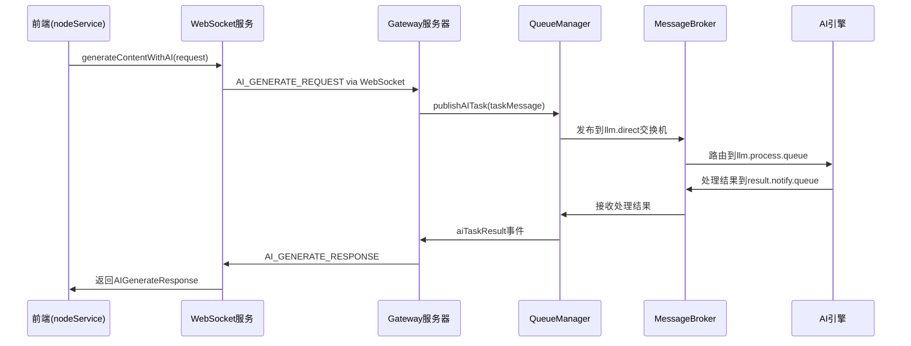

# @sker/broker 修复验证测试

## 修复后的消息流转路径

## 关键修复点

### ✅ 1. nodeService.ts修复
- **移除**: 直接调用`queueService.submitAITask()`
- **改为**: 通过`websocketService.generateContent()`
- **效果**: 遵循正确的架构层次

### ✅ 2. WebSocketManager.ts完善
- **替换**: TODO实现为真实的队列集成
- **添加**: `aiTaskRequest`事件触发
- **改进**: 连接状态验证和错误处理

### ✅ 3. Gateway集成增强
- **新增**: WebSocketManager与QueueManager事件桥接
- **完善**: AI任务结果的多格式消息发送
- **优化**: 错误处理和状态反馈

### ✅ 4. queueService.ts重构
- **简化**: 作为纯WebSocket封装层
- **移除**: 直接队列操作逻辑
- **保留**: 任务状态跟踪功能

## 测试检查项

### P0 - 基础功能测试
- [ ] WebSocket连接建立成功
- [ ] AI生成请求能发送到Gateway
- [ ] Gateway能正确路由到消息队列
- [ ] 处理结果能返回到前端

### P1 - 错误处理测试
- [ ] WebSocket断开时的错误处理
- [ ] Gateway服务异常时的错误处理
- [ ] 消息队列不可用时的错误处理
- [ ] AI引擎处理失败时的错误处理

### P2 - 性能和稳定性
- [ ] 大量并发请求处理
- [ ] 长时间连接稳定性
- [ ] 内存泄漏检查
- [ ] 消息确认和重试机制

## 预期修复效果

### 🎯 架构一致性
- 严格按照设计文档的消息流转路径
- Frontend → Gateway → Broker → Engine

### 🛡️ 错误处理完善
- 每个层级都有适当的错误处理
- 用户友好的错误消息
- 自动重试和恢复机制

### 📈 可扩展性提升
- 统一的Gateway入口支持负载均衡
- 消息队列支持水平扩展
- 清晰的服务边界便于维护

## 注意事项

1. **WebSocket URL配置**: 确保前端连接到正确的Socket.IO端点
2. **消息类型匹配**: 前后端WebSocket事件类型必须一致
3. **认证机制**: Gateway的WebSocket认证需要正确配置
4. **依赖启动顺序**: 确保服务按正确顺序启动

## 下一步

- 进行实际环境测试
- 监控消息流转性能
- 优化错误恢复机制
- 完善日志和监控