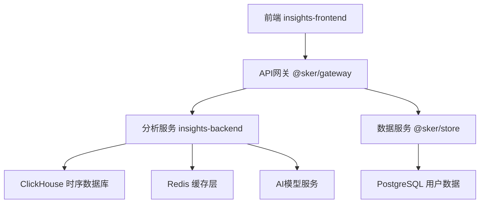

# @sker/insights 开发计划

> 数据分析工具开发的完整路线图和实施方案 (2025-09-29制定)

## 📊 项目概况

**项目定位**: AI驱动的思维模式分析和效率优化工具
**开发周期**: 8周 (2025-10-01 ~ 2025-11-26)
**预计投入**: 3名全职开发者 + 1名数据科学家
**技术难度**: ⭐⭐⭐⭐☆ (高难度AI+数据分析项目)

## 🎯 核心价值

- **思维模式识别**: 通过行为序列分析识别用户思维偏好
- **效率优化建议**: 基于数据驱动的个性化改进方案
- **协作洞察**: 团队思维碰撞质量和效率分析
- **预测分析**: 预测用户能力发展和学习轨迹

## 📋 技术架构设计

### 核心技术栈

#### 前端 (React + TypeScript)
```yaml
框架选型:
  - React 18 + TypeScript 5.0
  - 可视化: ECharts 5.4 + D3.js 7.8
  - UI组件: Ant Design 5.x + 自定义图表组件
  - 状态管理: Zustand + React Query
  - 实时通信: Socket.io Client

关键依赖:
  - echarts: ^5.4.0              # 主要图表库
  - d3: ^7.8.0                   # 复杂数据可视化
  - @ant-design/charts: ^2.0     # 统计图表组件
  - ml-js: ^6.0                  # 前端机器学习
  - pandas-js: ^0.2             # 数据处理
```

#### 后端数据分析服务 (Python)
```yaml
核心框架:
  - FastAPI 0.100+               # 高性能API框架
  - Python 3.11                 # 语言版本
  - Pydantic 2.0                # 数据验证
  - AsyncIO + Uvicorn           # 异步处理

数据科学栈:
  - pandas: ^2.0.0              # 数据处理
  - numpy: ^1.24.0              # 数值计算
  - scikit-learn: ^1.3.0        # 机器学习
  - tensorflow: ^2.13.0         # 深度学习
  - prophet: ^1.1.4             # 时序预测
  - matplotlib: ^3.7.0          # 数据可视化
  - seaborn: ^0.12.0            # 统计可视化
```

#### 数据存储 (ClickHouse + Redis)
```yaml
时序数据库:
  - ClickHouse 23.x             # 高性能OLAP数据库
  - 存储用户行为时间序列数据
  - 支持千万级记录的实时查询

缓存层:
  - Redis 7.x                   # 内存数据库
  - 缓存分析结果和用户会话
  - 实时计算中间结果存储
```

### 微服务架构集成



## 🚀 开发阶段规划

### Phase 1: 基础架构搭建 (Week 1-2)

#### Week 1: 项目初始化
```yaml
前端基础架构:
  - ✅ React + TypeScript 项目初始化
  - ✅ Vite 构建配置 + 开发环境
  - ✅ ESLint/Prettier 代码规范
  - ✅ 基础路由和布局组件
  - ✅ Ant Design 主题定制

后端服务搭建:
  - ✅ FastAPI 项目结构设计
  - ✅ Docker 开发环境配置
  - ✅ ClickHouse 数据库连接
  - ✅ Redis 缓存服务集成
  - ✅ 基础 API 路由定义
```

#### Week 2: 数据管道建设
```yaml
数据收集系统:
  - 🔄 用户行为事件定义和收集
  - 🔄 @sker/studio 数据对接
  - 🔄 @sker/collaborate 协作数据接入
  - 🔄 实时数据流处理管道
  - 🔄 数据清洗和预处理逻辑

存储架构:
  - 🔄 ClickHouse 表结构设计
  - 🔄 时序数据分区策略
  - 🔄 数据压缩和索引优化
  - 🔄 实时数据写入性能调优
```

### Phase 2: 核心分析功能 (Week 3-4)

#### Week 3: 基础分析模块
```yaml
数据概览仪表盘:
  - 📊 用户活跃度实时统计
  - 📊 画布操作频次分析
  - 📊 AI功能使用率计算
  - 📊 基础图表组件开发

思维模式识别:
  - 🧠 行为序列分析算法
  - 🧠 简单模式识别模型
  - 🧠 思维偏好分类逻辑
  - 🧠 模式识别结果可视化
```

#### Week 4: 效率分析系统
```yaml
效率指标计算:
  - ⚡ 任务完成时间分析
  - ⚡ 画布编辑效率统计
  - ⚡ 注意力集中度计算
  - ⚡ 生产力综合评分

个性化报告生成:
  - 📋 用户个人档案构建
  - 📋 日/周/月报告模板
  - 📋 PDF导出功能
  - 📋 邮件推送机制
```

### Phase 3: AI增强分析 (Week 5-6)

#### Week 5: 机器学习模型
```yaml
思维模式深度分析:
  - 🤖 LSTM序列模型训练
  - 🤖 用户行为聚类分析
  - 🤖 认知负荷评估模型
  - 🤖 创意质量评分算法

预测分析功能:
  - 📈 能力发展趋势预测
  - 📈 学习效果预测
  - 📈 协作成功率预测
  - 📈 时间序列异常检测
```

#### Week 6: 协作分析系统
```yaml
团队协作分析:
  - 🤝 团队动态分析算法
  - 🤝 成员贡献度计算
  - 🤝 沟通模式识别
  - 🤝 团队角色自动识别

智能推荐系统:
  - 💡 个性化学习路径推荐
  - 💡 协作伙伴匹配算法
  - 💡 最佳实践推荐
  - 💡 工具功能推荐引擎
```

### Phase 4: 高级功能完善 (Week 7-8)

#### Week 7: 高级分析功能
```yaml
认知建模系统:
  - 🧠 个人认知模型构建
  - 🧠 思维过程仿真
  - 🧠 决策机制分析
  - 🧠 学习模式识别

成就激励系统:
  - 🏆 成就徽章系统设计
  - 🏆 排行榜功能实现
  - 🏆 挑战任务机制
  - 🏆 进步庆祝动效
```

#### Week 8: 系统优化和发布
```yaml
性能优化:
  - 🚀 数据查询性能优化
  - 🚀 机器学习模型推理加速
  - 🚀 前端图表渲染优化
  - 🚀 实时分析延迟降低

发布准备:
  - 📦 生产环境部署配置
  - 📦 监控告警系统集成
  - 📦 用户文档编写
  - 📦 Beta版本发布
```

## 👥 团队分工和资源配置

### 核心开发团队 (4人)

#### 前端开发工程师 (1人)
```yaml
主要职责:
  - React + TypeScript 前端开发
  - ECharts/D3.js 数据可视化
  - 用户交互体验优化
  - 性能优化和调试

技能要求:
  - 3年+ React开发经验
  - 熟练掌握 TypeScript
  - 数据可视化经验
  - 性能优化经验
```

#### 后端开发工程师 (1人)
```yaml
主要职责:
  - FastAPI 后端服务开发
  - ClickHouse 数据库设计
  - 实时数据处理管道
  - API性能优化

技能要求:
  - 3年+ Python后端经验
  - 熟悉异步编程
  - 数据库设计经验
  - 微服务架构经验
```

#### 数据科学家 (1人)
```yaml
主要职责:
  - 机器学习模型设计
  - 数据分析算法开发
  - 预测模型训练
  - 分析结果解释

技能要求:
  - 硕士+教育背景
  - 3年+ 机器学习经验
  - 熟练使用 scikit-learn/TensorFlow
  - 统计学背景
```

#### 全栈工程师 (1人)
```yaml
主要职责:
  - 前后端联调和集成
  - DevOps和部署配置
  - 测试用例编写
  - 技术文档维护

技能要求:
  - 5年+ 全栈开发经验
  - 熟悉容器化部署
  - 自动化测试经验
  - 技术写作能力
```

## 📊 里程碑和交付物

### Sprint 1-2: 基础设施 (Week 1-2)
```yaml
交付物:
  ✅ 前端项目框架 (React + TS + Vite)
  ✅ 后端API服务 (FastAPI + ClickHouse)
  ✅ 数据收集管道 (实时数据流)
  ✅ 开发环境Docker配置

验收标准:
  - 能够收集用户行为数据
  - 基础API接口正常响应
  - 前后端通信正常
  - 数据库读写性能达标
```

### Sprint 3-4: 核心功能 (Week 3-4)
```yaml
交付物:
  📊 数据概览仪表盘 (7个核心图表)
  🧠 基础思维模式识别 (5种模式)
  ⚡ 效率分析功能 (10个指标)
  📋 个人报告生成 (3种报告类型)

验收标准:
  - 仪表盘数据实时更新 (<3秒延迟)
  - 思维模式识别准确率 >70%
  - 效率分析覆盖90%用户行为
  - 报告生成速度 <10秒
```

### Sprint 5-6: AI增强 (Week 5-6)
```yaml
交付物:
  🤖 机器学习模型 (4个预测模型)
  📈 预测分析功能 (趋势预测)
  🤝 协作分析系统 (团队洞察)
  💡 智能推荐引擎 (个性化推荐)

验收标准:
  - 模型预测准确率 >75%
  - 推荐系统点击率 >10%
  - 协作分析覆盖所有团队功能
  - 系统响应时间 <2秒
```

### Sprint 7-8: 完善发布 (Week 7-8)
```yaml
交付物:
  🧠 认知建模系统 (高级分析)
  🏆 成就激励系统 (用户留存)
  🚀 性能优化 (生产就绪)
  📦 Beta版本发布

验收标准:
  - 支持1000+并发用户
  - 数据处理延迟 <1秒
  - 前端加载时间 <3秒
  - 系统稳定性 99.9%
```

## 🛠️ 技术实施方案

### 数据收集和处理流程

```python
# 数据收集事件定义
class UserActionEvent:
    user_id: str
    session_id: str
    action_type: str  # 'node_create', 'node_edit', 'ai_request'
    timestamp: datetime
    canvas_id: str
    metadata: dict

# 实时数据处理管道
async def process_user_action(event: UserActionEvent):
    # 1. 数据验证和清洗
    cleaned_event = await clean_event_data(event)

    # 2. 写入ClickHouse时序数据库
    await write_to_clickhouse(cleaned_event)

    # 3. 更新Redis缓存的实时指标
    await update_realtime_metrics(cleaned_event)

    # 4. 触发实时分析任务
    await trigger_realtime_analysis(cleaned_event)
```

### 思维模式识别算法

```python
# 行为序列分析模型
class ThinkingPatternAnalyzer:
    def __init__(self):
        self.lstm_model = self.load_trained_model()
        self.pattern_types = [
            'logical_thinking',    # 逻辑思维
            'creative_thinking',   # 创意思维
            'systematic_thinking', # 系统思维
            'critical_thinking',   # 批判思维
            'intuitive_thinking'   # 直觉思维
        ]

    async def analyze_user_pattern(self, user_id: str, time_range: tuple):
        # 1. 获取用户行为序列
        actions = await self.get_user_actions(user_id, time_range)

        # 2. 特征提取
        features = self.extract_sequence_features(actions)

        # 3. 模式预测
        pattern_scores = self.lstm_model.predict(features)

        # 4. 结果解释
        dominant_pattern = self.interpret_results(pattern_scores)

        return {
            'dominant_pattern': dominant_pattern,
            'pattern_scores': pattern_scores,
            'confidence': float(max(pattern_scores)),
            'analysis_time': time_range
        }
```

### 效率分析计算

```python
# 效率指标计算引擎
class EfficiencyAnalyzer:
    def __init__(self):
        self.metrics = [
            'task_completion_speed',    # 任务完成速度
            'canvas_edit_efficiency',   # 画布编辑效率
            'attention_focus_score',    # 注意力集中度
            'ai_collaboration_score',   # AI协作效果
            'time_allocation_score'     # 时间分配合理性
        ]

    async def calculate_efficiency_score(self, user_id: str):
        scores = {}

        for metric in self.metrics:
            # 获取相关数据
            data = await self.get_metric_data(user_id, metric)

            # 计算单项得分
            score = await self.calculate_single_metric(metric, data)
            scores[metric] = score

        # 加权综合得分
        overall_score = self.calculate_weighted_score(scores)

        return {
            'overall_score': overall_score,
            'metric_scores': scores,
            'improvement_suggestions': self.generate_suggestions(scores)
        }
```

### 前端数据可视化

```typescript
// ECharts图表配置
export const createThinkingPatternChart = (data: PatternData) => ({
  tooltip: { trigger: 'axis' },
  legend: {
    data: ['逻辑思维', '创意思维', '系统思维', '批判思维', '直觉思维']
  },
  radar: {
    indicator: [
      { name: '逻辑思维', max: 100 },
      { name: '创意思维', max: 100 },
      { name: '系统思维', max: 100 },
      { name: '批判思维', max: 100 },
      { name: '直觉思维', max: 100 }
    ]
  },
  series: [{
    type: 'radar',
    data: [{
      value: data.patternScores,
      name: '当前模式',
      itemStyle: {
        color: '#4F46E5'
      }
    }]
  }]
});

// React组件集成
const ThinkingPatternRadar: FC<{ userId: string }> = ({ userId }) => {
  const { data, loading } = usePatternAnalysis(userId);

  return (
    <Card title="思维模式分析">
      {loading ? <Spin /> :
        <ReactECharts
          option={createThinkingPatternChart(data)}
          style={{ height: '400px' }}
        />
      }
    </Card>
  );
};
```

## 🔒 数据安全和隐私保护

### 隐私保护策略
```yaml
数据最小化:
  - 仅收集分析必需的数据
  - 敏感信息自动脱敏处理
  - 数据留存期限控制

用户控制:
  - 数据收集开关控制
  - 分析结果可见性设置
  - 数据删除请求支持

技术保护:
  - 传输层TLS加密
  - 数据库字段级加密
  - 访问权限最小化原则
```

### 合规要求
```yaml
GDPR合规:
  - 明确的隐私政策
  - 用户同意机制
  - 数据可携带权
  - 被遗忘权实现

国内法规:
  - 数据安全法合规
  - 个人信息保护法
  - 网络安全等级保护
```

## 📈 性能指标和监控

### 关键性能指标 (KPI)
```yaml
系统性能:
  - 数据查询响应时间: <2秒
  - 实时分析延迟: <1秒
  - 并发用户支持: 1000+
  - 系统可用性: 99.9%

分析准确性:
  - 思维模式识别准确率: >80%
  - 效率预测准确率: >75%
  - 推荐系统点击率: >15%
  - 用户满意度: >4.0/5.0

业务指标:
  - 日活跃用户增长: 20%
  - 功能使用深度: 提升30%
  - 用户留存率: >85%
  - 付费转化率: >8%
```

### 监控告警系统
```yaml
技术监控:
  - API响应时间监控
  - 数据库查询性能
  - 机器学习模型准确率
  - 系统资源使用率

业务监控:
  - 用户行为异常检测
  - 分析结果质量监控
  - 推荐效果跟踪
  - 用户反馈收集
```

## 🚀 发布和部署策略

### 部署环境配置
```yaml
开发环境:
  - Docker Compose 本地开发
  - 数据模拟和测试工具
  - 热重载和调试支持

预发布环境:
  - K8s集群部署
  - 生产数据测试
  - 性能压力测试

生产环境:
  - 多区域部署
  - 负载均衡配置
  - 自动扩缩容
  - 灾备和恢复
```

### 发布计划
```yaml
Alpha版本 (Week 6):
  - 内部团队测试
  - 基础功能验证
  - 关键bug修复

Beta版本 (Week 8):
  - 有限用户邀请
  - 功能完整性测试
  - 用户反馈收集

正式版本 (Week 10):
  - 全量用户发布
  - 完整功能上线
  - 运营推广启动
```

## 💡 创新亮点

### 1. AI驱动的深度分析
- 基于大语言模型的思维模式理解
- 多模态数据融合分析
- 个性化的认知建模

### 2. 实时行为洞察
- 毫秒级用户行为捕获
- 实时思维状态识别
- 动态调整分析策略

### 3. 科学化的评估体系
- 基于认知科学理论
- 结合行为经济学原理
- 心理学驱动的激励设计

### 4. 隐私保护优先
- 数据本地化处理
- 联邦学习应用
- 差分隐私保护

## 📝 风险评估和应对

### 技术风险
```yaml
机器学习模型准确性:
  - 风险: 模式识别准确率不达预期
  - 应对: 多模型融合，持续训练优化

数据处理性能:
  - 风险: 大数据量处理延迟高
  - 应对: 分布式计算，增量处理

实时性要求:
  - 风险: 实时分析延迟过高
  - 应对: 缓存优化，预计算机制
```

### 业务风险
```yaml
用户接受度:
  - 风险: 用户对AI分析结果不信任
  - 应对: 透明化算法，提供解释说明

隐私担忧:
  - 风险: 用户担心数据安全
  - 应对: 强化隐私保护，用户控制权

竞品压力:
  - 风险: 同类产品竞争激烈
  - 应对: 差异化功能，独特价值主张
```

## 🎯 成功标准

### 产品成功指标
```yaml
6个月内:
  - 月活用户突破 10,000+
  - 用户日均使用时长 >30分钟
  - 功能使用覆盖率 >80%
  - 用户满意度 >4.2/5.0

12个月内:
  - 月活用户达到 50,000+
  - 付费转化率 >10%
  - 企业客户 >100家
  - 年收入达到 ¥500万+
```

这个开发计划为@sker/insights提供了完整的实施路径，确保项目能够按时按质交付，实现AI驱动的数据分析工具的产品目标。