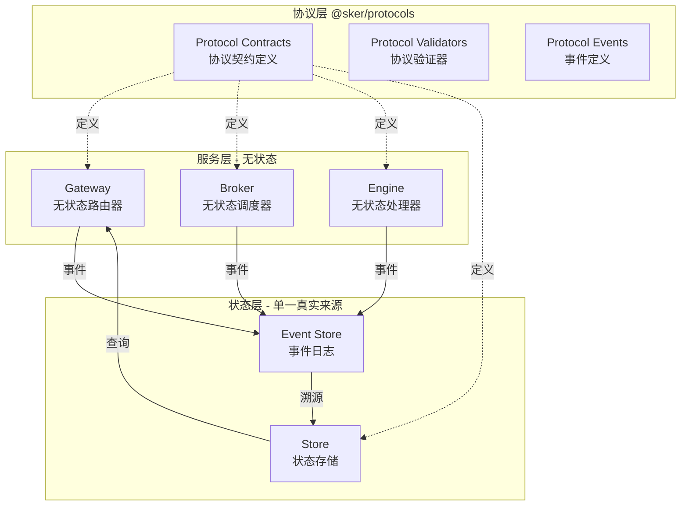

# SKER 协议优先架构设计

## 概述

本文档定义SKER系统的新一代架构，基于**协议优先**、**事件驱动**、**类型安全**原则，解决当前架构的核心问题。

## 问题诊断

### 当前架构的致命缺陷

1. **状态管理混乱**
   - Broker依赖内存Map(`activeTasks`)，重启后状态丢失
   - 缺乏单一真实来源(Single Source of Truth)
   - 前后端状态不一致，缺乏同步机制

2. **类型安全缺失**
   - 接口定义不完整(`StoreClient.nodes.get`缺失)
   - 消息格式在服务间不一致
   - 缺少运行时验证，错误在运行时才发现

3. **职责边界模糊**
   - Broker既调度又管理状态
   - Engine既处理AI又更新数据库
   - Gateway既路由又转换数据格式

4. **协议管理混乱**
   - 消息格式散落各服务
   - 缺乏版本管理机制
   - 事件定义重复且不一致

## 新架构设计原则

### 1. 协议优先 (Contract-First)

**定义**: 所有服务间通信基于严格定义的协议契约

```typescript
// @sker/protocols - 独立的协议定义包
export const AITaskContractV1 = {
  version: '1.0.0',
  schemas: {
    task: AITaskMessageSchemaV1,
    result: AIResultMessageSchemaV1
  }
}
```

**优势**:
- 编译时类型检查 + 运行时验证
- 协议版本化，支持渐进式升级
- 单一真实定义，避免重复和不一致

### 2. 事件驱动 (Event-Driven)

**定义**: 状态变更通过事件传播，服务保持无状态

```
状态 = reduce(事件流, 初始状态)

事件流示例:
NodeCreated → AITaskQueued → AITaskStarted
→ AITaskCompleted → NodeUpdated
```

**优势**:
- 完整的审计日志
- 可重放和时间旅行
- 服务解耦，独立扩展

### 3. 类型安全 (Type-Safe)

**定义**: 编译时+运行时双重类型保障

```typescript
// Branded Types防止ID混用
type TaskId = string & { readonly __brand: 'TaskId' }
type NodeId = string & { readonly __brand: 'NodeId' }

// ❌ 编译错误
const node = getNode(taskId)

// Zod运行时验证
const result = AITaskMessageSchema.parse(data)
```

**优势**:
- 提前发现类型错误
- 防止运行时类型混淆
- 自动生成验证代码

### 4. 单一真实来源 (SSOT)

**定义**: 状态仅存储于Store，其他皆为派生或缓存

```
Store (唯一状态源)
  ↓ 事件发布
Broker (无状态调度)
  ↓ 任务分发
Engine (无状态处理)
  ↓ 结果事件
Store (状态更新)
```

**优势**:
- 消除状态不一致
- 简化并发控制
- 服务重启不丢失状态

## 核心架构

### 系统架构图



### 数据流示例：AI任务处理

```
1. Frontend → Gateway: 创建AI任务请求
   └─ Gateway验证协议: AITaskContractV1.task

2. Gateway → Event Store: 发布 AI_TASK_QUEUED 事件
   └─ Event Store持久化事件

3. Broker订阅事件 → 发布到RabbitMQ队列
   └─ Broker保持无状态，不追踪任务

4. Engine消费队列 → 调用AI服务
   └─ Engine发布 AI_TASK_STARTED 事件

5. Engine处理完成 → 发布 AI_TASK_COMPLETED 事件
   └─ 携带结果但不更新数据库

6. Store订阅完成事件 → 更新节点状态
   └─ Store是唯一写入数据库的服务

7. Store发布 NODE_UPDATED 事件
   └─ Gateway订阅并推送到Frontend
```

## 包结构设计

### 1. @sker/protocols (协议定义包)

```
packages/protocols/
├── src/
│   ├── contracts/           # 协议契约
│   │   ├── ai-task.contract.ts
│   │   ├── node.contract.ts
│   │   └── event.contract.ts
│   ├── validators/          # 验证器
│   │   ├── message.validator.ts
│   │   └── runtime.validator.ts
│   ├── codegen/            # 代码生成
│   │   └── client.generator.ts
│   └── versions/           # 版本管理
│       ├── v1/
│       └── migrations.ts
└── package.json
```

**核心功能**:
- 所有协议的唯一定义源
- 编译时类型 + 运行时Zod验证
- 协议版本管理和迁移

### 2. @sker/events (事件系统包)

```
packages/events/
├── src/
│   ├── store/              # 事件存储
│   │   ├── EventStore.ts
│   │   └── PostgresEventStore.ts
│   ├── projections/        # 事件投影(CQRS)
│   │   ├── NodeProjection.ts
│   │   └── TaskProjection.ts
│   └── handlers/           # 事件处理器
│       └── EventHandler.ts
└── package.json
```

**核心功能**:
- 事件存储和查询
- 事件溯源支持
- CQRS读模型投影

### 3. @sker/broker (无状态调度器)

```typescript
// 重构后的Broker - 无状态设计
export class StatelessTaskScheduler {
  async scheduleTask(task: AITaskMessage): Promise<void> {
    // 1. 协议验证
    AITaskContractV1.schemas.task.parse(task)

    // 2. 发布事件（不存储状态）
    await this.eventStore.append({
      eventType: DomainEvents.AI_TASK_QUEUED,
      payload: task
    })

    // 3. 发布到队列
    await this.broker.publish(QUEUE_NAMES.AI_TASKS, task)

    // ❌ 删除: activeTasks.set(taskId, task)
    // ✅ 状态由EventStore管理
  }
}
```

**关键变化**:
- 移除所有内存状态(`activeTasks` Map)
- 不再追踪任务结果
- 纯调度功能，通过事件查询状态

### 4. @sker/engine (无状态处理器)

```typescript
// 重构后的Engine - 职责单一
export class StatelessAIProcessor {
  async processTask(task: AITaskMessage): Promise<void> {
    // 1. 发布开始事件
    await this.eventStore.append({
      eventType: DomainEvents.AI_TASK_STARTED,
      payload: { taskId: task.taskId }
    })

    // 2. 调用AI服务（纯处理）
    const result = await this.aiClient.complete({...})

    // 3. 发布完成事件（不更新数据库）
    await this.eventStore.append({
      eventType: DomainEvents.AI_TASK_COMPLETED,
      payload: { taskId, nodeId, result }
    })

    // ❌ 删除: await storeClient.nodes.update(...)
    // ✅ Store监听事件自行更新
  }
}
```

**关键变化**:
- 不再直接调用`storeClient.nodes.update`
- 通过事件传递结果
- 专注AI处理，不管数据库

### 5. @sker/store (事件驱动状态管理)

```typescript
// Store监听事件更新状态
export class AITaskEventHandler {
  constructor(
    private storeService: StoreService,
    private eventStore: EventStore
  ) {
    this.eventStore.subscribe(
      DomainEvents.AI_TASK_COMPLETED,
      this.handleTaskCompleted.bind(this)
    )
  }

  private async handleTaskCompleted(event: DomainEvent): Promise<void> {
    const { nodeId, result } = event.payload

    // 1. 查询当前节点
    const node = await this.storeService.nodes.findById(nodeId)

    // 2. 乐观锁检查
    if (node.version !== event.version - 1) {
      throw new ConcurrencyError()
    }

    // 3. 事务性更新
    await this.storeService.transaction(async (tx) => {
      await tx.nodes.update(nodeId, {
        ...result,
        version: node.version + 1
      })

      // 4. 发布节点更新事件
      await this.eventStore.append({
        eventType: DomainEvents.NODE_UPDATED,
        causationId: event.eventId
      })
    })
  }
}
```

**关键变化**:
- Store是唯一写入数据库的服务
- 通过事件订阅驱动更新
- 实现乐观锁防并发冲突

## 类型安全保障机制

### Branded Types（品牌类型）

```typescript
// 防止ID类型混用
type TaskId = string & { readonly __brand: 'TaskId' }
type NodeId = string & { readonly __brand: 'NodeId' }

function updateNode(nodeId: NodeId) {}

const taskId: TaskId = '123' as TaskId
updateNode(taskId) // ❌ 编译错误
```

### 运行时验证

```typescript
import { z } from 'zod'

// Schema定义
const AITaskSchema = z.object({
  taskId: z.string().uuid(),
  type: z.enum(['generate', 'optimize'])
})

// 运行时验证
try {
  const task = AITaskSchema.parse(unknownData)
  // ✅ 类型安全的task
} catch (error) {
  // ❌ 验证失败
}
```

### 协议版本化

```typescript
// v1.0.0 协议
export const AITaskContractV1 = {
  version: '1.0.0',
  schemas: { task: AITaskSchemaV1 }
}

// v2.0.0 协议（破坏性变更）
export const AITaskContractV2 = {
  version: '2.0.0',
  schemas: { task: AITaskSchemaV2 }
}

// 自动迁移
export class ProtocolMigrator {
  migrate(data: unknown, from: string, to: string) {
    // 应用迁移链
  }
}
```

## 实施计划

### Phase 1: 协议层 (Week 1)
- [x] 创建`@sker/protocols`包
- [x] 定义AI任务协议契约
- [x] 定义节点协议契约
- [x] 定义事件协议契约
- [ ] 实现协议验证器
- [ ] 编写协议文档

### Phase 2: 事件系统 (Week 2)
- [ ] 创建`@sker/events`包
- [ ] 实现EventStore（PostgreSQL）
- [ ] 统一领域事件定义
- [ ] 实现事件订阅机制
- [ ] 添加事件溯源查询

### Phase 3: 服务重构 (Week 3)
- [ ] Broker无状态化改造
- [ ] Engine职责单一化
- [ ] Store事件驱动改造
- [ ] 移除服务间直接调用
- [ ] 添加幂等性保障

### Phase 4: 集成测试 (Week 4)
- [ ] 协议验证测试
- [ ] 事件溯源测试
- [ ] 并发场景测试
- [ ] 故障恢复测试
- [ ] 性能压测

### Phase 5: 文档与部署 (Week 5)
- [ ] 架构文档完善
- [ ] API文档生成
- [ ] 迁移指南编写
- [ ] 部署流程更新

## 新架构优势

### 1. 状态一致性
- 单一真实来源，消除状态不一致
- 事件溯源，完整审计日志
- 乐观锁机制，防并发冲突

### 2. 类型安全
- 编译时类型检查
- 运行时Schema验证
- Branded Types防止ID混用

### 3. 可测试性
- 无状态服务，纯函数处理
- 事件可mock，易于测试
- 协议驱动，契约测试

### 4. 可扩展性
- 协议版本化，渐进式升级
- 事件驱动，松耦合
- 服务无状态，水平扩展

### 5. 可维护性
- 职责单一，边界清晰
- 协议集中定义，易于查找
- 事件日志，问题可追溯

### 6. 容错性
- 服务重启不丢状态
- 幂等性保障
- 事件重放恢复

## 技术选型

| 技术 | 用途 | 理由 |
|------|------|------|
| Zod | 运行时验证 | TypeScript友好，性能好 |
| PostgreSQL | 事件存储 | JSONB支持，事务性强 |
| RabbitMQ | 消息队列 | 保持不变，成熟稳定 |
| TypeScript | 类型系统 | 编译时类型安全 |
| Vitest | 测试框架 | 快速，ESM支持好 |

## 迁移策略

### 1. 渐进式迁移
- 新功能使用新架构
- 旧功能逐步迁移
- 双写保证兼容

### 2. 协议适配层
- 在过渡期提供适配器
- 自动转换旧格式到新协议
- 逐步淘汰适配层

### 3. 数据迁移
- 事件回填历史数据
- 版本号补齐
- 状态一致性校验

## 总结

新架构通过**协议优先**、**事件驱动**、**类型安全**、**单一真实来源**四大原则，从根本上解决当前系统的架构问题：

- ✅ **状态一致性**: Event Store + Store单一写入
- ✅ **类型安全**: Branded Types + Zod验证
- ✅ **职责清晰**: Broker调度、Engine处理、Store状态
- ✅ **协议统一**: @sker/protocols集中管理

这是一个**生产级**、**可演进**、**高可靠**的现代化微服务架构。
