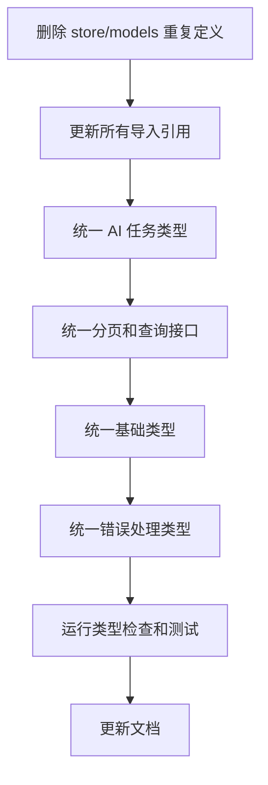

# 项目类型定义统一性分析报告

## 概述

本报告分析了 SKER 项目中各包的类型定义情况，识别出多处类型不统一和重复定义的问题。这些问题影响代码维护性、类型安全性和开发效率。

## 项目结构概览

项目包含以下主要包：
- `@sker/models` - 统一数据模型包（应该是唯一的类型定义源）
- `@sker/store` - 数据存储包
- `@sker/gateway` - API 网关包
- `@sker/engine` - AI 引擎包
- `@sker/broker` - 消息代理包
- `@sker/plugin-sdk` - 插件 SDK 包

## 严重问题分析

### 1. 🔴 核心模型类型完全重复

**问题描述：** `@sker/models` 和 `@sker/store/models` 几乎完全重复定义了相同的类型。

**重复类型列表：**
- `User` 接口 (packages/models/src/index.ts:2 ↔ packages/store/src/models/index.ts:2)
- `Project` 接口 (packages/models/src/index.ts:32 ↔ packages/store/src/models/index.ts:32)
- `Node` 接口 (packages/models/src/index.ts:80 ↔ packages/store/src/models/index.ts:80)
- `AITask` 接口 (packages/models/src/index.ts:212 ↔ packages/store/src/models/index.ts:192)
- `Connection`、`NodeVersion`、`ProjectCollaborator` 等所有核心类型

**影响：**
- 🛠️ 维护困难：修改一处需要同步修改另一处
- ⚠️ 版本不一致风险：已发现 `ValidationError` 构造函数参数不同
- 🔄 依赖混乱：其他包不知道应该导入哪个版本

**建议：** 立即删除 `packages/store/src/models/index.ts`，让 store 包直接使用 `@sker/models`

### 2. 🟡 AI任务类型各自为政

**问题描述：** AI相关类型在多个包中有不同的定义和命名约定。

**包对比：**

| 包 | 接口名称 | 任务类型枚举 | 位置 |
|---|---|---|---|
| engine | `AITaskRequest`, `AITaskResult` | 'generate' \| 'optimize' \| 'fusion' \| 'expand' \| 'analyze' | packages/engine/src/types/index.ts |
| gateway | `AIGenerateRequest`, `AIGenerateResponse` | 'generate' \| 'optimize' \| 'fusion' | packages/gateway/src/types/ApiTypes.ts |
| models | `UnifiedAITaskMessage`, `UnifiedAIResultMessage` | 'generate' \| 'optimize' \| 'fusion' \| 'analyze' \| 'expand' | packages/models/src/messaging/AITaskTypes.ts |
| broker | 正确使用 `@sker/models` 但添加类型别名 | 从 models 导入 | packages/broker/src/types/AITypes.ts |

**建议：** 所有包统一使用 `@sker/models` 中的 `UnifiedAITaskMessage` 系列类型

### 3. 🟡 分页和查询类型不统一

**问题对比：**

**@sker/models:**
```typescript
interface PaginatedResult<T> {
  data: T[]
  pagination: {
    total: number
    page: number
    limit: number
    totalPages: number
    hasNext: boolean
    hasPrev: boolean
  }
}

interface QueryOptions {
  orderDirection?: 'ASC' | 'DESC'
}
```

**@sker/gateway:**
```typescript
interface PaginatedResponse<T> {
  items: T[]
  total: number
  page: number
  pageSize: number
  hasNext: boolean
  hasPrev: boolean
}

interface PaginationParams {
  sortOrder?: 'asc' | 'desc'
}
```

**建议：** 统一使用 `@sker/models` 中的分页接口

### 4. 🟡 基础类型重复定义

**Position 和 Size 接口重复位置：**
- packages/models/src/index.ts:104-112
- packages/plugin-sdk/src/types/index.ts:92-103
- packages/store/src/models/index.ts:103-111

**建议：** plugin-sdk 应该导入 `@sker/models` 的基础类型

### 5. 🟡 错误类型不统一

**错误处理类型分散定义：**
- `@sker/models`: `DatabaseError`, `ValidationError`, `NotFoundError`, `UnauthorizedError`
- `@sker/gateway`: `ApiError` 接口
- `@sker/engine`: `AIEngineError`, `ErrorDetails`

**问题：** models 和 store 中的 `ValidationError` 构造函数签名不同

**建议：** 统一使用 `@sker/models` 中的错误类型

## 正确实践示例

✅ **packages/broker/src/types/AITypes.ts** 正确地从 `@sker/models` 导入统一类型：

```typescript
import type {
  UnifiedAITaskMessage,
  UnifiedAITaskType,
  TaskPriority,
  // ... 其他类型
} from '@sker/models'
```

## 立即行动建议

### 🎯 高优先级（立即执行）

1. **删除重复的核心模型**
   ```bash
   # 删除重复文件
   rm packages/store/src/models/index.ts

   # 更新 store 包的导入
   # 将所有 './models' 导入改为 '@sker/models'
   ```

2. **统一 AI 任务类型**
   - engine 包：删除本地 AI 类型定义，使用 `@sker/models`
   - gateway 包：替换 `AIGenerateRequest` 为 `UnifiedAITaskMessage`
   - 删除 broker 包中的类型别名（保持直接导入）

### 🎯 中优先级（本周内完成）

3. **统一分页接口**
   - 更新 gateway API 使用 `PaginatedResult<T>`
   - 统一查询参数命名约定

4. **统一基础类型**
   - plugin-sdk 导入 `@sker/models` 的 `Position` 和 `Size`
   - 删除重复定义

5. **统一错误处理**
   - 所有包使用 `@sker/models` 的错误类型
   - 修复 `ValidationError` 构造函数不一致问题

## 长期收益

实施这些统一化改造将带来：

1. **🛡️ 类型安全**：避免不兼容类型定义导致的运行时错误
2. **⚡ 开发效率**：开发者只需了解一套类型系统
3. **💰 维护成本**：模型定义修改只需在一处进行
4. **📚 文档一致性**：API 文档和类型定义保持同步
5. **🔧 重构安全**：TypeScript 编译器能准确检测变更影响

## 实施路径



## 风险评估

- **低风险**：删除 store 重复模型（只是删除重复代码）
- **中风险**：AI 任务类型统一（需要更新多个包的接口）
- **低风险**：基础类型统一（简单的导入替换）

建议分阶段实施，每个阶段完成后运行完整的类型检查和测试。

---

**报告生成时间：** 2025-09-30
**分析覆盖范围：** 所有 packages 目录下的 TypeScript 类型定义
**建议执行期限：** 2 周内完成高优先级项目，1 个月内完成所有统一化工作