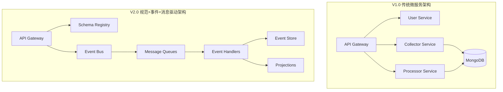
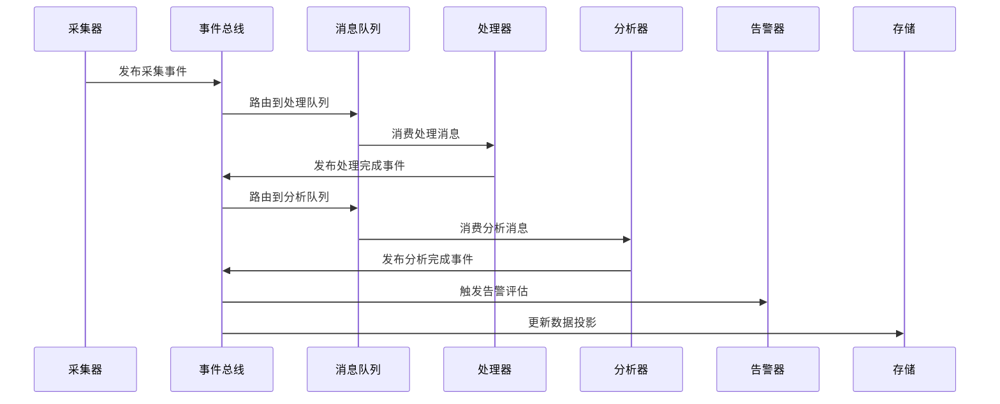
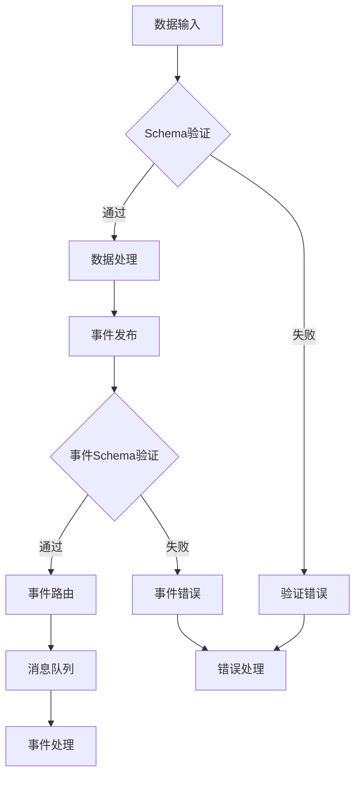

# 舆情监测系统 V2.0 - 规范驱动+事件驱动+消息队列架构

## 1. 架构概述

基于现有舆情监测系统，升级为"规范驱动+事件驱动+消息队列"的现代化架构，提升系统的可扩展性、可维护性和性能表现。

### 1.1 设计目标

- **规范驱动**: 通过Schema优先确保数据一致性和类型安全
- **事件驱动**: 实现服务间松耦合和异步处理
- **消息队列**: 提供可靠的异步通信和流量削峰
- **高可用**: 系统可用性达到99.9%以上
- **高性能**: 支持每秒万级舆情数据处理

### 1.2 架构演进



## 2. 核心架构组件

### 2.1 规范驱动层

```typescript
// 规范驱动架构核心
interface SchemaContext {
  registry: SchemaRegistry;      // Schema注册中心
  validator: SchemaValidator;    // 运行时验证
  generator: TypeGenerator;      // 类型生成器
  migrator: SchemaMigrator;     // Schema迁移
}

// 事件驱动架构核心
interface EventContext {
  eventBus: EventBus;           // 事件总线
  eventStore: EventStore;       // 事件存储
  eventRouter: EventRouter;     // 事件路由
  projections: ProjectionManager; // 投影管理
}

// 消息队列架构核心
interface MessageContext {
  queueManager: QueueManager;   // 队列管理
  messageRouter: MessageRouter; // 消息路由
  retryHandler: RetryHandler;   // 重试处理
  deadLetter: DeadLetterQueue;  // 死信队列
}
```

### 2.2 整体架构图

```
┌─────────────────────────────────────────────────────────────────┐
│                           用户层                                 │
│  ┌─────────────┐  ┌─────────────┐  ┌─────────────┐              │
│  │   Web 端    │  │   移动端    │  │    API     │              │
│  └─────────────┘  └─────────────┘  └─────────────┘              │
└─────────────────────────────────────────────────────────────────┘
                              │
┌─────────────────────────────────────────────────────────────────┐
│                         网关层                                   │
│  ┌─────────────┐  ┌─────────────┐  ┌─────────────┐              │
│  │ API Gateway │  │ 负载均衡器  │  │ 限流熔断器  │              │
│  └─────────────┘  └─────────────┘  └─────────────┘              │
└─────────────────────────────────────────────────────────────────┘
                              │
┌─────────────────────────────────────────────────────────────────┐
│                       规范驱动层                                 │
│  ┌─────────────┐  ┌─────────────┐  ┌─────────────┐              │
│  │Schema Registry│ │Schema Validator│ │Type Generator│           │
│  └─────────────┘  └─────────────┘  └─────────────┘              │
└─────────────────────────────────────────────────────────────────┘
                              │
┌─────────────────────────────────────────────────────────────────┐
│                       事件驱动层                                 │
│  ┌─────────────┐  ┌─────────────┐  ┌─────────────┐              │
│  │  Event Bus  │  │ Event Store │  │Event Router │              │
│  └─────────────┘  └─────────────┘  └─────────────┘              │
└─────────────────────────────────────────────────────────────────┘
                              │
┌─────────────────────────────────────────────────────────────────┐
│                       消息队列层                                 │
│  ┌─────────────┐  ┌─────────────┐  ┌─────────────┐              │
│  │  RabbitMQ   │  │    Kafka    │  │    Redis    │              │
│  └─────────────┘  └─────────────┘  └─────────────┘              │
└─────────────────────────────────────────────────────────────────┘
                              │
┌─────────────────────────────────────────────────────────────────┐
│                        业务服务层                                │
│  ┌─────────────┐  ┌─────────────┐  ┌─────────────┐              │
│  │  采集服务   │  │  处理服务   │  │  分析服务   │              │
│  └─────────────┘  └─────────────┘  └─────────────┘              │
│  ┌─────────────┐  ┌─────────────┐  ┌─────────────┐              │
│  │  告警服务   │  │  用户服务   │  │  展示服务   │              │
│  └─────────────┘  └─────────────┘  └─────────────┘              │
└─────────────────────────────────────────────────────────────────┘
                              │
┌─────────────────────────────────────────────────────────────────┐
│                         数据层                                   │
│  ┌─────────────┐  ┌─────────────┐  ┌─────────────┐              │
│  │ PostgreSQL  │  │  MongoDB    │  │    Redis    │              │
│  └─────────────┘  └─────────────┘  └─────────────┘              │
│  ┌─────────────┐  ┌─────────────┐  ┌─────────────┐              │
│  │ Event Store │  │Elasticsearch│  │   InfluxDB  │              │
│  └─────────────┘  └─────────────┘  └─────────────┘              │
└─────────────────────────────────────────────────────────────────┘
```

## 3. 数据流转架构

### 3.1 事件驱动数据流



### 3.2 Schema验证流程



## 4. 业务事件模型

### 4.1 事件分类体系

```typescript
// 领域事件
export enum DomainEvents {
  // 舆情采集域
  SENTIMENT_DISCOVERED = 'sentiment.discovered',
  SENTIMENT_COLLECTED = 'sentiment.collected',
  SENTIMENT_VALIDATED = 'sentiment.validated',

  // 舆情处理域
  SENTIMENT_PROCESSED = 'sentiment.processed',
  SENTIMENT_CLEANED = 'sentiment.cleaned',
  SENTIMENT_ENRICHED = 'sentiment.enriched',

  // 舆情分析域
  SENTIMENT_ANALYZED = 'sentiment.analyzed',
  SENTIMENT_CLASSIFIED = 'sentiment.classified',
  SENTIMENT_SCORED = 'sentiment.scored',

  // 告警域
  ALERT_RULE_TRIGGERED = 'alert.rule_triggered',
  ALERT_ESCALATED = 'alert.escalated',
  ALERT_RESOLVED = 'alert.resolved',

  // 用户域
  USER_LOGGED_IN = 'user.logged_in',
  USER_PERMISSION_CHANGED = 'user.permission_changed'
}

// 集成事件
export enum IntegrationEvents {
  EXTERNAL_API_CALLED = 'integration.api_called',
  EXTERNAL_DATA_RECEIVED = 'integration.data_received',
  WEBHOOK_RECEIVED = 'integration.webhook_received'
}

// 系统事件
export enum SystemEvents {
  SERVICE_STARTED = 'system.service_started',
  SERVICE_STOPPED = 'system.service_stopped',
  HEALTH_CHECK_FAILED = 'system.health_check_failed',
  PERFORMANCE_THRESHOLD_EXCEEDED = 'system.performance_threshold_exceeded'
}
```

### 4.2 事件生命周期

```typescript
interface EventLifecycle {
  created: Date;      // 事件创建时间
  published: Date;    // 事件发布时间
  routed: Date;       // 事件路由时间
  processed: Date;    // 事件处理时间
  completed: Date;    // 事件完成时间
  ttl: number;        // 事件生存时间
  retryCount: number; // 重试次数
  status: 'pending' | 'processing' | 'completed' | 'failed';
}
```

## 5. 消息队列拓扑

### 5.1 RabbitMQ 交换机和队列设计

```
# 主要交换机
sentiment.events (topic)
├── sentiment.collected → sentiment.processing.queue
├── sentiment.processed → sentiment.analysis.queue
└── sentiment.analyzed → [
    sentiment.storage.queue,
    alert.evaluation.queue,
    search.indexing.queue
]

alert.events (topic)
├── alert.triggered → [
    alert.notification.queue,
    alert.escalation.queue
]
└── alert.resolved → alert.cleanup.queue

system.events (fanout)
└── all.events → [
    monitoring.queue,
    audit.queue,
    metrics.queue
]

# 死信交换机
sentiment.dlx (direct)
alert.dlx (direct)
system.dlx (direct)
```

### 5.2 Kafka 主题设计

```yaml
# 高吞吐量数据流
topics:
  - name: raw-sentiment-data
    partitions: 12
    replication: 3
    retention: 7d

  - name: processed-sentiment-data
    partitions: 8
    replication: 3
    retention: 30d

  - name: real-time-analytics
    partitions: 4
    replication: 3
    retention: 1d

  - name: search-indexing
    partitions: 6
    replication: 3
    retention: 3d
```

## 6. 服务重构方案

### 6.1 采集服务重构

```typescript
// 原有同步处理
class CollectorServiceV1 {
  async collectData(source: string): Promise<void> {
    const data = await this.scrapeData(source);
    const cleanData = await this.cleanData(data);
    const processedData = await this.processData(cleanData);
    await this.saveData(processedData);
    await this.notifyComplete(processedData.id);
  }
}

// 新事件驱动处理
class CollectorServiceV2 {
  async collectData(source: string): Promise<void> {
    const data = await this.scrapeData(source);

    // 立即发布采集事件
    await eventBus.publish({
      type: DomainEvents.SENTIMENT_COLLECTED,
      data: { source, rawData: data },
      correlationId: generateTraceId()
    });

    // 后续处理通过事件驱动
  }

  @EventHandler(DomainEvents.SENTIMENT_COLLECTED)
  async handleCollected(event: Event): Promise<void> {
    const { rawData } = event.data;
    const validatedData = await this.validateData(rawData);

    await eventBus.publish({
      type: DomainEvents.SENTIMENT_VALIDATED,
      data: validatedData,
      correlationId: event.correlationId,
      causationId: event.id
    });
  }
}
```

### 6.2 处理服务重构

```typescript
class ProcessorServiceV2 {
  @EventHandler(DomainEvents.SENTIMENT_VALIDATED)
  async handleValidated(event: Event): Promise<void> {
    const data = event.data;

    // 并行处理多个步骤
    const [cleanedData, enrichedData] = await Promise.all([
      this.cleanData(data),
      this.enrichData(data)
    ]);

    // 发布处理完成事件
    await eventBus.publish({
      type: DomainEvents.SENTIMENT_PROCESSED,
      data: { ...cleanedData, ...enrichedData },
      correlationId: event.correlationId,
      causationId: event.id
    });
  }

  @EventHandler(DomainEvents.SENTIMENT_PROCESSED)
  async handleProcessed(event: Event): Promise<void> {
    // 触发分析流程
    await queueManager.publishToQueue('sentiment.analysis', {
      id: generateId(),
      type: 'analysis.request',
      payload: event.data,
      correlationId: event.correlationId
    });
  }
}
```

### 6.3 分析服务重构

```typescript
class AnalysisServiceV2 {
  async handleAnalysisRequest(message: Message): Promise<void> {
    const data = message.payload;

    // 并行执行多种分析
    const [sentiment, keywords, category, entities] = await Promise.all([
      this.analyzeSentiment(data.content),
      this.extractKeywords(data.content),
      this.classifyCategory(data.content),
      this.extractEntities(data.content)
    ]);

    const analysisResult = {
      ...data,
      sentiment,
      keywords,
      category,
      entities,
      analyzedAt: new Date()
    };

    // 发布分析完成事件
    await eventBus.publish({
      type: DomainEvents.SENTIMENT_ANALYZED,
      data: analysisResult,
      correlationId: message.correlationId
    });
  }

  @EventHandler(DomainEvents.SENTIMENT_ANALYZED)
  async handleAnalyzed(event: Event): Promise<void> {
    const data = event.data;

    // 根据分析结果路由到不同的后续处理
    if (data.sentiment.label === 'negative' && data.sentiment.score < -0.7) {
      // 负面情感，触发告警评估
      await queueManager.publishToQueue('alert.evaluation', {
        id: generateId(),
        type: 'alert.evaluate',
        payload: data,
        priority: MessagePriority.HIGH
      });
    }

    // 存储到搜索引擎
    await queueManager.publishToQueue('search.indexing', {
      id: generateId(),
      type: 'search.index',
      payload: data
    });

    // 更新实时统计
    await this.updateRealTimeStats(data);
  }
}
```

## 7. 投影和视图管理

### 7.1 实时统计投影

```typescript
class RealTimeStatsProjection {
  @EventHandler(DomainEvents.SENTIMENT_ANALYZED)
  async updateStats(event: Event): Promise<void> {
    const data = event.data;
    const timeWindow = this.getTimeWindow(Date.now());

    // 更新Redis中的实时统计
    const pipeline = redis.pipeline();

    // 按情感统计
    pipeline.hincrby(`stats:sentiment:${timeWindow}`, data.sentiment.label, 1);

    // 按平台统计
    pipeline.hincrby(`stats:platform:${timeWindow}`, data.platform, 1);

    // 按关键词统计 (Top 100)
    for (const keyword of data.keywords.slice(0, 5)) {
      pipeline.zincrby(`stats:keywords:${timeWindow}`, 1, keyword);
    }

    // 设置过期时间
    pipeline.expire(`stats:sentiment:${timeWindow}`, 3600);
    pipeline.expire(`stats:platform:${timeWindow}`, 3600);
    pipeline.expire(`stats:keywords:${timeWindow}`, 3600);

    await pipeline.exec();
  }

  private getTimeWindow(timestamp: number): string {
    // 按小时分组
    const date = new Date(timestamp);
    return `${date.getFullYear()}-${date.getMonth() + 1}-${date.getDate()}-${date.getHours()}`;
  }
}
```

### 7.2 搜索索引投影

```typescript
class SearchIndexProjection {
  @EventHandler(DomainEvents.SENTIMENT_ANALYZED)
  async indexDocument(event: Event): Promise<void> {
    const data = event.data;

    const document = {
      id: data.id,
      content: data.content,
      source: data.source,
      platform: data.platform,
      publishTime: data.publishTime,
      sentiment: {
        label: data.sentiment.label,
        score: data.sentiment.score,
        confidence: data.sentiment.confidence
      },
      keywords: data.keywords,
      category: data.category,
      entities: data.entities,
      indexedAt: new Date()
    };

    await elasticsearchClient.index({
      index: 'sentiments',
      id: data.id,
      body: document
    });

    console.log(`Document ${data.id} indexed successfully`);
  }

  @EventHandler('sentiment.deleted')
  async removeDocument(event: Event): Promise<void> {
    await elasticsearchClient.delete({
      index: 'sentiments',
      id: event.data.id
    });
  }
}
```

## 8. 监控和可观测性

### 8.1 分布式链路追踪

```typescript
class DistributedTracing {
  private tracer: Tracer;

  constructor() {
    this.tracer = opentelemetry.trace.getTracer('sentiment-monitor');
  }

  async traceEvent(event: Event, handler: () => Promise<void>): Promise<void> {
    const span = this.tracer.startSpan(`event.${event.type}`);

    span.setAttributes({
      'event.id': event.id,
      'event.type': event.type,
      'event.source': event.source,
      'correlation.id': event.correlationId || '',
      'causation.id': event.causationId || ''
    });

    try {
      await opentelemetry.context.with(
        opentelemetry.trace.setSpan(opentelemetry.context.active(), span),
        handler
      );
      span.setStatus({ code: opentelemetry.SpanStatusCode.OK });
    } catch (error) {
      span.recordException(error);
      span.setStatus({
        code: opentelemetry.SpanStatusCode.ERROR,
        message: error.message
      });
      throw error;
    } finally {
      span.end();
    }
  }
}
```

### 8.2 业务指标监控

```typescript
class BusinessMetrics {
  @EventHandler(DomainEvents.SENTIMENT_ANALYZED)
  async recordSentimentMetrics(event: Event): Promise<void> {
    const data = event.data;

    // 情感分布指标
    metricsClient.increment('sentiment.analyzed.total', {
      platform: data.platform,
      sentiment: data.sentiment.label
    });

    // 处理延迟指标
    const processingTime = Date.now() - new Date(data.collectedAt).getTime();
    metricsClient.histogram('sentiment.processing.duration', processingTime, {
      platform: data.platform
    });

    // 情感分数分布
    metricsClient.histogram('sentiment.score.distribution', data.sentiment.score, {
      platform: data.platform,
      label: data.sentiment.label
    });
  }

  @EventHandler('alert.triggered')
  async recordAlertMetrics(event: Event): Promise<void> {
    const data = event.data;

    metricsClient.increment('alerts.triggered.total', {
      severity: data.severity,
      type: data.alertType
    });

    // 告警响应时间
    if (data.detectedAt && data.triggeredAt) {
      const responseTime = new Date(data.triggeredAt).getTime() - new Date(data.detectedAt).getTime();
      metricsClient.histogram('alerts.response.time', responseTime, {
        severity: data.severity
      });
    }
  }
}
```

## 9. 性能优化策略

### 9.1 事件批处理

```typescript
class EventBatchProcessor {
  private batchSize = 50;
  private batchTimeout = 1000; // 1秒
  private batches = new Map<string, Event[]>();

  async processBatch(events: Event[]): Promise<void> {
    // 按事件类型分组批处理
    const eventGroups = this.groupByType(events);

    for (const [type, groupEvents] of eventGroups) {
      switch (type) {
        case DomainEvents.SENTIMENT_ANALYZED:
          await this.batchUpdateSearchIndex(groupEvents);
          await this.batchUpdateStats(groupEvents);
          break;

        case 'alert.notification':
          await this.batchSendNotifications(groupEvents);
          break;

        default:
          // 单独处理
          for (const event of groupEvents) {
            await eventBus.handleLocal(event);
          }
      }
    }
  }

  private async batchUpdateSearchIndex(events: Event[]): Promise<void> {
    const operations = events.flatMap(event => [
      { index: { _index: 'sentiments', _id: event.data.id } },
      this.transformToSearchDocument(event.data)
    ]);

    await elasticsearchClient.bulk({ body: operations });
  }

  private async batchSendNotifications(events: Event[]): Promise<void> {
    const notifications = events.map(event => ({
      to: event.data.recipients,
      subject: event.data.subject,
      body: event.data.body
    }));

    await notificationService.sendBatch(notifications);
  }
}
```

### 9.2 智能缓存策略

```typescript
class IntelligentCache {
  private l1Cache = new LRUCache<string, any>({ max: 1000 }); // 内存缓存
  private l2Cache: Redis; // Redis缓存

  async get(key: string, fetcher: () => Promise<any>): Promise<any> {
    // L1 缓存
    let value = this.l1Cache.get(key);
    if (value) {
      return value;
    }

    // L2 缓存
    const cached = await this.l2Cache.get(key);
    if (cached) {
      value = JSON.parse(cached);
      this.l1Cache.set(key, value);
      return value;
    }

    // 源数据
    value = await fetcher();
    if (value) {
      // 异步更新缓存
      setImmediate(() => {
        this.l1Cache.set(key, value);
        this.l2Cache.setex(key, this.getTTL(key), JSON.stringify(value));
      });
    }

    return value;
  }

  private getTTL(key: string): number {
    // 根据key类型确定TTL
    if (key.startsWith('stats:')) return 300; // 5分钟
    if (key.startsWith('user:')) return 1800; // 30分钟
    if (key.startsWith('config:')) return 3600; // 1小时
    return 600; // 默认10分钟
  }
}
```

## 10. 部署和运维

### 10.1 Docker Compose 配置

```yaml
version: '3.8'

services:
  # 规范注册中心
  schema-registry:
    build: ./services/schema-registry
    ports:
      - "8081:8081"
    environment:
      - REDIS_URL=redis://redis:6379
    depends_on:
      - redis

  # 事件总线
  event-bus:
    build: ./services/event-bus
    ports:
      - "8082:8082"
    environment:
      - RABBITMQ_URL=amqp://rabbitmq:5672
      - MONGODB_URL=mongodb://mongodb:27017
    depends_on:
      - rabbitmq
      - mongodb

  # 消息队列
  rabbitmq:
    image: rabbitmq:3-management-alpine
    ports:
      - "5672:5672"
      - "15672:15672"
    environment:
      - RABBITMQ_DEFAULT_USER=admin
      - RABBITMQ_DEFAULT_PASS=password
    volumes:
      - ./config/rabbitmq.conf:/etc/rabbitmq/rabbitmq.conf

  kafka:
    image: confluentinc/cp-kafka:latest
    ports:
      - "9092:9092"
    environment:
      - KAFKA_BROKER_ID=1
      - KAFKA_ZOOKEEPER_CONNECT=zookeeper:2181
      - KAFKA_ADVERTISED_LISTENERS=PLAINTEXT://localhost:9092
    depends_on:
      - zookeeper

  # 业务服务
  collector-service:
    build: ./services/collector
    environment:
      - EVENT_BUS_URL=http://event-bus:8082
      - SCHEMA_REGISTRY_URL=http://schema-registry:8081
    depends_on:
      - event-bus
      - schema-registry

  processor-service:
    build: ./services/processor
    environment:
      - EVENT_BUS_URL=http://event-bus:8082
      - RABBITMQ_URL=amqp://rabbitmq:5672
    depends_on:
      - event-bus
      - rabbitmq

  analysis-service:
    build: ./services/analysis
    environment:
      - KAFKA_BROKERS=kafka:9092
      - EVENT_BUS_URL=http://event-bus:8082
    depends_on:
      - kafka
      - event-bus

  # 监控服务
  prometheus:
    image: prom/prometheus
    ports:
      - "9090:9090"
    volumes:
      - ./config/prometheus.yml:/etc/prometheus/prometheus.yml

  grafana:
    image: grafana/grafana
    ports:
      - "3000:3000"
    environment:
      - GF_SECURITY_ADMIN_PASSWORD=admin
    depends_on:
      - prometheus

  jaeger:
    image: jaegertracing/all-in-one
    ports:
      - "16686:16686"
      - "14268:14268"
```

### 10.2 Kubernetes 部署配置

```yaml
# 事件总线部署
apiVersion: apps/v1
kind: Deployment
metadata:
  name: event-bus
spec:
  replicas: 3
  selector:
    matchLabels:
      app: event-bus
  template:
    metadata:
      labels:
        app: event-bus
    spec:
      containers:
      - name: event-bus
        image: sentiment-monitor/event-bus:latest
        ports:
        - containerPort: 8082
        env:
        - name: RABBITMQ_URL
          valueFrom:
            secretKeyRef:
              name: message-queue-secrets
              key: rabbitmq-url
        - name: MONGODB_URL
          valueFrom:
            secretKeyRef:
              name: database-secrets
              key: mongodb-url
        resources:
          requests:
            memory: "512Mi"
            cpu: "250m"
          limits:
            memory: "1Gi"
            cpu: "500m"
        livenessProbe:
          httpGet:
            path: /health
            port: 8082
          initialDelaySeconds: 30
          periodSeconds: 10
---
apiVersion: v1
kind: Service
metadata:
  name: event-bus-service
spec:
  selector:
    app: event-bus
  ports:
  - port: 8082
    targetPort: 8082
```

## 11. 迁移策略

### 11.1 渐进式迁移

```typescript
// 阶段1: 双写模式
class HybridCollectorService {
  async collectData(source: string): Promise<void> {
    const data = await this.scrapeData(source);

    // 旧流程
    await this.legacyProcess(data);

    // 新流程（并行执行，不影响主流程）
    try {
      await eventBus.publish({
        type: DomainEvents.SENTIMENT_COLLECTED,
        data: { source, rawData: data }
      });
    } catch (error) {
      console.error('New event flow failed:', error);
      // 不影响主流程
    }
  }
}

// 阶段2: 读取切换
class MigrationReadService {
  async getSentiments(query: any): Promise<any> {
    const useNewStack = await this.shouldUseNewStack(query);

    if (useNewStack) {
      return await this.newDataAccess.getSentiments(query);
    } else {
      return await this.legacyDataAccess.getSentiments(query);
    }
  }

  private async shouldUseNewStack(query: any): Promise<boolean> {
    // 基于特性开关决定
    const featureFlag = await this.featureFlagService.isEnabled('new-data-stack');
    return featureFlag && this.isQuerySupported(query);
  }
}

// 阶段3: 完全切换
class NewCollectorService {
  async collectData(source: string): Promise<void> {
    const data = await this.scrapeData(source);

    await eventBus.publish({
      type: DomainEvents.SENTIMENT_COLLECTED,
      data: { source, rawData: data }
    });

    // 旧流程已移除
  }
}
```

### 11.2 数据一致性保证

```typescript
class DataConsistencyChecker {
  async validateMigration(): Promise<void> {
    const results = await Promise.all([
      this.compareCounts(),
      this.compareLatestRecords(),
      this.compareAggregations()
    ]);

    if (results.some(r => !r.consistent)) {
      throw new Error('Data migration validation failed');
    }
  }

  private async compareCounts(): Promise<{ consistent: boolean, details: any }> {
    const [legacyCount, newCount] = await Promise.all([
      this.legacyDB.countSentiments(),
      this.newDB.countSentiments()
    ]);

    return {
      consistent: Math.abs(legacyCount - newCount) <= 100, // 允许小差异
      details: { legacyCount, newCount, diff: legacyCount - newCount }
    };
  }

  private async compareLatestRecords(): Promise<{ consistent: boolean, details: any }> {
    const [legacyRecords, newRecords] = await Promise.all([
      this.legacyDB.getLatestSentiments(1000),
      this.newDB.getLatestSentiments(1000)
    ]);

    const legacyIds = new Set(legacyRecords.map(r => r.id));
    const newIds = new Set(newRecords.map(r => r.id));

    const missing = legacyRecords.filter(r => !newIds.has(r.id));
    const extra = newRecords.filter(r => !legacyIds.has(r.id));

    return {
      consistent: missing.length === 0 && extra.length === 0,
      details: { missing: missing.length, extra: extra.length }
    };
  }
}
```

## 12. 性能基准和监控

### 12.1 关键性能指标

```typescript
interface PerformanceMetrics {
  // 事件处理性能
  eventThroughput: number;        // 事件/秒
  eventLatency: number;           // 事件处理延迟(ms)
  eventErrorRate: number;         // 事件错误率

  // 消息队列性能
  messageQueueDepth: number;      // 队列深度
  messageProcessingRate: number;  // 消息处理率
  messageRetryRate: number;       // 消息重试率

  // 业务处理性能
  sentimentProcessingRate: number;  // 舆情处理率/秒
  analysisAccuracy: number;         // 分析准确率
  alertResponseTime: number;        // 告警响应时间

  // 系统资源
  cpuUsage: number;               // CPU使用率
  memoryUsage: number;            // 内存使用率
  diskIO: number;                 // 磁盘IO
  networkIO: number;              // 网络IO
}
```

### 12.2 性能监控面板

```typescript
class PerformanceDashboard {
  async getMetrics(): Promise<PerformanceMetrics> {
    const [eventMetrics, queueMetrics, businessMetrics, systemMetrics] = await Promise.all([
      this.getEventMetrics(),
      this.getQueueMetrics(),
      this.getBusinessMetrics(),
      this.getSystemMetrics()
    ]);

    return {
      ...eventMetrics,
      ...queueMetrics,
      ...businessMetrics,
      ...systemMetrics
    };
  }

  private async getEventMetrics(): Promise<Partial<PerformanceMetrics>> {
    const metrics = await prometheusClient.query([
      'rate(events_processed_total[5m])',
      'histogram_quantile(0.95, rate(event_processing_duration_seconds_bucket[5m]))',
      'rate(events_failed_total[5m]) / rate(events_processed_total[5m])'
    ]);

    return {
      eventThroughput: metrics[0].value,
      eventLatency: metrics[1].value * 1000,
      eventErrorRate: metrics[2].value
    };
  }
}
```

## 13. 总结

通过"规范驱动+事件驱动+消息队列"的架构升级，舆情监测系统实现了：

### 13.1 架构优势

1. **规范驱动**
   - 数据一致性和类型安全
   - 自动化代码生成和文档
   - 向后兼容的Schema演进

2. **事件驱动**
   - 服务间松耦合
   - 异步处理提升性能
   - 业务事件溯源和重放

3. **消息队列**
   - 可靠的异步通信
   - 流量削峰和负载均衡
   - 故障隔离和重试机制

### 13.2 技术收益

- **可扩展性**: 支持水平扩展和微服务独立部署
- **可靠性**: 事件存储、消息持久化、故障恢复
- **可观测性**: 分布式链路追踪、业务指标监控
- **可维护性**: Schema驱动的代码生成、事件版本管理

### 13.3 业务价值

- **处理能力**: 从千级提升到万级事件处理
- **响应时间**: 实时事件处理和告警响应
- **数据质量**: Schema验证确保数据准确性
- **运维效率**: 自动化监控和故障处理

这套架构为舆情监测系统提供了面向未来的技术基础，支持业务的快速发展和技术的持续演进。