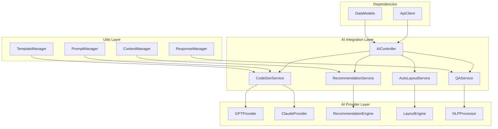

# @sker/ai-integration

> AI 集成与智能化服务 - 提供代码生成、智能推荐和自动化功能

## 📋 概述

@sker/ai-integration 是一个专为低代码平台设计的 AI 集成服务包，提供代码智能生成、组件推荐、自动布局、智能问答等功能。它集成了多种 AI 服务，为用户提供智能化的开发体验。

### 为什么这么设计？

1. **智能化需求**：现代低代码平台需要 AI 辅助来提高开发效率
2. **代码生成**：通过 AI 自动生成组件代码，减少手工编码
3. **智能推荐**：基于用户行为和项目上下文推荐合适的组件和配置
4. **自动化布局**：AI 辅助进行界面布局优化和调整
5. **多模型支持**：支持多种 AI 模型，提供不同能力的智能服务
6. **可扩展性**：提供插件机制，便于集成新的 AI 服务

## 🏗️ 架构设计



## 🚀 核心功能

### 1. 代码生成服务
- **组件代码生成**：基于描述自动生成组件代码
- **样式生成**：AI 辅助生成 CSS 样式
- **逻辑生成**：生成业务逻辑和事件处理代码
- **测试代码生成**：自动生成单元测试代码

### 2. 智能推荐服务
- **组件推荐**：基于上下文推荐合适的组件
- **属性推荐**：推荐组件的最佳属性配置
- **样式推荐**：推荐设计风格和配色方案
- **布局推荐**：推荐页面布局和结构

### 3. 自动布局服务
- **智能排列**：AI 辅助组件自动排列
- **响应式布局**：自动生成响应式设计
- **对齐优化**：智能对齐和间距调整
- **布局分析**：分析并优化现有布局

### 4. 智能问答服务
- **开发助手**：回答开发相关问题
- **代码解释**：解释代码功能和逻辑
- **错误诊断**：帮助诊断和解决错误
- **最佳实践**：提供开发最佳实践建议

## 📦 安装

```bash
npm install @sker/ai-integration
```

## 🔧 基础用法

### 代码生成

```typescript
import { CodeGenService, PromptManager } from '@sker/ai-integration';
import { ComponentModel } from '@sker/data-models';

// 初始化代码生成服务
const codeGenService = new CodeGenService({
  provider: 'gpt-4',
  apiKey: process.env.OPENAI_API_KEY,
  temperature: 0.7,
  maxTokens: 2000
});

// 生成组件代码
const generateComponent = async () => {
  const prompt = PromptManager.createComponentPrompt({
    description: '创建一个带有搜索功能的用户列表组件',
    framework: 'react',
    style: 'tailwind',
    features: ['search', 'pagination', 'loading']
  });
  
  const result = await codeGenService.generateComponent(prompt);
  
  console.log('生成的组件代码:', result.code);
  console.log('组件属性:', result.props);
  console.log('样式代码:', result.styles);
  
  return result;
};

// 生成样式代码
const generateStyles = async (component: ComponentModel) => {
  const stylePrompt = PromptManager.createStylePrompt({
    component,
    theme: 'modern',
    colorScheme: 'blue',
    responsive: true
  });
  
  const styles = await codeGenService.generateStyles(stylePrompt);
  
  return styles;
};
```

### 智能推荐

```typescript
import { RecommendationService, ContextManager } from '@sker/ai-integration';

const recommendationService = new RecommendationService({
  model: 'recommendation-v2',
  contextWindow: 100
});

// 组件推荐
const getComponentRecommendations = async (context: any) => {
  const contextData = ContextManager.buildContext({
    currentPage: context.page,
    userBehavior: context.userActions,
    projectType: context.project.type,
    existingComponents: context.components
  });
  
  const recommendations = await recommendationService.recommendComponents({
    context: contextData,
    position: context.dropPosition,
    limit: 5
  });
  
  recommendations.forEach(rec => {
    console.log(`推荐组件: ${rec.name} (相似度: ${rec.score})`);
    console.log(`推荐理由: ${rec.reason}`);
  });
  
  return recommendations;
};

// 属性推荐
const getPropertyRecommendations = async (component: ComponentModel) => {
  const propRecommendations = await recommendationService.recommendProperties({
    component,
    context: 'form-input',
    userPreferences: getUserPreferences()
  });
  
  return propRecommendations;
};
```

### 自动布局

```typescript
import { AutoLayoutService, LayoutEngine } from '@sker/ai-integration';

const autoLayoutService = new AutoLayoutService({
  algorithm: 'constraint-based',
  optimizeFor: 'usability' // 'usability' | 'aesthetic' | 'performance'
});

// 自动排列组件
const autoArrangeComponents = async (components: ComponentModel[]) => {
  const layoutSuggestions = await autoLayoutService.arrangeComponents({
    components,
    containerSize: { width: 1200, height: 800 },
    constraints: {
      minSpacing: 16,
      alignment: 'grid',
      responsive: true
    }
  });
  
  return layoutSuggestions;
};

// 响应式布局生成
const generateResponsiveLayout = async (components: ComponentModel[]) => {
  const responsiveLayout = await autoLayoutService.generateResponsiveLayout({
    components,
    breakpoints: ['mobile', 'tablet', 'desktop'],
    strategy: 'mobile-first'
  });
  
  return responsiveLayout;
};

// 布局优化
const optimizeLayout = async (currentLayout: any) => {
  const optimization = await autoLayoutService.optimizeLayout({
    layout: currentLayout,
    metrics: ['accessibility', 'visual-hierarchy', 'spacing'],
    targets: {
      accessibility: 0.9,
      visualHierarchy: 0.8,
      spacing: 0.85
    }
  });
  
  return optimization;
};
```

### 智能问答

```typescript
import { QAService, NLPProcessor } from '@sker/ai-integration';

const qaService = new QAService({
  model: 'gpt-4',
  knowledgeBase: 'lowcode-dev',
  language: 'zh-CN'
});

// 开发助手问答
const askDevelopmentQuestion = async (question: string, context?: any) => {
  const enhancedContext = {
    ...context,
    projectInfo: getCurrentProject(),
    userLevel: getUserSkillLevel(),
    recentActions: getRecentUserActions()
  };
  
  const answer = await qaService.askQuestion({
    question,
    context: enhancedContext,
    type: 'development'
  });
  
  console.log('问题:', question);
  console.log('回答:', answer.response);
  
  if (answer.codeExamples) {
    console.log('代码示例:');
    answer.codeExamples.forEach(example => {
      console.log(`- ${example.title}: ${example.code}`);
    });
  }
  
  return answer;
};

// 代码解释
const explainCode = async (code: string) => {
  const explanation = await qaService.explainCode({
    code,
    language: 'typescript',
    level: 'intermediate'
  });
  
  return explanation;
};

// 错误诊断
const diagnoseError = async (error: any, context: any) => {
  const diagnosis = await qaService.diagnoseError({
    error: error.message,
    stackTrace: error.stack,
    context: {
      component: context.component,
      props: context.props,
      environment: context.env
    }
  });
  
  return diagnosis;
};
```

## 🗂️ 项目结构

```
ai-integration/
├── src/
│   ├── services/
│   │   ├── CodeGenService.ts          # 代码生成服务
│   │   ├── RecommendationService.ts   # 推荐服务
│   │   ├── AutoLayoutService.ts       # 自动布局服务
│   │   └── QAService.ts               # 问答服务
│   ├── providers/
│   │   ├── GPTProvider.ts             # GPT 提供商
│   │   ├── ClaudeProvider.ts          # Claude 提供商
│   │   ├── GeminiProvider.ts          # Gemini 提供商
│   │   └── CustomProvider.ts          # 自定义提供商
│   ├── engines/
│   │   ├── RecommendationEngine.ts    # 推荐引擎
│   │   ├── LayoutEngine.ts            # 布局引擎
│   │   ├── NLPProcessor.ts            # 自然语言处理
│   │   └── CodeAnalyzer.ts            # 代码分析器
│   ├── managers/
│   │   ├── PromptManager.ts           # 提示词管理
│   │   ├── ContextManager.ts          # 上下文管理
│   │   ├── TemplateManager.ts         # 模板管理
│   │   └── ResponseManager.ts         # 响应管理
│   ├── utils/
│   │   ├── tokenizer.ts               # 分词器
│   │   ├── embedding.ts               # 向量嵌入
│   │   ├── similarity.ts              # 相似度计算
│   │   └── cache.ts                   # 缓存工具
│   ├── plugins/
│   │   ├── CustomAIPlugin.ts          # 自定义 AI 插件
│   │   ├── AnalyticsPlugin.ts         # 分析插件
│   │   └── LoggingPlugin.ts           # 日志插件
│   ├── types/
│   │   ├── ai.ts                      # AI 类型定义
│   │   ├── prompts.ts                 # 提示词类型
│   │   ├── recommendations.ts         # 推荐类型
│   │   └── layout.ts                  # 布局类型
│   └── constants/
│       ├── prompts.ts                 # 提示词常量
│       ├── models.ts                  # 模型常量
│       └── templates.ts               # 模板常量
├── tests/
│   ├── unit/                          # 单元测试
│   ├── integration/                   # 集成测试
│   └── e2e/                           # 端到端测试
├── prompts/                           # 提示词库
│   ├── component-generation/          # 组件生成提示词
│   ├── style-generation/              # 样式生成提示词
│   ├── recommendations/               # 推荐提示词
│   └── qa/                            # 问答提示词
└── docs/                              # 文档
```

## 🧪 测试策略

### 单元测试
```typescript
// tests/unit/CodeGenService.test.ts
import { CodeGenService } from '../../src/services/CodeGenService';
import { MockAIProvider } from '../mocks/MockAIProvider';

describe('CodeGenService', () => {
  let codeGenService: CodeGenService;
  let mockProvider: MockAIProvider;
  
  beforeEach(() => {
    mockProvider = new MockAIProvider();
    codeGenService = new CodeGenService({
      provider: mockProvider
    });
  });
  
  test('应该生成有效的组件代码', async () => {
    const prompt = {
      description: '创建一个按钮组件',
      framework: 'react',
      style: 'tailwind'
    };
    
    const result = await codeGenService.generateComponent(prompt);
    
    expect(result.code).toContain('function');
    expect(result.code).toContain('Button');
    expect(result.props).toBeDefined();
  });
  
  test('应该处理无效的提示词', async () => {
    const invalidPrompt = {
      description: '',
      framework: 'unknown'
    };
    
    await expect(
      codeGenService.generateComponent(invalidPrompt)
    ).rejects.toThrow('Invalid prompt');
  });
});
```

### 集成测试
```typescript
// tests/integration/ai-workflow.test.ts
describe('AI Integration Workflow', () => {
  test('应该支持完整的 AI 辅助开发流程', async () => {
    // 1. 获取组件推荐
    const recommendations = await recommendationService
      .recommendComponents({
        context: testContext,
        position: { x: 100, y: 100 }
      });
    
    expect(recommendations).toHaveLength(5);
    
    // 2. 生成选中组件的代码
    const selectedComponent = recommendations[0];
    const generatedCode = await codeGenService
      .generateComponent({
        description: selectedComponent.description,
        framework: 'react'
      });
    
    expect(generatedCode.code).toBeTruthy();
    
    // 3. 获取布局建议
    const layoutSuggestions = await autoLayoutService
      .arrangeComponents({
        components: [generatedCode.component],
        containerSize: { width: 800, height: 600 }
      });
    
    expect(layoutSuggestions.layout).toBeDefined();
    
    // 4. 优化布局
    const optimizedLayout = await autoLayoutService
      .optimizeLayout({
        layout: layoutSuggestions.layout,
        metrics: ['accessibility']
      });
    
    expect(optimizedLayout.score).toBeGreaterThan(0.8);
  });
});
```

### 性能测试
```typescript
// tests/performance/ai-response-time.test.ts
describe('AI Response Performance', () => {
  test('代码生成应在合理时间内完成', async () => {
    const startTime = Date.now();
    
    const result = await codeGenService.generateComponent({
      description: '复杂的数据表格组件',
      framework: 'react',
      features: ['sorting', 'filtering', 'pagination']
    });
    
    const responseTime = Date.now() - startTime;
    
    expect(responseTime).toBeLessThan(10000); // 10秒内
    expect(result.code).toBeTruthy();
  });
  
  test('推荐服务应快速响应', async () => {
    const startTime = Date.now();
    
    const recommendations = await recommendationService
      .recommendComponents({
        context: largeContext,
        limit: 10
      });
    
    const responseTime = Date.now() - startTime;
    
    expect(responseTime).toBeLessThan(2000); // 2秒内
    expect(recommendations).toHaveLength(10);
  });
});
```

## ⚡ 性能优化

### 1. 响应缓存
```typescript
// src/utils/cache.ts
export class AIResponseCache {
  private cache = new Map<string, CacheEntry>();
  private maxSize = 1000;
  private ttl = 3600000; // 1小时
  
  get(key: string): any | null {
    const entry = this.cache.get(key);
    
    if (!entry) return null;
    
    if (Date.now() - entry.timestamp > this.ttl) {
      this.cache.delete(key);
      return null;
    }
    
    return entry.data;
  }
  
  set(key: string, data: any): void {
    if (this.cache.size >= this.maxSize) {
      this.evictOldest();
    }
    
    this.cache.set(key, {
      data,
      timestamp: Date.now()
    });
  }
  
  private evictOldest(): void {
    const firstKey = this.cache.keys().next().value;
    this.cache.delete(firstKey);
  }
}
```

### 2. 批量处理
```typescript
// src/services/BatchProcessor.ts
export class BatchProcessor {
  private queue: AIRequest[] = [];
  private batchSize = 5;
  private batchTimeout = 1000;
  
  async process(request: AIRequest): Promise<AIResponse> {
    return new Promise((resolve, reject) => {
      this.queue.push({ ...request, resolve, reject });
      
      if (this.queue.length >= this.batchSize) {
        this.processBatch();
      } else {
        setTimeout(() => this.processBatch(), this.batchTimeout);
      }
    });
  }
  
  private async processBatch(): Promise<void> {
    if (this.queue.length === 0) return;
    
    const batch = this.queue.splice(0, this.batchSize);
    
    try {
      const responses = await this.aiProvider.processBatch(
        batch.map(req => req.prompt)
      );
      
      batch.forEach((req, index) => {
        req.resolve(responses[index]);
      });
    } catch (error) {
      batch.forEach(req => req.reject(error));
    }
  }
}
```

### 3. 上下文优化
```typescript
// src/managers/ContextManager.ts
export class ContextManager {
  private maxContextSize = 4000; // tokens
  
  buildContext(data: ContextData): OptimizedContext {
    let context = this.extractRelevantContext(data);
    
    // 如果上下文过大，进行压缩
    if (this.estimateTokens(context) > this.maxContextSize) {
      context = this.compressContext(context);
    }
    
    return context;
  }
  
  private compressContext(context: any): any {
    // 移除不重要的属性
    const compressed = { ...context };
    delete compressed.detailedHistory;
    delete compressed.debugInfo;
    
    // 压缩数组数据
    if (compressed.components?.length > 10) {
      compressed.components = compressed.components.slice(0, 10);
    }
    
    return compressed;
  }
  
  private estimateTokens(text: string): number {
    // 简单的 token 估算
    return Math.ceil(text.length / 4);
  }
}
```

## 🎯 最佳实践

### 1. 提示词工程
```typescript
// src/constants/prompts.ts
export const COMPONENT_GENERATION_PROMPTS = {
  react: {
    base: `你是一个专业的 React 开发者。请根据以下要求生成组件代码：

要求：{description}
框架：React + TypeScript
样式：{styleFramework}
功能：{features}

请生成：
1. 组件代码（包含完整的 TypeScript 类型）
2. 属性接口定义
3. 样式代码（如果需要）
4. 使用示例

代码要求：
- 遵循 React 最佳实践
- 包含错误处理
- 支持可访问性
- 代码简洁可读
`,
    
    withHooks: `基于上述要求，请使用 React Hooks 实现组件，包括：
- 状态管理（useState, useReducer）
- 副作用处理（useEffect）
- 性能优化（useMemo, useCallback）
- 自定义 Hooks（如果需要）
`
  }
};
```

### 2. 错误处理
```typescript
// src/services/AIServiceBase.ts
export abstract class AIServiceBase {
  protected async safeCall<T>(
    operation: () => Promise<T>,
    fallback?: T
  ): Promise<T> {
    try {
      return await operation();
    } catch (error) {
      console.error('AI service error:', error);
      
      // 记录错误用于分析
      this.logError(error);
      
      // 返回降级结果
      if (fallback !== undefined) {
        return fallback;
      }
      
      throw new AIServiceError('AI service failed', error);
    }
  }
  
  private logError(error: any): void {
    // 发送到错误监控服务
    this.errorTracker.capture(error, {
      service: this.constructor.name,
      timestamp: Date.now(),
      context: this.getCurrentContext()
    });
  }
}
```

### 3. 模型选择策略
```typescript
// src/managers/ModelManager.ts
export class ModelManager {
  private models = {
    'code-generation': {
      primary: 'gpt-4',
      fallback: 'gpt-3.5-turbo',
      local: 'codellama'
    },
    'recommendations': {
      primary: 'custom-recommendation-model',
      fallback: 'gpt-3.5-turbo'
    },
    'qa': {
      primary: 'gpt-4',
      fallback: 'claude-3'
    }
  };
  
  selectModel(task: string, requirements?: ModelRequirements): string {
    const taskModels = this.models[task];
    
    if (!taskModels) {
      return this.models['code-generation'].primary;
    }
    
    // 根据要求选择模型
    if (requirements?.preferLocal && taskModels.local) {
      return taskModels.local;
    }
    
    if (requirements?.highQuality) {
      return taskModels.primary;
    }
    
    return taskModels.fallback || taskModels.primary;
  }
}
```

## 📈 版本历史

### v1.0.0
- ✅ 基础代码生成功能
- ✅ 简单组件推荐
- ✅ GPT 集成

### v1.1.0
- ✅ 智能布局服务
- ✅ 多模型支持
- ✅ 响应缓存优化

### v1.2.0
- ✅ 问答服务
- ✅ 上下文管理
- ✅ 批量处理优化

### v2.0.0 (规划中)
- 🔄 本地模型支持
- 🔄 增强推荐算法
- 🔄 可视化代码编辑
- 🔄 AI 训练数据管理

## 🤝 依赖关系

```json
{
  "dependencies": {
    "@sker/api-client": "^1.0.0",
    "@sker/data-models": "^1.0.0"
  },
  "peerDependencies": {
    "openai": "^4.0.0",
    "anthropic": "^0.18.0",
    "tiktoken": "^1.0.0"
  }
}
```

### 与 @sker/api-client 的集成

@sker/ai-integration 使用 @sker/api-client 与各种 AI 服务进行通信：

```typescript
import { ApiClient } from '@sker/api-client';

export class GPTProvider {
  constructor(private apiClient: ApiClient) {}
  
  async generateCode(prompt: string): Promise<string> {
    const response = await this.apiClient.post('/openai/chat/completions', {
      model: 'gpt-4',
      messages: [{ role: 'user', content: prompt }],
      temperature: 0.7
    });
    
    return response.data.choices[0].message.content;
  }
}
```

这样的设计确保了 AI 服务与网络通信层的解耦，提供了统一的错误处理和重试机制。