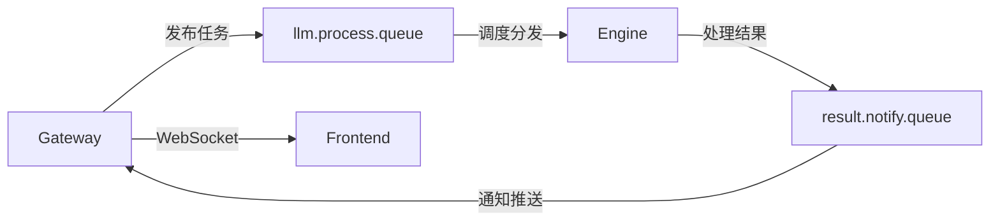

# @sker/broker

消息代理服务包 - 为@sker/studio提供RabbitMQ消息队列封装和AI任务调度。

## 系统架构位置

`@sker/broker` 是SKER系统的**消息代理层**，作为异步任务调度和服务间通信的核心枢纽：

```
API网关 (@sker/gateway)
        ↓ 任务发布
📍 消息代理 (@sker/broker) ← 当前模块
        ├─→ AI引擎 (@sker/engine)   ← 任务分发
        └─→ 实时通知 (WebSocket)     ← 结果推送
```

### 消息流转架构



### 服务间集成关系

- **消息接收者**: 接收来自以下服务的消息：
  - `@sker/gateway`: AI处理任务请求
  - `@sker/engine`: 处理结果和状态更新
- **任务分发者**: 将任务分发给：
  - `@sker/engine`: AI处理任务调度
  - `@sker/gateway`: 结果通知和WebSocket推送
- **依赖关系**:
  ```json
  {
    "@sker/models": "workspace:*",
    "@sker/config": "workspace:*"
  }
  ```
- **外部依赖**: RabbitMQ消息队列服务

## 🎯 核心功能

### 消息队列管理
- **连接管理**: RabbitMQ连接池的建立、维护和故障恢复
- **队列声明**: 自动创建和配置所需的交换机和队列
- **消息发布**: 可靠的消息发布，支持确认机制
- **消息消费**: 高效的消息消费，支持并发处理
- **错误处理**: 死信队列和重试机制

### AI任务调度
- **任务分发**: 将AI处理请求分发到处理队列
- **进度跟踪**: 实时跟踪AI任务的处理进度
- **结果收集**: 收集AI处理结果并通知相关服务
- **负载均衡**: 智能分配任务到可用的AI处理器

### 实时通信协调
- **WebSocket集成**: 与WebSocket服务协调实时消息推送
- **事件分发**: 处理各种系统事件并分发给相关服务
- **状态同步**: 保持各服务间的状态同步

## 📦 主要模块

### Message Broker
```typescript
import { MessageBroker } from '@sker/broker'

const broker = new MessageBroker({
  connectionUrl: 'amqp://localhost:5672',
  exchanges: ['llm.direct', 'events.topic'],
  queues: ['llm.process.queue', 'result.notify.queue']
})

await broker.connect()
```

### AI Task Scheduler
```typescript
import { AITaskScheduler } from '@sker/broker'

const scheduler = new AITaskScheduler(broker)

// 调度AI任务
const taskId = await scheduler.scheduleTask({
  type: 'generate',
  inputs: ['用户输入内容'],
  context: '上下文信息',
  priority: 'high'
})
```

### Event Publisher
```typescript
import { EventPublisher } from '@sker/broker'

const publisher = new EventPublisher(broker)

// 发布事件
await publisher.publish('node.created', {
  nodeId: 'node-123',
  projectId: 'project-456',
  content: '节点内容'
})
```

## 🔧 队列架构

### 交换机设计
使用统一的消息队列常量 (`@sker/models`):
- `llm.direct` - AI处理任务的直接交换机 (`EXCHANGE_NAMES.LLM_DIRECT`)
- `events.topic` - 系统事件的主题交换机 (`EXCHANGE_NAMES.EVENTS_TOPIC`)
- `realtime.fanout` - 实时消息的扇出交换机 (`EXCHANGE_NAMES.REALTIME_FANOUT`)
- `ai.results` - AI结果交换机 (`EXCHANGE_NAMES.AI_RESULTS`)

### 队列设计
- `llm.process.queue` - AI处理任务队列 (`QUEUE_NAMES.AI_TASKS`)
- `result.notify.queue` - 处理结果通知队列 (`QUEUE_NAMES.AI_RESULTS`)
- `llm.batch.process.queue` - 批处理任务队列 (`QUEUE_NAMES.AI_BATCH`)
- `events.websocket.queue` - WebSocket事件队列 (`QUEUE_NAMES.EVENTS_WEBSOCKET`)
- `events.storage.queue` - 存储事件队列 (`QUEUE_NAMES.EVENTS_STORAGE`)

### 消息流转
```
Frontend Request
    ↓
Gateway (WebSocket)
    ↓
Broker (llm.process.queue)
    ↓
AI Engine Processing
    ↓
Broker (result.notify.queue)
    ↓
Gateway (WebSocket Response)
    ↓
Frontend Update
```

## 🚀 使用方式

### 基础使用
```typescript
import { createBroker } from '@sker/broker'

const broker = await createBroker({
  connectionUrl: process.env.RABBITMQ_URL || 'amqp://localhost:5672',
  exchanges: {
    'llm.direct': { type: 'direct', durable: true },
    'events.topic': { type: 'topic', durable: true }
  },
  queues: {
    'llm.process.queue': { durable: true, exclusive: false },
    'result.notify.queue': { durable: true, exclusive: false }
  }
})

// 启动消息处理
await broker.start()
```

### AI任务调度
```typescript
import { AITaskScheduler } from '@sker/broker'

const scheduler = new AITaskScheduler(broker)

// 生成内容任务
const generateTask = await scheduler.scheduleGenerate({
  inputs: ['基于以下内容生成分析报告'],
  context: '用户需求文档',
  nodeId: 'node-123',
  priority: 'normal'
})

// 优化内容任务
const optimizeTask = await scheduler.scheduleOptimize({
  content: '当前内容',
  instruction: '请优化语言表达',
  nodeId: 'node-456',
  priority: 'high'
})

// 融合内容任务
const fusionTask = await scheduler.scheduleFusion({
  inputs: ['内容1', '内容2', '内容3'],
  instruction: '请融合这些分析，提供综合建议',
  nodeId: 'node-789',
  priority: 'high'
})

// 语义分析任务
const analyzeTask = await scheduler.scheduleAnalyze({
  inputs: ['需要分析的文本内容'],
  context: '分析上下文',
  nodeId: 'node-abc',
  priority: 'normal'
})

// 内容扩展任务
const expandTask = await scheduler.scheduleExpand({
  inputs: ['基础内容'],
  instruction: '请扩展和丰富这个内容',
  nodeId: 'node-def',
  priority: 'normal'
})
```

### 事件处理
```typescript
import { EventSubscriber } from '@sker/broker'

const subscriber = new EventSubscriber(broker)

// 订阅节点事件
subscriber.subscribe('node.*', async (event) => {
  console.log('Node event:', event.type, event.payload)

  switch (event.type) {
    case 'node.created':
      // 处理节点创建事件
      break
    case 'node.updated':
      // 处理节点更新事件
      break
    case 'node.deleted':
      // 处理节点删除事件
      break
  }
})

// 订阅AI处理事件
subscriber.subscribe('ai.*', async (event) => {
  console.log('AI event:', event.type, event.payload)
})
```

## 📋 消息格式

> **重要**: 从 v2.0 开始，所有消息类型已统一为 `@sker/models` 包中的定义，确保broker和engine服务间的类型一致性。

### AI处理消息
```typescript
// 使用统一的消息类型 (@sker/models)
import type { UnifiedAITaskMessage } from '@sker/models'

interface AIProcessMessage extends UnifiedAITaskMessage {
  taskId: string
  type: 'generate' | 'optimize' | 'fusion' | 'analyze' | 'expand'  // 支持全部5种任务类型
  inputs: string[]
  context?: string
  instruction?: string
  nodeId: string
  projectId: string
  userId: string
  priority: 'low' | 'normal' | 'high' | 'urgent'  // 增加urgent优先级
  timestamp: Date
  metadata?: TaskMetadata
}
```

### 处理结果消息
```typescript
interface AIResultMessage {
  taskId: string
  nodeId: string
  success: boolean
  result?: {
    content: string
    title?: string
    confidence: number
    tags: string[]
    metadata: Record<string, any>
  }
  error?: {
    code: string
    message: string
    details?: any
  }
  processingTime: number
  timestamp: Date
}
```

### 事件消息
```typescript
interface EventMessage {
  eventId: string
  type: string
  source: string
  payload: any
  timestamp: Date
  correlation?: {
    traceId: string
    userId?: string
    sessionId?: string
  }
}
```

## 🔧 配置说明

```typescript
interface BrokerConfig {
  connectionUrl: string
  connectionOptions?: amqp.Options.Connect
  exchanges: Record<string, ExchangeConfig>
  queues: Record<string, QueueConfig>
  prefetch?: number
  heartbeat?: number
  retry?: RetryConfig
  deadLetter?: DeadLetterConfig
}
```

## 🛡️ 可靠性特性

- **连接重试**: 自动重连机制，处理网络中断
- **消息确认**: 确保消息被正确处理
- **死信队列**: 处理失败消息的重试和记录
- **幂等性**: 支持重复消息的幂等处理
- **监控告警**: 队列状态和性能监控

## 📊 监控指标

- 消息发布/消费速率
- 队列长度和消息积压
- 处理延迟和吞吐量
- 错误率和重试次数
- 连接状态和健康度

为@sker/studio提供可靠、高效的消息队列服务，确保AI处理任务的顺畅调度和实时通信。