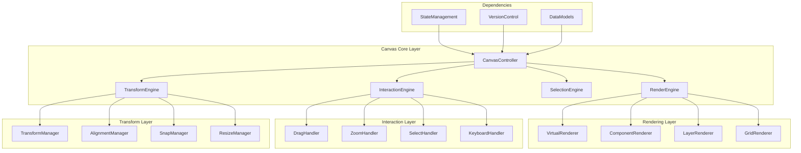

# @sker/canvas-core

> 可视化画布核心引擎 - 提供高性能的可视化编辑、渲染和交互功能

## 📋 概述

@sker/canvas-core 是一个专为低代码平台设计的高性能画布引擎，提供完整的可视化编辑功能，包括组件渲染、拖拽操作、选择交互、缩放平移、网格对齐等核心功能。采用虚拟化渲染和增量更新技术，确保在处理大量组件时的流畅性能。

### 为什么这么设计？

1. **高性能需求**：低代码画布需要处理大量组件，需要高效的渲染机制
2. **实时交互**：支持实时拖拽、缩放、选择等交互操作
3. **协作支持**：集成版本控制，支持多人实时协作编辑
4. **状态管理**：与状态管理系统深度集成，确保数据一致性
5. **扩展性**：提供插件机制，支持自定义渲染器和交互行为
6. **响应式**：支持多设备预览和响应式设计编辑

## 🏗️ 架构设计



## 🚀 核心功能

### 1. 渲染引擎
- **虚拟化渲染**：只渲染可视区域内的组件
- **增量更新**：只更新发生变化的组件
- **层级管理**：支持多层级组件渲染
- **缓存优化**：智能缓存渲染结果

### 2. 交互引擎
- **拖拽操作**：流畅的组件拖拽体验
- **多选支持**：支持框选和多选操作
- **键盘快捷键**：完整的键盘操作支持
- **触摸支持**：移动设备触摸交互

### 3. 变换引擎
- **精确定位**：像素级精确的组件定位
- **智能对齐**：自动对齐和吸附功能
- **尺寸调整**：支持等比缩放和自由调整
- **旋转变换**：组件旋转和翻转支持

### 4. 选择引擎
- **高效选择**：高性能的选择检测算法
- **选择反馈**：直观的选择状态反馈
- **批量操作**：支持批量选择和操作
- **选择历史**：记录选择历史便于撤销

## 📦 安装

```bash
npm install @sker/canvas-core
```

## 🔧 基础用法

### 画布初始化

```typescript
import { CanvasController, RenderEngine } from '@sker/canvas-core';
import { useCanvasStore } from '@sker/state-management';
import { VersionController } from '@sker/version-control';

// 初始化画布控制器
const canvasController = new CanvasController({
  container: document.getElementById('canvas-container'),
  width: 1200,
  height: 800,
  zoom: 1,
  grid: {
    enabled: true,
    size: 16,
    color: '#e0e0e0'
  },
  performance: {
    enableVirtualization: true,
    maxComponents: 1000,
    enableCache: true
  }
});

// 集成状态管理
const canvasStore = useCanvasStore();
canvasController.bindStore(canvasStore);

// 集成版本控制
const versionController = new VersionController();
canvasController.bindVersionControl(versionController);

// 启动画布
await canvasController.initialize();
```

### 组件渲染

```typescript
import { ComponentRenderer, VirtualRenderer } from '@sker/canvas-core';
import { ComponentModel } from '@sker/data-models';

// 创建渲染器
const componentRenderer = new ComponentRenderer({
  enableShadowDOM: true,
  enableStyleScoping: true,
  optimizeRerenders: true
});

// 渲染组件
const renderComponent = async (component: ComponentModel) => {
  const renderResult = await componentRenderer.render({
    component,
    context: {
      theme: 'light',
      responsive: 'desktop',
      interactive: true
    },
    optimizations: {
      useVirtualDOM: true,
      enableMemoization: true,
      batchUpdates: true
    }
  });
  
  return renderResult;
};

// 虚拟化渲染大量组件
const virtualRenderer = new VirtualRenderer({
  viewport: { width: 1200, height: 800 },
  itemHeight: 'variable',
  bufferSize: 10,
  estimatedItemCount: 1000
});

const renderManyComponents = async (components: ComponentModel[]) => {
  const virtualizedResult = await virtualRenderer.renderList({
    items: components,
    renderItem: (component, index) => renderComponent(component),
    getItemKey: (component) => component.id
  });
  
  return virtualizedResult;
};
```

### 交互处理

```typescript
import { InteractionEngine, DragHandler, SelectHandler } from '@sker/canvas-core';

// 创建交互引擎
const interactionEngine = new InteractionEngine({
  enableMultiSelect: true,
  enableKeyboardShortcuts: true,
  dragThreshold: 5,
  selectMode: 'box' // 'point' | 'box' | 'lasso'
});

// 拖拽处理
const dragHandler = new DragHandler({
  snapToGrid: true,
  snapThreshold: 8,
  enableGuides: true,
  constrainToBounds: true
});

dragHandler.on('dragstart', (event) => {
  console.log('开始拖拽:', event.target);
  
  // 显示拖拽反馈
  canvasController.showDragFeedback(event.target);
});

dragHandler.on('drag', (event) => {
  // 更新组件位置
  const newPosition = {
    x: event.position.x,
    y: event.position.y
  };
  
  // 应用网格吸附
  const snappedPosition = dragHandler.snapToGrid(newPosition);
  
  // 更新状态
  canvasStore.updateComponentPosition(event.target.id, snappedPosition);
});

dragHandler.on('dragend', (event) => {
  console.log('拖拽结束:', event.target);
  
  // 隐藏拖拽反馈
  canvasController.hideDragFeedback();
  
  // 记录版本变更
  versionController.recordChange({
    type: 'component-move',
    componentId: event.target.id,
    oldPosition: event.startPosition,
    newPosition: event.endPosition
  });
});

// 选择处理
const selectHandler = new SelectHandler({
  enableBoxSelect: true,
  enableCtrlSelect: true,
  highlightColor: '#007acc'
});

selectHandler.on('selectionchange', (event) => {
  console.log('选择变更:', event.selected, event.deselected);
  
  // 更新选择状态
  canvasStore.setSelection(event.currentSelection);
  
  // 显示选择框
  canvasController.updateSelectionBox(event.currentSelection);
});
```

### 变换操作

```typescript
import { TransformEngine, AlignmentManager, SnapManager } from '@sker/canvas-core';

// 创建变换引擎
const transformEngine = new TransformEngine({
  enableSnapping: true,
  snapDistance: 8,
  enableRotation: true,
  enableResize: true
});

// 对齐管理
const alignmentManager = new AlignmentManager();

// 左对齐选中的组件
const alignLeft = () => {
  const selected = canvasStore.getSelectedComponents();
  if (selected.length < 2) return;
  
  const leftMost = Math.min(...selected.map(c => c.position.x));
  
  selected.forEach(component => {
    canvasStore.updateComponentPosition(component.id, {
      x: leftMost,
      y: component.position.y
    });
  });
  
  // 记录变更
  versionController.recordBatchChange({
    type: 'components-align',
    alignment: 'left',
    components: selected.map(c => c.id)
  });
};

// 智能分布
const distributeHorizontally = () => {
  const selected = canvasStore.getSelectedComponents()
    .sort((a, b) => a.position.x - b.position.x);
  
  if (selected.length < 3) return;
  
  const totalWidth = selected[selected.length - 1].position.x - selected[0].position.x;
  const spacing = totalWidth / (selected.length - 1);
  
  selected.forEach((component, index) => {
    if (index === 0 || index === selected.length - 1) return;
    
    const newX = selected[0].position.x + spacing * index;
    canvasStore.updateComponentPosition(component.id, {
      x: newX,
      y: component.position.y
    });
  });
};

// 吸附管理
const snapManager = new SnapManager({
  snapToGrid: true,
  snapToComponents: true,
  snapToGuides: true,
  gridSize: 16
});

const performSnap = (component: ComponentModel, newPosition: Point) => {
  const snapResult = snapManager.snap({
    component,
    position: newPosition,
    otherComponents: canvasStore.getOtherComponents(component.id)
  });
  
  return snapResult.snappedPosition;
};
```

### 缩放和平移

```typescript
import { ZoomHandler, PanHandler, ViewportManager } from '@sker/canvas-core';

// 视口管理
const viewportManager = new ViewportManager({
  minZoom: 0.1,
  maxZoom: 5,
  zoomStep: 0.1,
  enableInertialScrolling: true
});

// 缩放处理
const zoomHandler = new ZoomHandler({
  wheelSensitivity: 0.001,
  pinchSensitivity: 0.01,
  zoomCenter: 'cursor' // 'cursor' | 'center' | 'custom'
});

zoomHandler.on('zoom', (event) => {
  const newZoom = Math.max(
    viewportManager.minZoom,
    Math.min(viewportManager.maxZoom, event.zoom)
  );
  
  canvasController.setZoom(newZoom, event.center);
  canvasStore.setZoom(newZoom);
});

// 平移处理
const panHandler = new PanHandler({
  enableInertia: true,
  friction: 0.95,
  boundaryBehavior: 'elastic' // 'elastic' | 'hard' | 'none'
});

panHandler.on('pan', (event) => {
  const newOffset = {
    x: event.offset.x,
    y: event.offset.y
  };
  
  canvasController.setPanOffset(newOffset);
  canvasStore.setPanOffset(newOffset);
});

// 适应视口
const fitToView = () => {
  const allComponents = canvasStore.getAllComponents();
  const bounds = canvasController.calculateBounds(allComponents);
  
  const zoom = viewportManager.calculateFitZoom(bounds);
  const center = viewportManager.calculateCenter(bounds);
  
  canvasController.animateToView({
    zoom,
    center,
    duration: 500,
    easing: 'ease-out'
  });
};
```

## 🗂️ 项目结构

```
canvas-core/
├── src/
│   ├── controllers/
│   │   ├── CanvasController.ts        # 画布控制器
│   │   ├── ViewportController.ts      # 视口控制器
│   │   └── LayerController.ts         # 图层控制器
│   ├── engines/
│   │   ├── RenderEngine.ts            # 渲染引擎
│   │   ├── InteractionEngine.ts       # 交互引擎
│   │   ├── SelectionEngine.ts         # 选择引擎
│   │   └── TransformEngine.ts         # 变换引擎
│   ├── renderers/
│   │   ├── VirtualRenderer.ts         # 虚拟化渲染器
│   │   ├── ComponentRenderer.ts       # 组件渲染器
│   │   ├── LayerRenderer.ts           # 图层渲染器
│   │   └── GridRenderer.ts            # 网格渲染器
│   ├── handlers/
│   │   ├── DragHandler.ts             # 拖拽处理器
│   │   ├── ZoomHandler.ts             # 缩放处理器
│   │   ├── PanHandler.ts              # 平移处理器
│   │   ├── SelectHandler.ts           # 选择处理器
│   │   └── KeyboardHandler.ts         # 键盘处理器
│   ├── managers/
│   │   ├── TransformManager.ts        # 变换管理器
│   │   ├── AlignmentManager.ts        # 对齐管理器
│   │   ├── SnapManager.ts             # 吸附管理器
│   │   ├── ViewportManager.ts         # 视口管理器
│   │   └── PerformanceManager.ts      # 性能管理器
│   ├── utils/
│   │   ├── geometry.ts                # 几何计算工具
│   │   ├── collision.ts               # 碰撞检测工具
│   │   ├── animation.ts               # 动画工具
│   │   └── optimization.ts            # 优化工具
│   ├── types/
│   │   ├── canvas.ts                  # 画布类型定义
│   │   ├── render.ts                  # 渲染类型定义
│   │   ├── interaction.ts             # 交互类型定义
│   │   └── transform.ts               # 变换类型定义
│   └── constants/
│       ├── events.ts                  # 事件常量
│       ├── shortcuts.ts               # 快捷键常量
│       └── defaults.ts                # 默认配置
├── tests/
│   ├── unit/                          # 单元测试
│   ├── integration/                   # 集成测试
│   └── performance/                   # 性能测试
└── docs/                              # 文档
```

## 🧪 测试策略

### 单元测试
```typescript
// tests/unit/RenderEngine.test.ts
import { RenderEngine } from '../../src/engines/RenderEngine';
import { ComponentModel } from '@sker/data-models';

describe('RenderEngine', () => {
  let renderEngine: RenderEngine;
  let mockContainer: HTMLElement;
  
  beforeEach(() => {
    mockContainer = document.createElement('div');
    renderEngine = new RenderEngine({
      container: mockContainer,
      enableVirtualization: true
    });
  });
  
  test('应该正确渲染单个组件', async () => {
    const component = new ComponentModel({
      id: 'test-component',
      type: 'button',
      properties: { text: 'Test Button' },
      position: { x: 100, y: 100 },
      size: { width: 120, height: 40 }
    });
    
    const result = await renderEngine.renderComponent(component);
    
    expect(result.element).toBeDefined();
    expect(result.element.textContent).toBe('Test Button');
    expect(result.bounds).toEqual({
      x: 100, y: 100, width: 120, height: 40
    });
  });
  
  test('应该支持虚拟化渲染', async () => {
    const components = Array.from({ length: 1000 }, (_, i) => 
      new ComponentModel({
        id: `component-${i}`,
        type: 'div',
        position: { x: 0, y: i * 50 },
        size: { width: 100, height: 40 }
      })
    );
    
    const viewport = { x: 0, y: 0, width: 800, height: 600 };
    const result = await renderEngine.renderInViewport(components, viewport);
    
    // 只应该渲染可见的组件
    expect(result.renderedComponents.length).toBeLessThan(20);
    expect(result.totalComponents).toBe(1000);
  });
});
```

### 交互测试
```typescript
// tests/unit/InteractionEngine.test.ts
import { InteractionEngine } from '../../src/engines/InteractionEngine';

describe('InteractionEngine', () => {
  let interactionEngine: InteractionEngine;
  let mockCanvas: HTMLCanvasElement;
  
  beforeEach(() => {
    mockCanvas = document.createElement('canvas');
    mockCanvas.width = 800;
    mockCanvas.height = 600;
    
    interactionEngine = new InteractionEngine({
      canvas: mockCanvas,
      enableMultiSelect: true
    });
  });
  
  test('应该正确处理鼠标点击选择', () => {
    const mockComponent = { id: 'comp-1', bounds: { x: 100, y: 100, width: 50, height: 50 } };
    
    interactionEngine.addComponent(mockComponent);
    
    const clickEvent = new MouseEvent('click', {
      clientX: 125,
      clientY: 125
    });
    
    mockCanvas.dispatchEvent(clickEvent);
    
    expect(interactionEngine.getSelectedComponents()).toContain(mockComponent);
  });
  
  test('应该支持框选多个组件', () => {
    const components = [
      { id: 'comp-1', bounds: { x: 100, y: 100, width: 50, height: 50 } },
      { id: 'comp-2', bounds: { x: 200, y: 100, width: 50, height: 50 } },
      { id: 'comp-3', bounds: { x: 300, y: 300, width: 50, height: 50 } }
    ];
    
    components.forEach(comp => interactionEngine.addComponent(comp));
    
    // 模拟框选操作
    interactionEngine.startBoxSelect({ x: 50, y: 50 });
    interactionEngine.updateBoxSelect({ x: 270, y: 170 });
    interactionEngine.endBoxSelect();
    
    const selected = interactionEngine.getSelectedComponents();
    expect(selected).toHaveLength(2);
    expect(selected.map(c => c.id)).toEqual(['comp-1', 'comp-2']);
  });
});
```

### 性能测试
```typescript
// tests/performance/render-performance.test.ts
describe('Render Performance', () => {
  test('大量组件渲染性能', async () => {
    const componentCount = 5000;
    const components = generateTestComponents(componentCount);
    
    const renderEngine = new RenderEngine({
      enableVirtualization: true,
      enableCache: true
    });
    
    const startTime = performance.now();
    
    await renderEngine.renderComponents(components);
    
    const renderTime = performance.now() - startTime;
    
    expect(renderTime).toBeLessThan(100); // 100ms内完成
    
    // 测试帧率
    const fps = await measureFrameRate(renderEngine, 1000); // 测试1秒
    expect(fps).toBeGreaterThan(30); // 保持30FPS以上
  });
  
  test('交互响应性能', async () => {
    const interactionEngine = new InteractionEngine();
    const components = generateTestComponents(1000);
    
    components.forEach(comp => interactionEngine.addComponent(comp));
    
    const startTime = performance.now();
    
    // 模拟快速连续的鼠标移动
    for (let i = 0; i < 100; i++) {
      const event = new MouseEvent('mousemove', {
        clientX: i * 5,
        clientY: i * 3
      });
      
      interactionEngine.handleMouseMove(event);
    }
    
    const interactionTime = performance.now() - startTime;
    
    expect(interactionTime).toBeLessThan(50); // 50ms内完成所有交互
  });
});
```

## ⚡ 性能优化

### 1. 虚拟化渲染
```typescript
// src/renderers/VirtualRenderer.ts
export class VirtualRenderer {
  private visibleItems = new Set<string>();
  private renderCache = new Map<string, RenderResult>();
  
  async renderInViewport(
    items: ComponentModel[],
    viewport: Viewport
  ): Promise<VirtualRenderResult> {
    // 计算可见项目
    const visibleItems = this.calculateVisibleItems(items, viewport);
    
    // 移除不可见项目
    this.cleanupInvisibleItems(visibleItems);
    
    // 渲染新的可见项目
    const renderPromises = visibleItems
      .filter(item => !this.renderCache.has(item.id))
      .map(item => this.renderItem(item));
    
    await Promise.all(renderPromises);
    
    return {
      visibleItems: visibleItems.length,
      totalItems: items.length,
      renderTime: performance.now()
    };
  }
  
  private calculateVisibleItems(
    items: ComponentModel[],
    viewport: Viewport
  ): ComponentModel[] {
    const buffer = 100; // 缓冲区域
    
    return items.filter(item => {
      const bounds = item.getBounds();
      return this.intersects(bounds, {
        x: viewport.x - buffer,
        y: viewport.y - buffer,
        width: viewport.width + buffer * 2,
        height: viewport.height + buffer * 2
      });
    });
  }
}
```

### 2. 增量更新
```typescript
// src/engines/IncrementalUpdateEngine.ts
export class IncrementalUpdateEngine {
  private dirtyComponents = new Set<string>();
  private updateQueue: UpdateTask[] = [];
  private isUpdating = false;
  
  markDirty(componentId: string): void {
    this.dirtyComponents.add(componentId);
    this.scheduleUpdate();
  }
  
  private scheduleUpdate(): void {
    if (this.isUpdating) return;
    
    requestAnimationFrame(() => {
      this.performUpdate();
    });
  }
  
  private async performUpdate(): Promise<void> {
    this.isUpdating = true;
    
    try {
      // 批量处理更新
      const batchSize = 50;
      const dirtyArray = Array.from(this.dirtyComponents);
      
      for (let i = 0; i < dirtyArray.length; i += batchSize) {
        const batch = dirtyArray.slice(i, i + batchSize);
        
        await this.updateBatch(batch);
        
        // 让出主线程
        if (i + batchSize < dirtyArray.length) {
          await new Promise(resolve => setTimeout(resolve, 0));
        }
      }
      
      this.dirtyComponents.clear();
    } finally {
      this.isUpdating = false;
    }
  }
  
  private async updateBatch(componentIds: string[]): Promise<void> {
    const updatePromises = componentIds.map(id => this.updateComponent(id));
    await Promise.all(updatePromises);
  }
}
```

### 3. 智能缓存
```typescript
// src/utils/RenderCache.ts
export class RenderCache {
  private cache = new Map<string, CacheEntry>();
  private maxSize = 500;
  private hitRate = 0;
  private accessCount = 0;
  
  get(key: string, version: number): RenderResult | null {
    this.accessCount++;
    
    const entry = this.cache.get(key);
    
    if (!entry || entry.version !== version) {
      return null;
    }
    
    // 更新访问时间
    entry.lastAccessed = Date.now();
    this.hitRate = (this.hitRate * (this.accessCount - 1) + 1) / this.accessCount;
    
    return entry.result;
  }
  
  set(key: string, version: number, result: RenderResult): void {
    if (this.cache.size >= this.maxSize) {
      this.evictLeastRecentlyUsed();
    }
    
    this.cache.set(key, {
      result,
      version,
      lastAccessed: Date.now(),
      renderTime: result.renderTime
    });
  }
  
  private evictLeastRecentlyUsed(): void {
    let oldestKey: string | null = null;
    let oldestTime = Date.now();
    
    for (const [key, entry] of this.cache) {
      if (entry.lastAccessed < oldestTime) {
        oldestTime = entry.lastAccessed;
        oldestKey = key;
      }
    }
    
    if (oldestKey) {
      this.cache.delete(oldestKey);
    }
  }
  
  getStats(): CacheStats {
    return {
      size: this.cache.size,
      hitRate: this.hitRate,
      accessCount: this.accessCount
    };
  }
}
```

## 🎯 最佳实践

### 1. 性能监控
```typescript
// src/managers/PerformanceManager.ts
export class PerformanceManager {
  private metrics = new Map<string, PerformanceMetric>();
  private observer: PerformanceObserver;
  
  constructor() {
    this.observer = new PerformanceObserver((list) => {
      for (const entry of list.getEntries()) {
        this.recordMetric(entry.name, entry.duration);
      }
    });
    
    this.observer.observe({ entryTypes: ['measure', 'navigation'] });
  }
  
  startMeasure(name: string): void {
    performance.mark(`${name}-start`);
  }
  
  endMeasure(name: string): void {
    performance.mark(`${name}-end`);
    performance.measure(name, `${name}-start`, `${name}-end`);
  }
  
  recordMetric(name: string, value: number): void {
    const metric = this.metrics.get(name) || {
      name,
      values: [],
      average: 0,
      min: Infinity,
      max: -Infinity
    };
    
    metric.values.push(value);
    metric.min = Math.min(metric.min, value);
    metric.max = Math.max(metric.max, value);
    metric.average = metric.values.reduce((a, b) => a + b) / metric.values.length;
    
    // 保持最近100个值
    if (metric.values.length > 100) {
      metric.values.shift();
    }
    
    this.metrics.set(name, metric);
    
    // 性能警告
    if (value > this.getWarningThreshold(name)) {
      console.warn(`Performance warning: ${name} took ${value}ms`);
    }
  }
  
  getWarningThreshold(metricName: string): number {
    const thresholds = {
      'render-frame': 16, // 60fps
      'interaction-response': 100,
      'layout-calculation': 50
    };
    
    return thresholds[metricName] || 1000;
  }
}
```

### 2. 内存管理
```typescript
// src/utils/MemoryManager.ts
export class MemoryManager {
  private observers = new Set<MutationObserver>();
  private intervals = new Set<number>();
  private listeners = new Map<EventTarget, EventListener[]>();
  
  addObserver(observer: MutationObserver): void {
    this.observers.add(observer);
  }
  
  addInterval(intervalId: number): void {
    this.intervals.add(intervalId);
  }
  
  addListener(
    target: EventTarget,
    type: string,
    listener: EventListener
  ): void {
    if (!this.listeners.has(target)) {
      this.listeners.set(target, []);
    }
    
    this.listeners.get(target)!.push(listener);
    target.addEventListener(type, listener);
  }
  
  cleanup(): void {
    // 清理观察器
    this.observers.forEach(observer => observer.disconnect());
    this.observers.clear();
    
    // 清理定时器
    this.intervals.forEach(id => clearInterval(id));
    this.intervals.clear();
    
    // 清理事件监听器
    this.listeners.forEach((listeners, target) => {
      listeners.forEach(listener => {
        target.removeEventListener('*', listener);
      });
    });
    this.listeners.clear();
  }
  
  getMemoryUsage(): MemoryInfo {
    return {
      usedJSHeapSize: (performance as any).memory?.usedJSHeapSize || 0,
      totalJSHeapSize: (performance as any).memory?.totalJSHeapSize || 0,
      jsHeapSizeLimit: (performance as any).memory?.jsHeapSizeLimit || 0
    };
  }
}
```

### 3. 错误恢复
```typescript
// src/utils/ErrorRecovery.ts
export class ErrorRecovery {
  private errorBoundaries = new Map<string, ErrorBoundary>();
  private retryAttempts = new Map<string, number>();
  private maxRetries = 3;
  
  wrapOperation<T>(
    operationId: string,
    operation: () => Promise<T>,
    fallback?: () => T
  ): Promise<T> {
    return new Promise(async (resolve, reject) => {
      try {
        const result = await operation();
        
        // 重置重试计数
        this.retryAttempts.delete(operationId);
        
        resolve(result);
      } catch (error) {
        const attempts = this.retryAttempts.get(operationId) || 0;
        
        if (attempts < this.maxRetries) {
          // 重试
          this.retryAttempts.set(operationId, attempts + 1);
          
          setTimeout(() => {
            this.wrapOperation(operationId, operation, fallback)
              .then(resolve)
              .catch(reject);
          }, Math.pow(2, attempts) * 1000); // 指数退避
        } else {
          // 使用降级方案
          if (fallback) {
            try {
              const fallbackResult = fallback();
              resolve(fallbackResult);
            } catch (fallbackError) {
              reject(fallbackError);
            }
          } else {
            reject(error);
          }
        }
      }
    });
  }
}
```

## 📈 版本历史

### v1.0.0
- ✅ 基础渲染引擎
- ✅ 简单交互支持
- ✅ 基础变换功能

### v1.1.0
- ✅ 虚拟化渲染
- ✅ 多选支持
- ✅ 键盘快捷键

### v1.2.0
- ✅ 智能对齐吸附
- ✅ 性能优化
- ✅ 缓存系统

### v2.0.0 (规划中)
- 🔄 WebGL 渲染支持
- 🔄 3D 变换功能
- 🔄 高级动画系统
- 🔄 协作光标显示

## 🤝 依赖关系

```json
{
  "dependencies": {
    "@sker/state-management": "^1.0.0",
    "@sker/version-control": "^1.0.0",
    "@sker/data-models": "^1.0.0"
  },
  "peerDependencies": {
    "konva": "^9.0.0",
    "fabric": "^5.0.0"
  }
}
```

### 与依赖包的集成

@sker/canvas-core 深度集成了状态管理和版本控制：

```typescript
import { useCanvasStore } from '@sker/state-management';
import { VersionController } from '@sker/version-control';

export class CanvasController {
  constructor(
    private canvasStore = useCanvasStore(),
    private versionController = new VersionController()
  ) {}
  
  // 与状态管理的双向绑定
  private bindStateManagement(): void {
    // 监听状态变化
    this.canvasStore.subscribe((state) => {
      this.syncWithState(state);
    });
    
    // 画布操作触发状态更新
    this.on('component-update', (component) => {
      this.canvasStore.updateComponent(component);
    });
  }
  
  // 与版本控制的集成
  private bindVersionControl(): void {
    this.on('significant-change', (change) => {
      this.versionController.recordChange(change);
    });
  }
}
```

这样的设计确保了画布操作与数据状态的完全同步，同时自动记录所有重要变更用于版本控制。