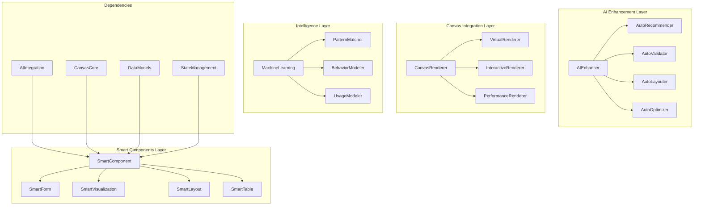

# @sker/smart-components

> 智能组件库 - 集成 AI 驱动的高级组件和智能化功能

## 📋 概述

@sker/smart-components 是一个专为低代码平台设计的智能组件库，结合了 AI 技术和高性能画布渲染，提供智能表单、数据可视化、自适应布局、智能推荐等高级组件。这些组件不仅具备传统组件的功能，还能通过 AI 进行自我优化和智能交互。

### 为什么这么设计？

1. **智能化增强**：传统组件通过 AI 增强，具备智能推荐、自动验证等功能
2. **自适应能力**：组件能根据内容和上下文自动调整布局和样式
3. **数据驱动**：深度集成数据分析，提供智能的数据展示和交互
4. **协作优化**：支持多人协作时的智能冲突解决和状态同步
5. **性能智能**：AI 驱动的性能优化，根据使用模式自动调整渲染策略
6. **无障碍支持**：内置智能无障碍功能，自动优化可访问性

## 🏗️ 架构设计



## 🚀 核心功能

### 1. 智能表单组件
- **智能验证**：AI 驱动的表单验证和错误提示
- **自动补全**：基于历史数据的智能自动补全
- **动态字段**：根据输入自动调整表单结构
- **无障碍优化**：智能无障碍功能增强

### 2. 智能数据可视化
- **自动图表选择**：根据数据特征推荐最佳图表类型
- **交互式探索**：AI 辅助的数据探索和钻取
- **异常检测**：自动检测和高亮数据异常
- **趋势预测**：基于历史数据的趋势预测

### 3. 自适应布局组件
- **智能响应式**：AI 驱动的响应式布局调整
- **内容感知**：根据内容自动调整组件大小
- **性能优化**：智能懒加载和虚拟化
- **用户习惯学习**：学习用户操作习惯优化界面

### 4. 协作智能组件
- **冲突智能解决**：AI 辅助的编辑冲突解决
- **智能合并**：智能合并多人编辑结果
- **操作预测**：预测用户操作意图
- **协作建议**：提供协作优化建议

## 📦 安装

```bash
npm install @sker/smart-components
```

## 🔧 基础用法

### 智能表单组件

```typescript
import { SmartForm, SmartInput, SmartSelect } from '@sker/smart-components';
import { AIEnhancer } from '@sker/ai-integration';

// 创建智能表单
const SmartUserForm = () => {
  const aiEnhancer = new AIEnhancer({
    model: 'form-optimization-v2',
    enableAutoValidation: true,
    enableSmartSuggestions: true
  });
  
  return (
    <SmartForm
      aiEnhancer={aiEnhancer}
      onSubmit={handleSubmit}
      autoValidate={true}
      smartLayout={true}
    >
      <SmartInput
        name="email"
        label="邮箱地址"
        aiFeatures={{
          autoComplete: true,
          smartValidation: true,
          patternLearning: true
        }}
        validationRules={{
          required: true,
          email: true,
          customValidation: (value) => aiEnhancer.validateEmail(value)
        }}
      />
      
      <SmartSelect
        name="country"
        label="国家/地区"
        aiFeatures={{
          smartSearch: true,
          popularSuggestions: true,
          contextAware: true
        }}
        onSelectionChange={(value) => {
          // AI 根据国家选择自动调整其他字段
          aiEnhancer.adaptFormByCountry(value);
        }}
      />
      
      <SmartInput
        name="phone"
        label="手机号码"
        aiFeatures={{
          formatPrediction: true,
          regionAware: true,
          smartValidation: true
        }}
        dynamicFormat={true} // 根据国家自动调整格式
      />
    </SmartForm>
  );
};

// AI 增强的表单行为
const handleFormEnhancement = (form: SmartForm) => {
  // 学习用户填写模式
  form.on('userInteraction', (interaction) => {
    aiEnhancer.learnUserPattern(interaction);
  });
  
  // 智能字段排序
  form.on('formLoad', async () => {
    const optimalOrder = await aiEnhancer.getOptimalFieldOrder({
      userProfile: getCurrentUser(),
      formContext: form.getContext(),
      historicalData: form.getHistoricalFillData()
    });
    
    form.reorderFields(optimalOrder);
  });
  
  // 智能错误处理
  form.on('validationError', async (error) => {
    const suggestion = await aiEnhancer.getSuggestion(error);
    form.showSmartSuggestion(suggestion);
  });
};
```

### 智能数据可视化

```typescript
import { SmartChart, SmartTable, DataInsights } from '@sker/smart-components';

// 智能图表组件
const SmartDashboard = ({ data }: { data: any[] }) => {
  const [insights, setInsights] = useState<DataInsights>();
  
  useEffect(() => {
    // AI 分析数据特征
    const analyzeData = async () => {
      const dataInsights = await AIEnhancer.analyzeData(data);
      setInsights(dataInsights);
    };
    
    analyzeData();
  }, [data]);
  
  return (
    <div className="smart-dashboard">
      <SmartChart
        data={data}
        aiFeatures={{
          autoChartType: true,
          anomalyDetection: true,
          trendPrediction: true,
          interactiveExploration: true
        }}
        onChartTypeChange={(newType, reason) => {
          console.log(`AI 推荐图表类型: ${newType}, 原因: ${reason}`);
        }}
        onAnomalyDetected={(anomalies) => {
          console.log('检测到数据异常:', anomalies);
        }}
      />
      
      <SmartTable
        data={data}
        aiFeatures={{
          smartFiltering: true,
          intelligentSorting: true,
          contextualActions: true,
          adaptiveColumns: true
        }}
        onSmartAction={(action, context) => {
          // AI 建议的操作
          console.log('AI 建议操作:', action, context);
        }}
      />
      
      {insights && (
        <DataInsights
          insights={insights}
          interactive={true}
          onInsightClick={(insight) => {
            // 基于洞察进行深入分析
            performDeepAnalysis(insight);
          }}
        />
      )}
    </div>
  );
};

// 智能图表配置
const configureSmartChart = (chartComponent: SmartChart) => {
  // AI 驱动的图表优化
  chartComponent.enableAIOptimization({
    performanceMode: 'adaptive', // 'performance' | 'quality' | 'adaptive'
    userPreferences: getUserVisualizationPreferences(),
    contextualHints: getContextualHints()
  });
  
  // 智能交互增强
  chartComponent.on('userInteraction', async (interaction) => {
    const suggestions = await AIEnhancer.getInteractionSuggestions({
      interaction,
      dataContext: chartComponent.getDataContext(),
      userBehavior: chartComponent.getUserBehaviorHistory()
    });
    
    if (suggestions.length > 0) {
      chartComponent.showInteractionSuggestions(suggestions);
    }
  });
};
```

### 自适应布局组件

```typescript
import { SmartLayout, SmartGrid, AdaptiveContainer } from '@sker/smart-components';

// 智能布局系统
const SmartPageLayout = ({ children }: { children: React.ReactNode }) => {
  return (
    <SmartLayout
      aiFeatures={{
        adaptiveBreakpoints: true,
        contentAwareSpacing: true,
        performanceOptimization: true,
        userBehaviorLearning: true
      }}
      optimizationStrategy={{
        prioritizeViewport: true,
        minimizeReflows: true,
        intelligentPrefetch: true
      }}
    >
      <SmartGrid
        columns={{ mobile: 1, tablet: 2, desktop: 3 }}
        aiSpacing={true} // AI 驱动的间距优化
        adaptiveItemSizing={true}
        onLayoutOptimization={(optimization) => {
          console.log('布局优化建议:', optimization);
        }}
      >
        {children}
      </SmartGrid>
    </SmartLayout>
  );
};

// 自适应容器
const AdaptiveContentContainer = ({ content }: { content: any }) => {
  return (
    <AdaptiveContainer
      aiFeatures={{
        contentAnalysis: true,
        dynamicSizing: true,
        smartScrolling: true,
        accessibilityOptimization: true
      }}
      adaptationRules={{
        textContent: 'optimize-readability',
        imageContent: 'optimize-display',
        interactiveContent: 'optimize-usability'
      }}
      onAdaptation={(adaptation) => {
        console.log('容器自适应:', adaptation);
      }}
    >
      {renderContent(content)}
    </AdaptiveContainer>
  );
};

// 智能响应式行为
const enableSmartResponsive = (component: SmartLayout) => {
  component.enableSmartResponsive({
    // 学习用户设备使用模式
    devicePatternLearning: true,
    
    // 预测性加载
    predictiveLoading: true,
    
    // 智能资源管理
    resourceOptimization: true,
    
    // 无障碍智能增强
    accessibilityEnhancement: true
  });
  
  // 监听智能优化事件
  component.on('smartOptimization', (optimization) => {
    console.log('智能优化执行:', optimization);
  });
};
```

### 协作智能组件

```typescript
import { CollaborativeEditor, SmartConflictResolver } from '@sker/smart-components';

// 智能协作编辑器
const SmartCollaborativeCanvas = () => {
  const conflictResolver = new SmartConflictResolver({
    aiModel: 'conflict-resolution-v3',
    learningEnabled: true,
    autoResolution: true
  });
  
  return (
    <CollaborativeEditor
      conflictResolver={conflictResolver}
      aiFeatures={{
        intentPrediction: true,
        smartMerging: true,
        collaborationSuggestions: true,
        contextAwareness: true
      }}
      onConflictDetected={async (conflict) => {
        const resolution = await conflictResolver.resolve(conflict);
        
        if (resolution.confidence > 0.8) {
          // 高置信度自动解决
          await applyResolution(resolution);
        } else {
          // 需要用户确认
          showConflictResolutionDialog(conflict, resolution);
        }
      }}
      onCollaborationInsight={(insight) => {
        console.log('协作洞察:', insight);
      }}
    />
  );
};

// 智能冲突解决
const handleSmartConflictResolution = (resolver: SmartConflictResolver) => {
  resolver.on('resolutionSuggestion', (suggestion) => {
    console.log('AI 冲突解决建议:', suggestion);
  });
  
  resolver.on('patternLearned', (pattern) => {
    console.log('学习到新的协作模式:', pattern);
  });
  
  // 自定义解决策略
  resolver.addResolutionStrategy('smart-merge', async (conflict) => {
    const context = await getConflictContext(conflict);
    const userPreferences = await getUserConflictPreferences();
    
    return AIEnhancer.generateMergeStrategy({
      conflict,
      context,
      preferences: userPreferences
    });
  });
};
```

## 🗂️ 项目结构

```
smart-components/
├── src/
│   ├── components/
│   │   ├── forms/
│   │   │   ├── SmartForm.tsx              # 智能表单
│   │   │   ├── SmartInput.tsx             # 智能输入框
│   │   │   ├── SmartSelect.tsx            # 智能选择器
│   │   │   └── SmartValidator.tsx         # 智能验证器
│   │   ├── visualization/
│   │   │   ├── SmartChart.tsx             # 智能图表
│   │   │   ├── SmartTable.tsx             # 智能表格
│   │   │   ├── DataInsights.tsx           # 数据洞察
│   │   │   └── InteractiveViz.tsx         # 交互式可视化
│   │   ├── layout/
│   │   │   ├── SmartLayout.tsx            # 智能布局
│   │   │   ├── SmartGrid.tsx              # 智能网格
│   │   │   ├── AdaptiveContainer.tsx      # 自适应容器
│   │   │   └── ResponsiveWrapper.tsx      # 响应式包装器
│   │   ├── collaboration/
│   │   │   ├── CollaborativeEditor.tsx    # 协作编辑器
│   │   │   ├── SmartConflictResolver.tsx  # 智能冲突解决
│   │   │   ├── RealtimeSync.tsx           # 实时同步
│   │   │   └── CollaborationHUD.tsx       # 协作界面
│   │   └── advanced/
│   │       ├── SmartWorkflow.tsx          # 智能工作流
│   │       ├── IntelligentSearch.tsx      # 智能搜索
│   │       ├── AdaptiveNavigation.tsx     # 自适应导航
│   │       └── SmartNotification.tsx      # 智能通知
│   ├── enhancers/
│   │   ├── AIEnhancer.ts                  # AI 增强器
│   │   ├── PerformanceEnhancer.ts         # 性能增强器
│   │   ├── AccessibilityEnhancer.ts       # 无障碍增强器
│   │   └── UserExperienceEnhancer.ts      # 用户体验增强器
│   ├── intelligence/
│   │   ├── PatternMatcher.ts              # 模式匹配
│   │   ├── BehaviorAnalyzer.ts            # 行为分析
│   │   ├── UsageModeler.ts                # 使用建模
│   │   └── PredictiveEngine.ts            # 预测引擎
│   ├── renderers/
│   │   ├── SmartRenderer.ts               # 智能渲染器
│   │   ├── AdaptiveRenderer.ts            # 自适应渲染器
│   │   ├── PerformanceRenderer.ts         # 性能渲染器
│   │   └── CollaborativeRenderer.ts       # 协作渲染器
│   ├── hooks/
│   │   ├── useSmartComponent.ts           # 智能组件钩子
│   │   ├── useAIEnhancement.ts            # AI 增强钩子
│   │   ├── useAdaptiveLayout.ts           # 自适应布局钩子
│   │   └── useCollaboration.ts            # 协作钩子
│   ├── types/
│   │   ├── smart-components.ts            # 智能组件类型
│   │   ├── ai-enhancement.ts              # AI 增强类型
│   │   ├── adaptive-layout.ts             # 自适应布局类型
│   │   └── collaboration.ts               # 协作类型
│   └── utils/
│       ├── smart-helpers.ts               # 智能助手工具
│       ├── ai-utils.ts                    # AI 工具
│       ├── performance-utils.ts           # 性能工具
│       └── accessibility-utils.ts         # 无障碍工具
├── tests/
│   ├── unit/                              # 单元测试
│   ├── integration/                       # 集成测试
│   ├── e2e/                               # 端到端测试
│   └── ai-validation/                     # AI 功能验证测试
├── stories/                               # Storybook 故事
├── examples/                              # 使用示例
└── docs/                                  # 文档
```

## 🧪 测试策略

### AI 功能测试
```typescript
// tests/ai-validation/smart-form.test.ts
import { SmartForm, AIEnhancer } from '../../src/components/forms';
import { MockAIProvider } from '../mocks/MockAIProvider';

describe('SmartForm AI Features', () => {
  let aiEnhancer: AIEnhancer;
  let mockAIProvider: MockAIProvider;
  
  beforeEach(() => {
    mockAIProvider = new MockAIProvider();
    aiEnhancer = new AIEnhancer({
      provider: mockAIProvider,
      enableLearning: true
    });
  });
  
  test('应该提供智能验证建议', async () => {
    const form = new SmartForm({ aiEnhancer });
    
    const invalidEmail = 'invalid-email';
    const validationResult = await form.validateField('email', invalidEmail);
    
    expect(validationResult.isValid).toBe(false);
    expect(validationResult.suggestions).toBeDefined();
    expect(validationResult.suggestions.length).toBeGreaterThan(0);
  });
  
  test('应该学习用户输入模式', async () => {
    const form = new SmartForm({ aiEnhancer });
    
    // 模拟用户输入历史
    const inputHistory = [
      { field: 'name', value: 'John Doe', timestamp: Date.now() - 1000 },
      { field: 'email', value: 'john@example.com', timestamp: Date.now() - 500 },
      { field: 'phone', value: '+1234567890', timestamp: Date.now() }
    ];
    
    await form.learnFromHistory(inputHistory);
    
    const predictions = await form.getPredictions('name', 'Jo');
    expect(predictions).toContain('John Doe');
  });
  
  test('应该根据上下文调整字段顺序', async () => {
    const form = new SmartForm({ aiEnhancer });
    
    const userContext = {
      country: 'US',
      userType: 'business',
      previousForms: ['contact', 'billing']
    };
    
    const optimizedOrder = await form.getOptimalFieldOrder(userContext);
    
    expect(optimizedOrder).toBeDefined();
    expect(optimizedOrder.length).toBeGreaterThan(0);
    
    // 商业用户应该优先显示公司相关字段
    expect(optimizedOrder.indexOf('company')).toBeLessThan(
      optimizedOrder.indexOf('personalInfo')
    );
  });
});
```

### 性能测试
```typescript
// tests/performance/smart-components.test.ts
describe('Smart Components Performance', () => {
  test('智能组件渲染性能', async () => {
    const largeDataset = generateLargeDataset(10000);
    
    const startTime = performance.now();
    
    const smartTable = new SmartTable({
      data: largeDataset,
      aiFeatures: {
        smartFiltering: true,
        intelligentSorting: true,
        adaptiveColumns: true
      }
    });
    
    await smartTable.render();
    
    const renderTime = performance.now() - startTime;
    
    expect(renderTime).toBeLessThan(200); // 200ms内完成
    
    // 测试 AI 功能不应显著影响性能
    const aiProcessingTime = smartTable.getAIProcessingTime();
    expect(aiProcessingTime).toBeLessThan(50); // AI 处理时间小于50ms
  });
  
  test('自适应布局性能', async () => {
    const components = generateTestComponents(500);
    
    const smartLayout = new SmartLayout({
      aiFeatures: {
        adaptiveBreakpoints: true,
        contentAwareSpacing: true,
        performanceOptimization: true
      }
    });
    
    const startTime = performance.now();
    
    await smartLayout.layoutComponents(components);
    
    const layoutTime = performance.now() - startTime;
    
    expect(layoutTime).toBeLessThan(100); // 布局计算在100ms内完成
    
    // 测试重新布局性能
    const relayoutStart = performance.now();
    await smartLayout.relayout();
    const relayoutTime = performance.now() - relayoutStart;
    
    expect(relayoutTime).toBeLessThan(50); // 重新布局更快
  });
});
```

### 协作功能测试
```typescript
// tests/integration/collaboration.test.ts
describe('Smart Collaboration Features', () => {
  test('智能冲突解决', async () => {
    const resolver = new SmartConflictResolver({
      aiModel: 'test-model',
      autoResolution: true
    });
    
    const conflict = createTestConflict({
      type: 'concurrent-edit',
      component: 'button-1',
      changes: [
        { user: 'user-1', property: 'text', value: 'Save' },
        { user: 'user-2', property: 'text', value: 'Submit' }
      ]
    });
    
    const resolution = await resolver.resolve(conflict);
    
    expect(resolution).toBeDefined();
    expect(resolution.strategy).toBeDefined();
    expect(resolution.confidence).toBeGreaterThan(0);
    
    if (resolution.confidence > 0.8) {
      expect(resolution.autoApply).toBe(true);
    }
  });
  
  test('协作模式学习', async () => {
    const collaborativeEditor = new CollaborativeEditor({
      learningEnabled: true
    });
    
    // 模拟协作会话
    const collaborationData = generateCollaborationHistory();
    
    await collaborativeEditor.learnFromHistory(collaborationData);
    
    const insights = await collaborativeEditor.getCollaborationInsights();
    
    expect(insights.commonPatterns).toBeDefined();
    expect(insights.optimizationSuggestions).toBeDefined();
    expect(insights.conflictPredictions).toBeDefined();
  });
});
```

## ⚡ 性能优化

### 1. AI 计算优化
```typescript
// src/enhancers/PerformanceEnhancer.ts
export class PerformanceEnhancer {
  private computeCache = new Map<string, AIResult>();
  private batchProcessor = new BatchProcessor();
  
  async optimizeAIComputation<T>(
    computation: () => Promise<T>,
    cacheKey?: string,
    priority: 'high' | 'normal' | 'low' = 'normal'
  ): Promise<T> {
    // 检查缓存
    if (cacheKey && this.computeCache.has(cacheKey)) {
      return this.computeCache.get(cacheKey) as T;
    }
    
    // 根据优先级决定处理方式
    switch (priority) {
      case 'high':
        return this.processImmediately(computation, cacheKey);
      case 'normal':
        return this.batchProcessor.process(computation, cacheKey);
      case 'low':
        return this.scheduleForLater(computation, cacheKey);
    }
  }
  
  private async processImmediately<T>(
    computation: () => Promise<T>,
    cacheKey?: string
  ): Promise<T> {
    const result = await computation();
    
    if (cacheKey) {
      this.computeCache.set(cacheKey, result);
    }
    
    return result;
  }
  
  enableIntelligentPrefetch(component: SmartComponent): void {
    component.on('userInteraction', (interaction) => {
      const predictions = this.predictNextActions(interaction);
      
      predictions.forEach(prediction => {
        if (prediction.confidence > 0.7) {
          this.prefetchComputation(prediction.computation);
        }
      });
    });
  }
}
```

### 2. 渲染优化
```typescript
// src/renderers/SmartRenderer.ts
export class SmartRenderer extends CanvasRenderer {
  private renderStrategies = new Map<string, RenderStrategy>();
  private performanceMonitor = new PerformanceMonitor();
  
  async smartRender(
    components: SmartComponent[],
    context: RenderContext
  ): Promise<RenderResult> {
    // 分析渲染场景
    const scene = await this.analyzeRenderScene(components, context);
    
    // 选择最优渲染策略
    const strategy = this.selectRenderStrategy(scene);
    
    // 执行智能渲染
    const result = await strategy.render(components, context);
    
    // 学习渲染性能
    this.learnRenderPerformance(scene, strategy, result);
    
    return result;
  }
  
  private selectRenderStrategy(scene: RenderScene): RenderStrategy {
    const strategies = Array.from(this.renderStrategies.values());
    
    return strategies.reduce((best, current) => {
      const bestScore = this.scoreStrategy(best, scene);
      const currentScore = this.scoreStrategy(current, scene);
      
      return currentScore > bestScore ? current : best;
    });
  }
  
  private scoreStrategy(
    strategy: RenderStrategy,
    scene: RenderScene
  ): number {
    const historicalPerformance = this.getHistoricalPerformance(strategy, scene);
    const sceneComplexity = this.analyzeComplexity(scene);
    const deviceCapability = this.getDeviceCapability();
    
    return this.calculateStrategyScore({
      historicalPerformance,
      sceneComplexity,
      deviceCapability
    });
  }
}
```

### 3. 内存管理
```typescript
// src/utils/smart-memory-manager.ts
export class SmartMemoryManager {
  private componentCache = new WeakMap<Component, ComponentMetadata>();
  private aiModelCache = new LRUCache<string, AIModel>(10);
  private memoryPressureHandler = new MemoryPressureHandler();
  
  constructor() {
    this.memoryPressureHandler.on('pressure', (level) => {
      this.handleMemoryPressure(level);
    });
  }
  
  manageComponentMemory(component: SmartComponent): void {
    const metadata = this.componentCache.get(component) || {
      lastAccessed: Date.now(),
      memoryUsage: 0,
      aiComputations: []
    };
    
    // 更新访问时间
    metadata.lastAccessed = Date.now();
    
    // 跟踪内存使用
    metadata.memoryUsage = this.calculateComponentMemoryUsage(component);
    
    this.componentCache.set(component, metadata);
    
    // 如果组件不再可见且内存使用较高，释放 AI 计算结果
    if (!component.isVisible() && metadata.memoryUsage > 10 * 1024 * 1024) {
      this.releaseAIComputations(component);
    }
  }
  
  private handleMemoryPressure(level: 'low' | 'medium' | 'high'): void {
    switch (level) {
      case 'low':
        this.clearOldCaches();
        break;
      case 'medium':
        this.releaseNonCriticalAIModels();
        break;
      case 'high':
        this.aggressiveCleanup();
        break;
    }
  }
}
```

## 🎯 最佳实践

### 1. AI 功能设计
```typescript
// src/enhancers/AIEnhancer.ts
export class AIEnhancer {
  private confidenceThreshold = 0.8;
  private fallbackStrategies = new Map<string, Function>();
  
  async enhanceWithConfidence<T>(
    operation: string,
    computation: () => Promise<T>,
    fallback?: () => T
  ): Promise<{ result: T; confidence: number; usedAI: boolean }> {
    try {
      const startTime = performance.now();
      const result = await computation();
      const computeTime = performance.now() - startTime;
      
      // 计算置信度（基于计算时间、模型性能等）
      const confidence = this.calculateConfidence({
        operation,
        computeTime,
        resultComplexity: this.analyzeResultComplexity(result)
      });
      
      if (confidence >= this.confidenceThreshold) {
        return { result, confidence, usedAI: true };
      } else if (fallback) {
        return { 
          result: fallback(), 
          confidence: 0.5, 
          usedAI: false 
        };
      } else {
        return { result, confidence, usedAI: true };
      }
    } catch (error) {
      console.warn(`AI enhancement failed for ${operation}:`, error);
      
      if (fallback) {
        return { 
          result: fallback(), 
          confidence: 0, 
          usedAI: false 
        };
      }
      
      throw error;
    }
  }
  
  registerFallbackStrategy(operation: string, strategy: Function): void {
    this.fallbackStrategies.set(operation, strategy);
  }
}
```

### 2. 组件自适应策略
```typescript
// src/components/SmartComponent.ts
export abstract class SmartComponent extends Component {
  private adaptationHistory = new Map<string, AdaptationResult>();
  private userPreferences = new Map<string, any>();
  
  protected async adapt(
    context: AdaptationContext
  ): Promise<AdaptationResult> {
    // 分析当前情况
    const situation = await this.analyzeSituation(context);
    
    // 检查历史适应结果
    const historicalResult = this.adaptationHistory.get(situation.signature);
    
    if (historicalResult && historicalResult.success) {
      return historicalResult;
    }
    
    // 执行新的适应
    const adaptationResult = await this.performAdaptation(situation);
    
    // 记录结果
    this.adaptationHistory.set(situation.signature, adaptationResult);
    
    // 学习用户反馈
    this.learnFromUserFeedback(adaptationResult);
    
    return adaptationResult;
  }
  
  private async learnFromUserFeedback(
    result: AdaptationResult
  ): Promise<void> {
    // 监听用户交互，判断适应是否成功
    const feedbackPromise = new Promise<boolean>((resolve) => {
      const timeout = setTimeout(() => resolve(true), 5000); // 5秒无反应认为成功
      
      this.once('userFeedback', (feedback) => {
        clearTimeout(timeout);
        resolve(feedback.satisfied);
      });
    });
    
    const satisfied = await feedbackPromise;
    
    if (!satisfied) {
      // 如果用户不满意，标记这个适应策略为低效
      this.markAdaptationAsIneffective(result);
    }
  }
}
```

### 3. 协作智能策略
```typescript
// src/collaboration/SmartCollaboration.ts
export class SmartCollaboration {
  private collaborationPatterns = new Map<string, CollaborationPattern>();
  private conflictPredictor = new ConflictPredictor();
  
  async optimizeCollaboration(
    users: CollaborativeUser[],
    context: CollaborationContext
  ): Promise<CollaborationOptimization> {
    // 分析用户协作模式
    const patterns = await this.analyzeCollaborationPatterns(users);
    
    // 预测潜在冲突
    const conflictPredictions = await this.conflictPredictor.predict({
      users,
      context,
      patterns
    });
    
    // 生成优化建议
    const optimizations = await this.generateOptimizations({
      patterns,
      predictions: conflictPredictions,
      context
    });
    
    return {
      suggestions: optimizations.suggestions,
      preventiveActions: optimizations.preventiveActions,
      workflowAdjustments: optimizations.workflowAdjustments
    };
  }
  
  async resolveConflictIntelligently(
    conflict: Conflict
  ): Promise<ConflictResolution> {
    // 分析冲突上下文
    const context = await this.analyzeConflictContext(conflict);
    
    // 生成解决方案
    const solutions = await this.generateResolutionSolutions(conflict, context);
    
    // 选择最优解决方案
    const bestSolution = this.selectBestSolution(solutions, context);
    
    // 应用解决方案并学习
    const result = await this.applyAndLearn(bestSolution, conflict);
    
    return result;
  }
}
```

## 📈 版本历史

### v1.0.0
- ✅ 基础智能组件（表单、图表、布局）
- ✅ AI 增强框架
- ✅ 基础自适应功能

### v1.1.0
- ✅ 智能协作功能
- ✅ 冲突智能解决
- ✅ 性能优化增强

### v1.2.0
- ✅ 高级数据可视化
- ✅ 预测性用户体验
- ✅ 无障碍智能优化

### v2.0.0 (规划中)
- 🔄 深度学习模型集成
- 🔄 实时个性化推荐
- 🔄 跨平台智能适配
- 🔄 高级协作 AI

## 🤝 依赖关系

```json
{
  "dependencies": {
    "@sker/ai-integration": "^1.0.0",
    "@sker/canvas-core": "^1.0.0",
    "@sker/state-management": "^1.0.0",
    "@sker/data-models": "^1.0.0"
  },
  "peerDependencies": {
    "react": "^18.0.0",
    "tensorflow": "^4.0.0",
    "d3": "^7.0.0"
  }
}
```

### 深度集成说明

@sker/smart-components 作为整个系统的顶层，深度集成了所有底层包：

```typescript
import { useCanvasStore } from '@sker/state-management';
import { CanvasController } from '@sker/canvas-core';
import { AIEnhancer } from '@sker/ai-integration';

export class SmartComponent {
  constructor(
    private canvasStore = useCanvasStore(),
    private canvasController = new CanvasController(),
    private aiEnhancer = new AIEnhancer()
  ) {
    this.initializeIntegrations();
  }
  
  private initializeIntegrations(): void {
    // 与画布的深度集成
    this.canvasController.registerSmartComponent(this);
    
    // AI 功能增强
    this.aiEnhancer.enhance(this);
    
    // 状态同步
    this.canvasStore.subscribe(this.onStateChange.bind(this));
  }
}
```

这样的设计确保了智能组件能够充分利用底层系统的所有能力，提供最佳的用户体验。

<function_calls>
<invoke name="TodoWrite">
<parameter name="todos">[{"content": "\u5206\u6790\u5305\u4f9d\u8d56\u5173\u7cfb\uff0c\u786e\u5b9a\u5f00\u53d1\u987a\u5e8f", "status": "completed", "activeForm": "\u5206\u6790\u5305\u4f9d\u8d56\u5173\u7cfb\uff0c\u786e\u5b9a\u5f00\u53d1\u987a\u5e8f"}, {"content": "\u8bbe\u8ba1@sker/config\u5305README.md\uff08\u65e0\u4f9d\u8d56\uff09", "status": "completed", "activeForm": "\u8bbe\u8ba1@sker/config\u5305README.md"}, {"content": "\u8bbe\u8ba1@sker/utils\u5305README.md\uff08\u4f9d\u8d56config\uff09", "status": "completed", "activeForm": "\u8bbe\u8ba1@sker/utils\u5305README.md"}, {"content": "\u8bbe\u8ba1@sker/data-models\u5305README.md\uff08\u4f9d\u8d56config\uff09", "status": "completed", "activeForm": "\u8bbe\u8ba1@sker/data-models\u5305README.md"}, {"content": "\u8bbe\u8ba1@sker/api-client\u5305README.md\uff08\u4f9d\u8d56utils\u3001data-models\uff09", "status": "completed", "activeForm": "\u8bbe\u8ba1@sker/api-client\u5305README.md"}, {"content": "\u8bbe\u8ba1@sker/backend-core\u5305README.md\uff08\u4f9d\u8d56data-models\u3001utils\uff09", "status": "completed", "activeForm": "\u8bbe\u8ba1@sker/backend-core\u5305README.md"}, {"content": "\u8bbe\u8ba1@sker/state-management\u5305README.md\uff08\u4f9d\u8d56data-models\uff09", "status": "completed", "activeForm": "\u8bbe\u8ba1@sker/state-management\u5305README.md"}, {"content": "\u8bbe\u8ba1@sker/version-control\u5305README.md\uff08\u4f9d\u8d56data-models\uff09", "status": "completed", "activeForm": "\u8bbe\u8ba1@sker/version-control\u5305README.md"}, {"content": "\u8bbe\u8ba1@sker/ai-integration\u5305README.md\uff08\u4f9d\u8d56api-client\uff09", "status": "completed", "activeForm": "\u8bbe\u8ba1@sker/ai-integration\u5305README.md"}, {"content": "\u8bbe\u8ba1@sker/canvas-core\u5305README.md\uff08\u4f9d\u8d56state-management\u3001version-control\uff09", "status": "completed", "activeForm": "\u8bbe\u8ba1@sker/canvas-core\u5305README.md"}, {"content": "\u8bbe\u8ba1@sker/smart-components\u5305README.md\uff08\u4f9d\u8d56ai-integration\u3001canvas-core\uff09", "status": "completed", "activeForm": "\u8bbe\u8ba1@sker/smart-components\u5305README.md"}]