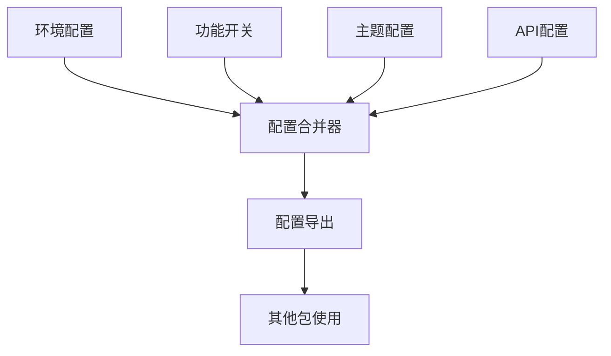

# @sker/config - 配置管理

> 扩展式AI协作画布系统的配置管理中心

## 📋 概述

@sker/config 是整个 packages 工具库的配置管理核心，提供统一的配置管理、环境切换、功能开关和主题配置功能。作为最底层的基础包，它不依赖任何其他包，为整个系统提供配置支撑。

## 🎯 设计原理

### 为什么需要独立的配置包？

1. **配置集中管理**: 避免配置分散在各个包中，难以维护
2. **环境隔离**: 支持开发、测试、生产环境的配置切换
3. **功能开关**: 支持功能的灰度发布和A/B测试
4. **类型安全**: 提供TypeScript类型支持，避免配置错误
5. **动态配置**: 支持运行时配置更新，无需重启应用

### 架构设计思路



## 🚀 核心功能

### 1. 环境配置管理
- 开发/测试/生产环境自动识别
- 环境特定的配置覆盖
- 配置验证和类型检查

### 2. 功能开关系统
- 基于环境的功能开关
- 用户级别的功能开关
- 渐进式功能发布支持

### 3. 主题配置
- 明暗主题切换
- 自定义主题变量
- 响应式主题适配

### 4. API配置管理
- 多环境API端点配置
- 请求超时和重试配置
- 认证配置管理

### 5. 构建配置
- Webpack/Vite配置选项
- 代码分割配置
- 性能优化配置

## 📦 安装使用

```bash
npm install @sker/config
```

## 📖 API文档

### EnvironmentConfig - 环境配置

```typescript
import { EnvironmentConfig } from '@sker/config';

// 获取当前环境配置
const config = EnvironmentConfig.get();
console.log(config.environment); // 'development' | 'staging' | 'production'

// 获取特定配置值
const apiUrl = EnvironmentConfig.getValue('api.baseUrl');
const dbUrl = EnvironmentConfig.getValue('database.url');

// 检查环境
if (EnvironmentConfig.isDevelopment()) {
  console.log('开发环境');
}
```

### FeatureFlags - 功能开关

```typescript
import { FeatureFlags } from '@sker/config';

// 检查功能是否启用
const isAIEnabled = FeatureFlags.isEnabled('ai-optimization');
const isNewUIEnabled = FeatureFlags.isEnabled('new-ui-components');

// 基于用户的功能开关
const isAdvancedMode = FeatureFlags.isEnabledForUser('advanced-mode', userId);

// 获取功能配置
const aiConfig = FeatureFlags.getConfig('ai-optimization');
```

### ThemeConfig - 主题配置

```typescript
import { ThemeConfig } from '@sker/config';

// 获取当前主题
const currentTheme = ThemeConfig.getCurrentTheme();

// 切换主题
ThemeConfig.setTheme('dark');

// 获取主题变量
const colors = ThemeConfig.getColors();
const spacing = ThemeConfig.getSpacing();

// 监听主题变化
ThemeConfig.onThemeChange((newTheme) => {
  console.log('主题已切换为:', newTheme);
});
```

### ApiConfig - API配置

```typescript
import { ApiConfig } from '@sker/config';

// 获取API配置
const apiConfig = ApiConfig.get();
console.log(apiConfig.baseUrl);
console.log(apiConfig.timeout);

// 获取特定服务配置
const aiServiceConfig = ApiConfig.getServiceConfig('ai-service');
const userServiceConfig = ApiConfig.getServiceConfig('user-service');

// 获取认证配置
const authConfig = ApiConfig.getAuthConfig();
```

### BuildConfig - 构建配置

```typescript
import { BuildConfig } from '@sker/config';

// 获取构建配置
const buildConfig = BuildConfig.get();

// 开发环境特定配置
if (BuildConfig.isDevelopment()) {
  const devConfig = BuildConfig.getDevelopmentConfig();
}

// 生产环境优化配置
if (BuildConfig.isProduction()) {
  const prodConfig = BuildConfig.getProductionConfig();
}
```

## 🛠️ 开发指南

### 配置文件结构

```
config/
├── src/
│   ├── types/           # 配置类型定义
│   │   ├── environment.ts
│   │   ├── features.ts
│   │   ├── theme.ts
│   │   ├── api.ts
│   │   └── build.ts
│   ├── managers/        # 配置管理器
│   │   ├── EnvironmentConfig.ts
│   │   ├── FeatureFlags.ts
│   │   ├── ThemeConfig.ts
│   │   ├── ApiConfig.ts
│   │   └── BuildConfig.ts
│   ├── validators/      # 配置验证器
│   │   ├── schema.ts
│   │   └── validator.ts
│   ├── defaults/        # 默认配置
│   │   ├── development.ts
│   │   ├── staging.ts
│   │   ├── production.ts
│   │   └── common.ts
│   └── index.ts         # 统一导出
├── config/              # 配置文件目录
│   ├── development.json
│   ├── staging.json
│   ├── production.json
│   └── features.json
└── tests/               # 测试文件
    ├── environment.test.ts
    ├── features.test.ts
    ├── theme.test.ts
    └── integration.test.ts
```

### 配置类型定义

```typescript
// types/environment.ts
export interface EnvironmentConfig {
  environment: 'development' | 'staging' | 'production';
  api: {
    baseUrl: string;
    timeout: number;
    retries: number;
  };
  database: {
    url: string;
    maxConnections: number;
  };
  redis: {
    url: string;
    ttl: number;
  };
  logging: {
    level: 'debug' | 'info' | 'warn' | 'error';
    format: 'json' | 'text';
  };
}

// types/features.ts
export interface FeatureFlag {
  name: string;
  enabled: boolean;
  environment?: string[];
  users?: string[];
  percentage?: number;
  config?: Record<string, any>;
}

// types/theme.ts
export interface ThemeConfig {
  name: string;
  colors: {
    primary: string;
    secondary: string;
    background: string;
    surface: string;
    text: string;
    border: string;
  };
  spacing: {
    xs: string;
    sm: string;
    md: string;
    lg: string;
    xl: string;
  };
  typography: {
    fontFamily: string;
    fontSize: Record<string, string>;
    fontWeight: Record<string, number>;
  };
}
```

### 环境变量支持

```typescript
// 支持的环境变量
process.env.NODE_ENV          // 环境标识
process.env.API_BASE_URL      // API基础URL
process.env.DATABASE_URL      // 数据库连接
process.env.REDIS_URL         // Redis连接
process.env.LOG_LEVEL         // 日志级别
process.env.FEATURE_FLAGS     // 功能开关JSON字符串
```

### 配置验证

```typescript
// validators/schema.ts
import { z } from 'zod';

export const environmentSchema = z.object({
  environment: z.enum(['development', 'staging', 'production']),
  api: z.object({
    baseUrl: z.string().url(),
    timeout: z.number().positive(),
    retries: z.number().min(0).max(5),
  }),
  database: z.object({
    url: z.string().min(1),
    maxConnections: z.number().positive(),
  }),
});

export const featureSchema = z.object({
  name: z.string().min(1),
  enabled: z.boolean(),
  environment: z.array(z.string()).optional(),
  users: z.array(z.string()).optional(),
  percentage: z.number().min(0).max(100).optional(),
});
```

## 🧪 测试策略

### 单元测试

```typescript
// tests/environment.test.ts
describe('EnvironmentConfig', () => {
  it('应该正确加载开发环境配置', () => {
    process.env.NODE_ENV = 'development';
    const config = EnvironmentConfig.get();
    expect(config.environment).toBe('development');
    expect(config.api.baseUrl).toContain('localhost');
  });

  it('应该支持配置覆盖', () => {
    process.env.API_BASE_URL = 'https://custom-api.com';
    const config = EnvironmentConfig.get();
    expect(config.api.baseUrl).toBe('https://custom-api.com');
  });
});
```

### 集成测试

```typescript
// tests/integration.test.ts
describe('配置集成测试', () => {
  it('所有配置管理器应该正常工作', () => {
    expect(() => EnvironmentConfig.get()).not.toThrow();
    expect(() => FeatureFlags.isEnabled('test-feature')).not.toThrow();
    expect(() => ThemeConfig.getCurrentTheme()).not.toThrow();
  });
});
```

## 📊 性能考虑

1. **配置缓存**: 配置在首次加载后会被缓存，避免重复读取
2. **懒加载**: 只有在需要时才加载特定的配置模块
3. **内存优化**: 使用WeakMap管理配置引用，支持垃圾回收
4. **类型擦除**: 编译时进行类型检查，运行时无性能损耗

## 🔧 配置热更新

```typescript
// 支持配置热更新（仅开发环境）
if (EnvironmentConfig.isDevelopment()) {
  EnvironmentConfig.enableHotReload();
  
  // 监听配置文件变化
  EnvironmentConfig.onConfigChange((newConfig) => {
    console.log('配置已更新:', newConfig);
  });
}
```

## 🎨 最佳实践

1. **配置分层**: 使用环境特定配置覆盖基础配置
2. **类型安全**: 始终使用TypeScript类型定义
3. **验证优先**: 在应用启动时验证配置完整性
4. **敏感信息**: 使用环境变量管理敏感配置
5. **文档同步**: 配置变更时同步更新文档

## 🚨 安全注意事项

1. **敏感信息**: 绝不在代码中硬编码敏感信息
2. **环境隔离**: 确保生产环境配置不会泄露到开发环境
3. **访问控制**: 限制对敏感配置的访问权限
4. **审计日志**: 记录配置变更的审计日志

## 📈 版本历史

- **v1.0.0**: 初始版本，提供基础配置管理功能
- **v1.1.0**: 添加功能开关系统
- **v1.2.0**: 支持主题配置和热更新
- **v1.3.0**: 增强配置验证和类型安全

## 🤝 贡献指南

1. Fork 项目
2. 创建功能分支
3. 编写测试用例
4. 确保所有测试通过
5. 提交 Pull Request

## 📄 许可证

MIT License