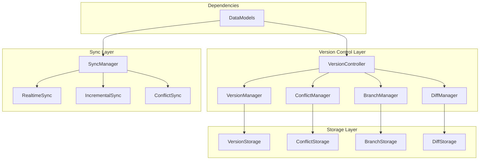

# @sker/version-control

> 版本控制与协作系统 - 提供组件版本管理、变更追踪和协作功能

## 📋 概述

@sker/version-control 是一个专为低代码画布设计的版本控制系统，提供完整的版本管理、变更追踪、分支管理和团队协作功能。它使用先进的差异算法和冲突解决机制，确保多人协作时的数据一致性。

### 为什么这么设计？

1. **版本管理需求**：低代码画布需要保存不同版本的设计状态，便于回滚和比较
2. **团队协作**：多人同时编辑画布时需要冲突检测和解决机制
3. **变更追踪**：需要详细记录每个组件的变更历史和操作者
4. **分支管理**：支持功能分支开发模式，便于并行开发
5. **性能优化**：使用增量同步和智能缓存，减少网络传输

## 🏗️ 架构设计



## 🚀 核心功能

### 1. 版本管理
- **版本创建与保存**：自动或手动创建版本快照
- **版本比较**：可视化对比不同版本的差异
- **版本回滚**：安全回滚到历史版本
- **版本标签**：为重要版本添加标签和描述

### 2. 分支管理
- **分支创建**：从任意版本创建新分支
- **分支合并**：智能合并分支变更
- **分支切换**：无缝切换工作分支
- **分支保护**：保护主分支免受意外修改

### 3. 冲突解决
- **冲突检测**：实时检测编辑冲突
- **冲突解决**：提供多种冲突解决策略
- **冲突预览**：可视化展示冲突内容
- **自动合并**：智能自动合并非冲突变更

### 4. 变更追踪
- **操作记录**：详细记录每个操作和变更
- **变更统计**：提供变更数据分析
- **操作者追踪**：记录每个变更的操作者
- **时间线视图**：按时间线展示项目历史

## 📦 安装

```bash
npm install @sker/version-control
```

## 🔧 基础用法

### 版本管理

```typescript
import { VersionController, VersionManager } from '@sker/version-control';
import { ProjectModel, ComponentModel } from '@sker/data-models';

// 初始化版本控制器
const versionController = new VersionController({
  projectId: 'project-123',
  storage: {
    type: 'indexeddb',
    dbName: 'project-versions'
  },
  sync: {
    enabled: true,
    serverUrl: 'wss://api.example.com/sync'
  }
});

// 创建版本
const version = await versionController.createVersion({
  message: '添加新的按钮组件',
  author: 'user-123',
  components: projectComponents,
  metadata: {
    buildNumber: '1.2.3',
    environment: 'development'
  }
});

console.log('版本创建成功:', version.id);

// 获取版本历史
const history = await versionController.getVersionHistory({
  limit: 10,
  branch: 'main'
});

// 比较版本
const diff = await versionController.compareVersions(
  'version-1',
  'version-2'
);

console.log('版本差异:', diff.changes);
```

### 分支管理

```typescript
import { BranchManager } from '@sker/version-control';

const branchManager = new BranchManager(versionController);

// 创建新分支
const newBranch = await branchManager.createBranch({
  name: 'feature/new-component',
  fromVersion: 'main-latest',
  description: '开发新组件功能'
});

// 切换分支
await branchManager.switchBranch('feature/new-component');

// 合并分支
const mergeResult = await branchManager.mergeBranch({
  source: 'feature/new-component',
  target: 'main',
  strategy: 'auto-merge',
  conflictResolution: 'interactive'
});

if (mergeResult.hasConflicts) {
  console.log('需要解决冲突:', mergeResult.conflicts);
}
```

### 冲突解决

```typescript
import { ConflictManager } from '@sker/version-control';

const conflictManager = new ConflictManager();

// 检测冲突
const conflicts = await conflictManager.detectConflicts({
  baseVersion: 'version-1',
  sourceChanges: sourceComponents,
  targetChanges: targetComponents
});

// 解决冲突
const resolution = await conflictManager.resolveConflict({
  conflictId: conflicts[0].id,
  resolution: 'use-source', // 'use-source' | 'use-target' | 'merge' | 'custom'
  customData: conflicts[0].sourceData
});

// 应用解决方案
await conflictManager.applyResolution(resolution);
```

### 实时同步

```typescript
import { SyncManager } from '@sker/version-control';

const syncManager = new SyncManager({
  projectId: 'project-123',
  userId: 'user-123',
  serverUrl: 'wss://api.example.com/sync'
});

// 开启实时同步
await syncManager.connect();

// 监听同步事件
syncManager.on('change', (change) => {
  console.log('收到远程变更:', change);
});

syncManager.on('conflict', (conflict) => {
  console.log('检测到冲突:', conflict);
});

// 推送本地变更
await syncManager.pushChanges([
  {
    type: 'component-update',
    componentId: 'comp-123',
    data: updatedComponent,
    timestamp: Date.now()
  }
]);
```

## 🗂️ 项目结构

```
version-control/
├── src/
│   ├── controllers/
│   │   ├── VersionController.ts      # 版本控制核心
│   │   ├── BranchController.ts       # 分支管理
│   │   └── SyncController.ts         # 同步控制
│   ├── managers/
│   │   ├── VersionManager.ts         # 版本管理器
│   │   ├── BranchManager.ts          # 分支管理器
│   │   ├── ConflictManager.ts        # 冲突管理器
│   │   ├── DiffManager.ts            # 差异管理器
│   │   └── SyncManager.ts            # 同步管理器
│   ├── storage/
│   │   ├── VersionStorage.ts         # 版本存储
│   │   ├── BranchStorage.ts          # 分支存储
│   │   ├── ConflictStorage.ts        # 冲突存储
│   │   └── DiffStorage.ts            # 差异存储
│   ├── algorithms/
│   │   ├── DiffAlgorithm.ts          # 差异算法
│   │   ├── MergeAlgorithm.ts         # 合并算法
│   │   └── ConflictDetection.ts      # 冲突检测
│   ├── sync/
│   │   ├── RealtimeSync.ts           # 实时同步
│   │   ├── IncrementalSync.ts        # 增量同步
│   │   └── ConflictSync.ts           # 冲突同步
│   ├── types/
│   │   ├── version.ts                # 版本类型定义
│   │   ├── branch.ts                 # 分支类型定义
│   │   ├── conflict.ts               # 冲突类型定义
│   │   └── sync.ts                   # 同步类型定义
│   └── utils/
│       ├── hash.ts                   # 哈希工具
│       ├── compression.ts            # 压缩工具
│       └── validation.ts             # 验证工具
├── tests/
│   ├── unit/                         # 单元测试
│   ├── integration/                  # 集成测试
│   └── performance/                  # 性能测试
└── docs/                             # 文档
```

## 🧪 测试策略

### 单元测试
```typescript
// tests/unit/VersionManager.test.ts
import { VersionManager } from '../../src/managers/VersionManager';
import { ProjectModel } from '@sker/data-models';

describe('VersionManager', () => {
  let versionManager: VersionManager;
  
  beforeEach(() => {
    versionManager = new VersionManager({
      storage: new MemoryStorage()
    });
  });
  
  test('应该成功创建版本', async () => {
    const version = await versionManager.createVersion({
      message: '测试版本',
      author: 'test-user',
      components: []
    });
    
    expect(version.id).toBeDefined();
    expect(version.message).toBe('测试版本');
  });
  
  test('应该正确比较版本差异', async () => {
    const version1 = await versionManager.createVersion({
      message: '版本1',
      components: [{ id: 'comp-1', type: 'button' }]
    });
    
    const version2 = await versionManager.createVersion({
      message: '版本2',
      components: [{ id: 'comp-1', type: 'input' }]
    });
    
    const diff = await versionManager.compareVersions(
      version1.id,
      version2.id
    );
    
    expect(diff.changes).toHaveLength(1);
    expect(diff.changes[0].type).toBe('modified');
  });
});
```

### 集成测试
```typescript
// tests/integration/version-control.test.ts
describe('Version Control Integration', () => {
  test('应该支持完整的版本控制流程', async () => {
    // 创建项目
    const project = await createTestProject();
    
    // 初始化版本控制
    const vc = new VersionController({ projectId: project.id });
    
    // 创建初始版本
    const v1 = await vc.createVersion({
      message: '初始版本',
      components: project.components
    });
    
    // 修改组件并创建新版本
    project.components[0].properties.text = '修改后的文本';
    const v2 = await vc.createVersion({
      message: '修改文本',
      components: project.components
    });
    
    // 比较版本
    const diff = await vc.compareVersions(v1.id, v2.id);
    expect(diff.changes).toHaveLength(1);
    
    // 回滚版本
    await vc.revertToVersion(v1.id);
    const currentState = await vc.getCurrentState();
    expect(currentState.components[0].properties.text)
      .not.toBe('修改后的文本');
  });
});
```

### 性能测试
```typescript
// tests/performance/large-project.test.ts
describe('Performance Tests', () => {
  test('应该高效处理大型项目版本', async () => {
    const largeProject = generateLargeProject(1000); // 1000个组件
    const vc = new VersionController({ projectId: largeProject.id });
    
    const startTime = Date.now();
    
    // 创建版本
    await vc.createVersion({
      message: '大型项目版本',
      components: largeProject.components
    });
    
    const createTime = Date.now() - startTime;
    expect(createTime).toBeLessThan(2000); // 应在2秒内完成
    
    // 测试差异计算性能
    const modifiedProject = { ...largeProject };
    modifiedProject.components[500].properties.text = '修改';
    
    const diffStartTime = Date.now();
    const diff = await vc.calculateDiff(
      largeProject.components,
      modifiedProject.components
    );
    const diffTime = Date.now() - diffStartTime;
    
    expect(diffTime).toBeLessThan(1000); // 差异计算应在1秒内完成
    expect(diff.changes).toHaveLength(1);
  });
});
```

## ⚡ 性能优化

### 1. 增量同步
```typescript
// src/sync/IncrementalSync.ts
export class IncrementalSync {
  private lastSyncTimestamp: number = 0;
  
  async syncChanges(): Promise<void> {
    // 只同步上次同步后的变更
    const changes = await this.getChangesSince(this.lastSyncTimestamp);
    
    if (changes.length > 0) {
      await this.pushChanges(changes);
      this.lastSyncTimestamp = Date.now();
    }
  }
  
  private async getChangesSince(timestamp: number): Promise<Change[]> {
    return this.storage.getChanges({
      since: timestamp,
      compress: true
    });
  }
}
```

### 2. 智能缓存
```typescript
// src/storage/CachedVersionStorage.ts
export class CachedVersionStorage extends VersionStorage {
  private cache = new Map<string, Version>();
  private maxCacheSize = 50;
  
  async getVersion(id: string): Promise<Version> {
    // 先检查缓存
    if (this.cache.has(id)) {
      return this.cache.get(id)!;
    }
    
    // 从存储加载
    const version = await super.getVersion(id);
    
    // 添加到缓存
    this.addToCache(id, version);
    
    return version;
  }
  
  private addToCache(id: string, version: Version): void {
    if (this.cache.size >= this.maxCacheSize) {
      // 移除最旧的缓存项
      const firstKey = this.cache.keys().next().value;
      this.cache.delete(firstKey);
    }
    
    this.cache.set(id, version);
  }
}
```

### 3. 压缩优化
```typescript
// src/utils/compression.ts
import { deflate, inflate } from 'pako';

export class CompressionUtils {
  static compress(data: any): Uint8Array {
    const jsonString = JSON.stringify(data);
    return deflate(jsonString, { level: 6 });
  }
  
  static decompress(compressed: Uint8Array): any {
    const jsonString = inflate(compressed, { to: 'string' });
    return JSON.parse(jsonString);
  }
  
  static calculateCompressionRatio(original: any, compressed: Uint8Array): number {
    const originalSize = JSON.stringify(original).length;
    return compressed.length / originalSize;
  }
}
```

## 🎯 最佳实践

### 1. 版本策略
```typescript
// 定期自动保存策略
const autoSaveManager = new AutoSaveManager({
  interval: 30000, // 30秒
  maxVersions: 100,
  strategy: 'time-based' // 'time-based' | 'change-based'
});

// 重要节点手动标记
await versionController.createVersion({
  message: '功能开发完成',
  tag: 'feature-complete',
  metadata: {
    milestone: true,
    tested: true
  }
});
```

### 2. 冲突预防
```typescript
// 乐观锁机制
const lockManager = new OptimisticLockManager();

await lockManager.acquireLock('component-123', {
  timeout: 30000,
  onConflict: (conflict) => {
    // 显示冲突提示
    showConflictNotification(conflict);
  }
});

// 使用悲观锁保护关键操作
await lockManager.withLock('project-structure', async () => {
  // 修改项目结构的关键操作
  await modifyProjectStructure();
});
```

### 3. 协作优化
```typescript
// 用户状态同步
const collaborationManager = new CollaborationManager();

collaborationManager.on('user-cursor', (event) => {
  // 显示其他用户的光标位置
  showUserCursor(event.userId, event.position);
});

collaborationManager.on('user-selection', (event) => {
  // 显示其他用户的选择状态
  showUserSelection(event.userId, event.selection);
});

// 操作冲突预警
collaborationManager.on('potential-conflict', (warning) => {
  showConflictWarning(warning.message);
});
```

## 📈 版本历史

### v1.0.0
- ✅ 基础版本管理功能
- ✅ 本地存储支持
- ✅ 简单差异计算

### v1.1.0
- ✅ 分支管理功能
- ✅ 基础冲突检测
- ✅ IndexedDB存储优化

### v1.2.0
- ✅ 实时同步功能
- ✅ 智能冲突解决
- ✅ 性能优化

### v2.0.0 (规划中)
- 🔄 分布式版本控制
- 🔄 高级合并策略
- 🔄 可视化版本树
- 🔄 版本分析工具

## 🤝 依赖关系

```json
{
  "dependencies": {
    "@sker/data-models": "^1.0.0"
  },
  "peerDependencies": {
    "rxjs": "^7.0.0",
    "lodash": "^4.17.0"
  }
}
```

### 与 @sker/data-models 的集成

@sker/version-control 深度依赖 @sker/data-models 提供的数据结构：

```typescript
import { 
  ProjectModel, 
  ComponentModel, 
  VersionModel,
  ChangeModel 
} from '@sker/data-models';

// 使用标准化的数据模型进行版本管理
const version = new VersionModel({
  id: generateId(),
  projectId: project.id,
  components: project.components.map(comp => new ComponentModel(comp)),
  changes: changes.map(change => new ChangeModel(change)),
  metadata: {
    author: user.id,
    timestamp: Date.now(),
    message: '版本描述'
  }
});
```

这样的设计确保了版本控制系统与整个项目的数据模型保持一致，提供了类型安全和数据验证功能。