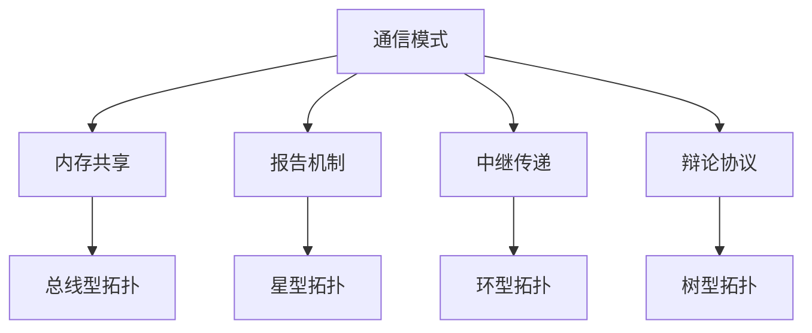

# 多Agent编程最佳实践指南 (2024版)

## 目录
1. [核心架构与框架选择](#1-核心架构与框架选择)
2. [Agent间通信最佳实践](#2-agent间通信最佳实践)
3. [任务分配与协调机制](#3-任务分配与协调机制)
4. [错误处理与容错策略](#4-错误处理与容错策略)
5. [性能优化与监控实践](#5-性能优化与监控实践)
6. [实施建议](#6-实施建议)

---

## 1. 核心架构与框架选择

### 1.1 主流框架对比 (2024年)

| 框架 | 特点 | 适用场景 | 性能表现 |
|------|------|----------|----------|
| **MetaGPT** | 元编程方法，集成结构化工作流 | 复杂协作任务 | 高质量输出 |
| **AutoGen** | 对话驱动的多Agent协作 | 灵活Agent行为定义 | 良好扩展性 |
| **LangGraph** | 最快的框架，最低延迟 | 性能要求高的场景 | 最优延迟 |
| **CrewAI** | 专为多Agent系统设计 | 多Agent原生应用 | 架构优势 |
| **Swarm** | 任务分发效率导向 | 专业化Agent协作 | 高效率 |

### 1.2 框架选择原则

#### 按应用场景选择
- **单Agent场景**: LangChain (链式优先，单Agent核心)
- **多Agent原生**: CrewAI (架构天然支持多Agent)
- **性能敏感**: LangGraph, Swarm (效率导向)
- **复杂协作**: MetaGPT (结构化工作流)

#### 按团队规模选择
- **小团队**: AutoGen (简单易用)
- **企业级**: CrewAI, LangGraph (成熟架构)
- **研究型**: MetaGPT (高度可定制)

### 1.3 架构设计原则

#### 模块化设计
```
├── Agent层
│   ├── 专业化Agent
│   ├── 协调Agent
│   └── 监控Agent
├── 通信层
│   ├── 消息路由
│   ├── 协议适配
│   └── 负载均衡
├── 存储层
│   ├── 共享内存
│   ├── 知识库
│   └── 状态管理
└── 监控层
    ├── 性能监控
    ├── 错误追踪
    └── 日志分析
```

#### 可扩展性考虑
- 支持从简单到复杂的渐进式扩展
- 预留接口适配新的协议和框架
- 组件间松耦合设计

---

## 2. Agent间通信最佳实践

### 2.1 通信协议标准化

#### 新兴标准协议 (2024)
| 协议 | 全称 | 特点 | 适用场景 |
|------|------|------|----------|
| **MCP** | Model Context Protocol | JSON-RPC客户端-服务器接口 | 安全工具调用 |
| **ACP** | Agent Communication Protocol | REST原生消息传递 | 多部分消息 |
| **A2A** | Agent-to-Agent Protocol | 点对点任务外包 | 直接协作 |
| **ANP** | Agent Network Protocol | 去中心化代理发现 | 开放网络 |

#### 协议选择指南
- **安全性要求高**: 选择MCP
- **RESTful环境**: 选择ACP
- **P2P协作**: 选择A2A
- **分布式网络**: 选择ANP

### 2.2 通信模式设计

#### 四种核心模式


#### 模式选择策略
- **内存共享**: 适用于需要全局状态的场景
- **报告机制**: 适用于状态监控和中央协调
- **中继传递**: 适用于顺序处理的工作流
- **辩论协议**: 适用于需要共识的决策场景

### 2.3 通信优化策略

#### 减少通信开销
- 批量消息处理
- 消息压缩和缓存
- 智能路由算法

#### 提高通信可靠性
- 消息确认机制
- 重试和超时策略
- 故障转移方案

---

## 3. 任务分配与协调机制

### 3.1 协调策略对比

| 策略类型 | 优势 | 劣势 | 适用场景 |
|----------|------|------|----------|
| **集中式协调** | 全局感知，决策一致 | 单点故障，扩展性差 | 小规模，强一致性需求 |
| **去中心化协调** | 高可用，好扩展 | 一致性挑战，协调复杂 | 大规模，容错要求高 |
| **混合协调** | 平衡优势 | 复杂度高 | 企业级应用 |

### 3.2 先进负载均衡技术

#### MARL (多Agent强化学习) 方法
```python
# 示例: MADDPG在UAV协调中的应用
class MADDPGCoordinator:
    def __init__(self, num_agents, state_dim, action_dim):
        self.agents = [Agent(state_dim, action_dim) for _ in range(num_agents)]
        self.critic = CentralizedCritic(num_agents * state_dim, num_agents * action_dim)

    def train(self, experiences):
        # 集中训练
        for agent in self.agents:
            agent.update_policy(self.critic.get_value(experiences))

    def execute(self, states):
        # 去中心化执行
        actions = [agent.act(state) for agent, state in zip(self.agents, states)]
        return actions
```

#### 遗传算法增强PPO (GAPPO)
- **特点**: 结合深度强化学习框架
- **优势**: 平衡任务分配和能耗优化
- **应用**: 复杂任务分配场景

#### 图神经网络蚁群优化 (GHNN-ACO)
- **创新点**: 结合GNN和ACO算法
- **适用**: 异构多Agent分配问题
- **效果**: 显著提升分配效率

### 3.3 实时适应机制

#### CTDE框架 (集中训练-去中心化执行)
```
训练阶段:
┌─────────────┐    ┌─────────────┐    ┌─────────────┐
│   Agent 1   │    │   Agent 2   │    │   Agent n   │
└─────────────┘    └─────────────┘    └─────────────┘
        │                  │                  │
        └──────────────────┼──────────────────┘
                           │
                  ┌─────────────┐
                  │ Global Critic│
                  └─────────────┘

执行阶段:
┌─────────────┐    ┌─────────────┐    ┌─────────────┐
│   Agent 1   │    │   Agent 2   │    │   Agent n   │
│  (独立决策)  │    │  (独立决策)  │    │  (独立决策)  │
└─────────────┘    └─────────────┘    └─────────────┘
```

#### 关键优势
- **实时适应**: 无需中央干预即可快速响应
- **全局视野**: 训练时考虑全局策略
- **本地执行**: 基于本地观察进行决策

---

## 4. 错误处理与容错策略

### 4.1 多层容错机制

#### 第一层: Agent级容错
```python
class FaultTolerantAgent:
    def __init__(self, agent_id, backup_count=2):
        self.agent_id = agent_id
        self.backup_agents = [BackupAgent() for _ in range(backup_count)]
        self.health_checker = HealthChecker()

    def execute_task(self, task):
        try:
            return self.primary_execute(task)
        except Exception as e:
            self.log_error(e)
            return self.failover_execute(task)

    def failover_execute(self, task):
        for backup in self.backup_agents:
            if backup.is_healthy():
                return backup.execute(task)
        raise SystemFailureException("All agents failed")
```

#### 第二层: 系统级容错
- **冗余设计**: 关键组件多实例部署
- **自动重启**: Kubernetes Pod自动恢复
- **优雅降级**: 核心功能保持，非核心功能暂停

#### 第三层: 协作容错
- **挑战机制**: Agent间相互质疑和验证
- **审查代理**: 专门的审查Agent监督输出
- **共识算法**: 多Agent投票决策

### 4.2 弹性架构设计

#### 层次化弹性结构
```
高弹性层 (控制层)
├── 决策冗余
├── 路径备份
└── 全局监控

中弹性层 (协调层)
├── 负载均衡
├── 故障检测
└── 自动切换

基础层 (执行层)
├── Agent冗余
├── 状态同步
└── 本地恢复
```

#### 智能传递模型 (ITM)
- **核心思想**: 解耦关键信息集
- **实现机制**: 分布式决策算法
- **效果**: 提高任务冗余和状态转换能力

### 4.3 故障恢复策略

#### 快速恢复机制
1. **故障检测**: 心跳监控 + 性能指标
2. **影响评估**: 故障范围和严重程度分析
3. **恢复选择**: 重启 vs 切换 vs 降级
4. **状态同步**: 数据一致性保证

#### 预防性措施
- **健康检查**: 定期Agent状态评估
- **资源监控**: CPU、内存、网络使用率
- **异常模式识别**: 机器学习异常检测

---

## 5. 性能优化与监控实践

### 5.1 可观测性挑战与解决方案

#### 观测性三难困境
```
    完整性
    /     \
   /       \
及时性 ---- 低开销
```

**挑战**: 很难同时实现完整性、及时性和低开销
**解决方案**:
- 智能采样策略
- 分层监控架构
- 异步数据处理

#### 动态环境监控
- **非确定性行为**: 使用概率模型预测
- **状态变化追踪**: 实时状态快照
- **模式识别**: 异常行为检测算法

### 5.2 关键性能指标 (KPIs)

#### 系统级指标
| 指标类别 | 具体指标 | 正常范围 | 告警阈值 |
|----------|----------|----------|----------|
| **响应时间** | Agent响应延迟 | < 100ms | > 500ms |
| **吞吐量** | 任务完成率 | > 95% | < 90% |
| **资源利用率** | CPU/内存使用 | 60-80% | > 90% |
| **错误率** | 任务失败率 | < 1% | > 5% |

#### Agent级指标
- **工具利用精度**: 选择正确工具的比例
- **工具错误率**: 工具执行失败率
- **协作成功率**: Agent间协作成功比例
- **学习效率**: 性能改进速度

### 5.3 监控解决方案

#### 企业级解决方案
```yaml
# Azure AI Foundry 配置示例
observability:
  enabled: true
  components:
    - evaluation
    - monitoring
    - tracing
    - governance
  metrics:
    - response_time
    - error_rate
    - agent_collaboration
  alerts:
    - threshold_exceeded
    - pattern_anomaly
```

#### 开源解决方案
- **Galileo**: 专为多Agent系统设计
- **AgentOps**: LLM Agent管理和可观测性
- **自研方案**: 基于Prometheus + Grafana

#### 监控架构设计
```
┌─────────────┐    ┌─────────────┐    ┌─────────────┐
│   Agent 1   │    │   Agent 2   │    │   Agent n   │
└─────────────┘    └─────────────┘    └─────────────┘
        │                  │                  │
        └──────────────────┼──────────────────┘
                           │
                  ┌─────────────┐
                  │ 监控收集器   │
                  └─────────────┘
                           │
    ┌─────────────┬────────┼────────┬─────────────┐
    │             │                 │             │
┌─────────┐ ┌─────────┐ ┌─────────┐ ┌─────────┐
│ 指标存储 │ │ 日志存储 │ │ 链路追踪 │ │ 告警系统 │
└─────────┘ └─────────┘ └─────────┘ └─────────┘
    │             │                 │             │
    └─────────────┴────────┬────────┴─────────────┘
                           │
                  ┌─────────────┐
                  │ 可视化面板   │
                  └─────────────┘
```

### 5.4 性能优化策略

#### 通信优化
- **瓶颈识别**: Agent间通信往往是主要瓶颈
- **优化方法**:
  - 异步消息处理
  - 消息批处理
  - 智能路由算法
  - 缓存机制

#### 计算优化
- **资源分配**: 基于Agent重要性的资源分配
- **负载均衡**: 动态任务分配算法
- **并行处理**: 最大化并发执行

#### 存储优化
- **内存管理**: 共享内存优化
- **数据一致性**: 最终一致性模型
- **缓存策略**: 多级缓存架构

---

## 6. 实施建议

### 6.1 项目启动阶段

#### 需求分析
1. **明确业务目标**: 定义多Agent系统要解决的具体问题
2. **识别Agent角色**: 确定需要哪些类型的Agent
3. **设计交互模式**: 规划Agent间的协作方式
4. **评估技术复杂度**: 选择合适的实施策略

#### 技术选型
```python
# 技术选型决策树
def choose_framework(requirements):
    if requirements.scale == "small" and requirements.complexity == "low":
        return "AutoGen"
    elif requirements.performance == "critical":
        return "LangGraph"
    elif requirements.multi_agent_native:
        return "CrewAI"
    elif requirements.structured_workflow:
        return "MetaGPT"
    else:
        return "Custom Solution"
```

### 6.2 开发阶段

#### 渐进式开发策略
1. **MVP阶段**: 最小可行产品
   - 2-3个基础Agent
   - 简单通信机制
   - 基础监控

2. **功能扩展**: 增强系统能力
   - 增加专业化Agent
   - 优化通信协议
   - 完善错误处理

3. **性能优化**: 系统调优
   - 负载均衡优化
   - 监控体系完善
   - 容错机制强化

#### 代码质量保证
```python
# Agent基类示例
from abc import ABC, abstractmethod
from typing import Dict, Any, List

class BaseAgent(ABC):
    def __init__(self, agent_id: str, config: Dict[str, Any]):
        self.agent_id = agent_id
        self.config = config
        self.health_status = "healthy"
        self.metrics = AgentMetrics()

    @abstractmethod
    async def process_task(self, task: Task) -> TaskResult:
        """处理任务的抽象方法"""
        pass

    async def communicate(self, target_agent: str, message: Message) -> Response:
        """与其他Agent通信"""
        try:
            response = await self.message_router.send(target_agent, message)
            self.metrics.record_communication(success=True)
            return response
        except Exception as e:
            self.metrics.record_communication(success=False)
            raise CommunicationError(f"Failed to communicate with {target_agent}: {e}")

    def get_health_status(self) -> Dict[str, Any]:
        """获取Agent健康状态"""
        return {
            "agent_id": self.agent_id,
            "status": self.health_status,
            "metrics": self.metrics.get_summary(),
            "timestamp": datetime.now().isoformat()
        }
```

### 6.3 部署与运维

#### 部署策略
```yaml
# Kubernetes部署示例
apiVersion: apps/v1
kind: Deployment
metadata:
  name: multi-agent-system
spec:
  replicas: 3
  selector:
    matchLabels:
      app: multi-agent
  template:
    spec:
      containers:
      - name: agent-coordinator
        image: multi-agent:latest
        env:
        - name: AGENT_TYPE
          value: "coordinator"
        resources:
          requests:
            memory: "256Mi"
            cpu: "250m"
          limits:
            memory: "512Mi"
            cpu: "500m"
        livenessProbe:
          httpGet:
            path: /health
            port: 8080
          initialDelaySeconds: 30
          periodSeconds: 10
```

#### 运维最佳实践
1. **监控告警**: 关键指标实时监控
2. **日志管理**: 结构化日志收集和分析
3. **性能调优**: 定期性能评估和优化
4. **安全保障**: 访问控制和数据保护

### 6.4 持续改进

#### 性能评估
- **定期评估**: 月度/季度性能报告
- **A/B测试**: 不同策略对比验证
- **用户反馈**: 收集使用体验和改进建议

#### 技术演进
- **框架升级**: 跟踪最新技术发展
- **算法优化**: 持续改进核心算法
- **架构演化**: 适应业务发展需求

---

## 总结

多Agent编程正在快速发展，2024年在标准化协议、智能协调算法和专业监控工具方面取得了重大进展。成功实施多Agent系统需要：

1. **选择合适的框架**: 根据具体需求选择最适合的技术栈
2. **建立标准化通信**: 采用新兴协议标准，确保互操作性
3. **实施智能协调**: 利用MARL等先进算法优化任务分配
4. **构建容错机制**: 多层次容错设计保证系统稳定性
5. **完善监控体系**: 专业化监控工具确保系统可观测性

随着技术不断演进，多Agent系统将在更多领域发挥重要作用，掌握这些最佳实践将为构建高质量的多Agent应用奠定坚实基础。

---

*文档版本: v1.0*
*更新日期: 2024年12月*
*维护者: AI Development Team*